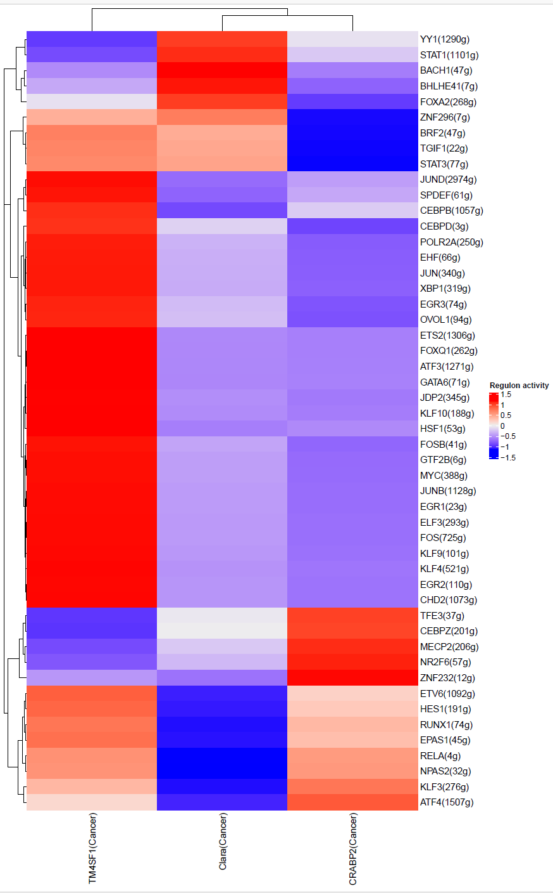
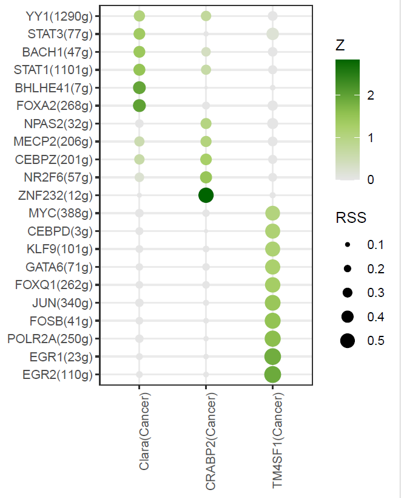
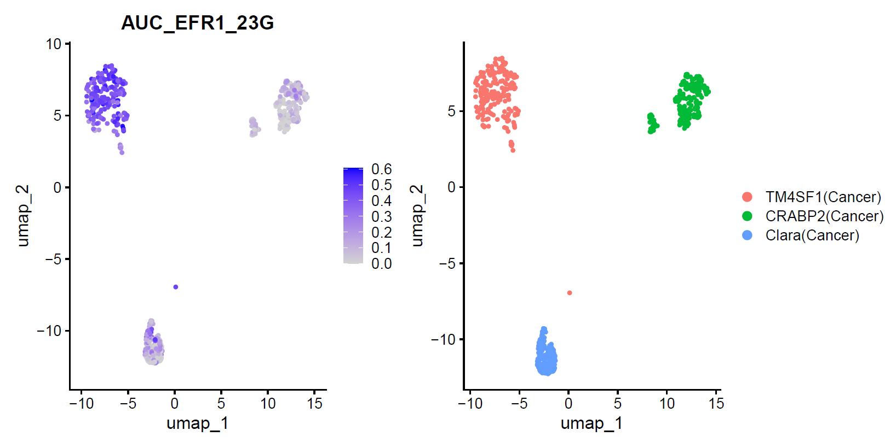

####  Transcriptions Factor (IF) analysis by SCENIC for epithelial cells 

#### Introduction

Transcription factors (TFs) are proteins that directly act on the genome by binding to specific DNA sequences (TFBS/motifs) to regulate the transcription process. TFs play critical roles in controlling genome accessibility, recruiting RNA polymerase for transcription, and modulating specific transcription stages, thereby governing key biological processes such as immune responses and developmental pathways. Analyzing TF expression and regulatory activity is essential for deciphering complex biological systems.

I utilized the SCENIC analysis pipeline. SCENIC (Single-Cell Regulatory Network Inference and Clustering) is a computational framework designed to reconstruct gene regulatory networks and identify cell states from single-cell transcriptomic data. SCENIC combines co-expression and motif analysis and involves three main steps:
1) Co-expression module inference: Using GENIE3 (random forest) or GRNBoost (gradient boosting), SCENIC infers co-expression modules between transcription factors and their candidate target genes. Each module consists of one TF and its co-expressed target genes, solely based on co-expression.
2) Motif enrichment analysis: RcisTarget analyzes the genes in each co-expression module to identify enriched TF motifs. Only modules with significant motif enrichment are retained, and direct targets are identified to construct TF-target regulatory networks (Regulons).
3) Regulon activity assessment: AUCell calculates the activity of each Regulon, determining which Regulons are “active” in specific cells.

Note: The core part of this pipeline runs within PySCENIC, which requires setting up a Conda environment beforehand.


#### Step 1: Set the clean environment and Load the required libraries 

```{r setup, eval=FALSE}

Sys.setenv(LANGUAGE = "en")
options(stringsAsFactors = FALSE)
rm(list=ls())
set.seed(123456)
setwd("C:/Users/xqbus/Desktop/sg_rnaseq/")
getwd()


library(Seurat)
library(AUCell)
library(RcisTarget)
#library(GENIE3)
library(SCENIC)

```

#### Step 2: Input data preparation: single-cell RNA-seq expression matrix and Species-specific databases 
```{r step1, eval=FALSE}

#1. Obtain RNA-seq expression matrix of cancer cells

load("./rdata/Epi_sce.Rdata")
table(Epi_sce$celltype)

cancer = Epi_sce[, Epi_sce$celltype %in% c( 'TM4SF1(Cancer)','CRABP2(Cancer)','Clara(Cancer)')]
Idents(cancer) = cancer$celltype
allCells=names(Idents(cancer))
allType = levels(Idents(cancer))

# Sample N cells for each celltype and save memory and time

N = 200
choose_Cells = unlist(lapply(allType, function(x){
  cgCells = allCells[Idents(cancer)== x ]
  cg=sample(cgCells,N)
  cg
}))
scRNAsub = cancer[, allCells %in% choose_Cells]
cellInfo <- data.frame(scRNAsub@meta.data)[,c("group","celltype")]

exprMat <- as.matrix(LayerData(scRNAsub, assay = "RNA", layer = "counts"))
dim(exprMat)


#2. Download the species-specific databases for RcisTarget (the motif rankings)

# Download Matrix containing motifs as rows and genes as columns and ranking position for each gene and motif used with cisTarget (R), stored in ./SCENIC
# https://resources.aertslab.org/cistarget/databases/homo_sapiens/hg19/refseq_r45/mc9nr/gene_based/

# Download transcription factors list 
# https://github.com/aertslab/pySCENIC/blob/master/resources/hs_hgnc_tfs.txt 

# Dowbnload Motif2TF annotations for human
# https://resources.aertslab.org/cistarget/motif2tf/

# list.files("./SCENIC")
# [1] "hg19-500bp-upstream-7species.mc9nr.feather"                             "hg19-500bp-upstream-7species.mc9nr.genes_vs_motifs.rankings.feather"   
# [3] "hg19-tss-centered-10kb-7species.mc9nr.feather"                          "hg19-tss-centered-10kb-7species.mc9nr.genes_vs_motifs.rankings.feather"
# [5] "hs_hgnc_tfs.txt"                                                        "motifs-v9-nr.hgnc-m0.001-o0.0.tbl.txt"


# Load in the motifannotation, this will load it into your environment but as the name in which is given to the list argument
data(list="motifAnnotations_hgnc_v9", package="RcisTarget")
# Rename the motif annnotion by attributing it to the variable that is in the error
motifAnnotations_hgnc <- motifAnnotations_hgnc_v9

#3. The initialization process
scenicOptions <- initializeScenic(org="hgnc",  #using human motifannotation 
                                  nCores=6,
                                  #datasetTitle = "SCENIC",
                                  dbDir="./rdata/SCENIC" )

save(scenicOptions, exprMat, cellInfo, motifAnnotations_hgnc, file = './rdata/scenic.Rdata') 
# load('./rdata/scenic.Rdata')

```

#### Step 3: Infer transcription regulation network  
```{r step2, eval=FALSE}

# Filter genes
genesKept <- geneFiltering(exprMat, scenicOptions=scenicOptions,
                           minCountsPerGene=3*.01*ncol(exprMat),
                           minSamples=ncol(exprMat)*.01)
exprMat_filtered <- exprMat[genesKept, ]
write.csv(exprMat_filtered,file = './rdata/matrix_for_pyscenic.csv', quote=FALSE, row.names=FALSE)

# Calculate correlation
runCorrelation(exprMat_filtered, scenicOptions)
exprMat_filtered_log <- log2(exprMat_filtered+1)

# Check the connections in current R environment and close them if too much
showConnections(all = TRUE)
closeAllConnections()

# Infer potential transcription factor targets based on the expression data
# Use pyscenic's pyscenic grn instead of runGenie3
# Notice that:  pyscenic should be bulit in conda environment first before running the following part

library(reticulate)
# R system use old version in default, and should be changed to pyscenic
use_condaenv("pyscenic", conda = "C:/Users/xqbus/anaconda3/condabin/conda", required = TRUE)
system('"C:/Users/xqbus/anaconda3/envs/pyscenic/python.exe" --version')

data2grn <- exprMat_filtered %>% as.data.frame() %>% tibble::rownames_to_column(var = "Symbol")
data.table::fwrite(data2grn, file = './rdata/matrix_for_pyscenic.csv', quote = FALSE, row.names = FALSE, sep = ",")

# Costruct system order by using pyscenic, cost 6 minutes with 600 cells and 10,000 genes
# 1 Gene regulatory network inference, and generation of coexpression modules
system('pyscenic grn --method grnboost2   --output ./rdata/step1_mx_adjacencies.tsv    --num_workers 6   --seed 100    --transpose ./rdata/matrix_for_pyscenic.csv ./rdata/SCENIC/hs_hgnc_tfs.txt')
# Can be saved for R downstream 


# 2 Regulon prediction (cisTarget)
# Time consuming: 66 minutes with 2 cores, and with 6 cores, the memory is not enough (11G need for 600 cells)
system('pyscenic ctx ./rdata/step1_mx_adjacencies.tsv ./rdata/SCENIC/hg19-500bp-upstream-7species.mc9nr.genes_vs_motifs.rankings.feather ./rdata/SCENIC/hg19-tss-centered-10kb-7species.mc9nr.genes_vs_motifs.rankings.feather --annotations_fname ./rdata/SCENIC/motifs-v9-nr.hgnc-m0.001-o0.0.tbl --expression_mtx_fname ./rdata/matrix_for_pyscenic.csv --mode dask_multiprocessing  --output ./rdata/step2_regulons.csv --num_workers 2 --transpose')


# 3 Celluar enrichment (AUCell)
system('pyscenic aucell --output ./rdata/step3_auc_mtx.csv --transpose ./rdata/matrix_for_pyscenic.csv ./rdata/step2_regulons.csv')

# Process step2_regulon file and get the transcriptio factor name and corresponding genesets
regulons <- read.csv("./rdata/step2_regulons.csv", header = TRUE)

# Abstract TF and Context list
library(stringr)
regulons$Context <- gsub("^.*\\[|\\].*$", "", regulons$Enrichment.6)  # abstract Context  context
regulons$Genes <- str_extract_all(regulons$Context, "\\'([^\\']+)\\'")  # split gene list
regulons$Genes <- lapply(regulons$Genes, function(x) gsub("'", "", x))
regulons <- regulons[-c(1:3), ]

# Construct hash table
library(dplyr)
gene_hash <- regulons %>%
  group_by(X) %>%  # X si TF 
  summarise(Unique_Genes = list(unique(unlist(Genes))))  #summary as unique gene

# Summarize gene number for one TF
gene_summary <- gene_hash %>%
  mutate(Gene_Count = sapply(Unique_Genes, length),
         Label = paste0(X, "(", Gene_Count, "g)"))
transname <- setNames(gene_summary$Label, gene_summary$X)
print(gene_summary)

# Process step3_auc_mtx.csv and save it
auc_matrix <- read.csv("./rdata/step3_auc_mtx.csv", header = TRUE, row.names = 1)

# Change the row name
regulon_names <- gsub("\\(\\+\\)", "", rownames(auc_matrix))

# Change the row name of auc_matrix according to transname
new_row_names <- sapply(regulon_names, function(gene) {
  if (gene %in% names(transname)) {
    return(transname[[gene]])
  } else {
    return(gene)
  }
})
rownames(auc_matrix) <- new_row_names

write.table(auc_matrix, file = "./rdata/finalout_auc_score_mtx.xls", sep = "\t", quote = FALSE, col.names = NA)

```

#### Step 4: Visualization 
```{r step3, eval=FALSE}

cellInfo$celltype <- droplevels(cellInfo$celltype)  # 移除空类别

#select top 50 to show according to mean auc scores across all 3 types
mean_auc <- rowMeans(auc_matrix)
top_regulons <- names(sort(mean_auc, decreasing = TRUE)[1:50])
filtered_auc <- auc_matrix[top_regulons, ]


# Analysis each regulons AUC value 
regulonActivity_byCellType <- sapply(split(rownames(cellInfo), cellInfo$celltype),
                                     function(cells) rowMeans(filtered_auc[, cells, drop = FALSE]))

# Heat map of the SCENIC results showing the area under the curve (AUC) (enrichment score) for the regulation of TF expression for each kind of tumor cell sub-cluster
a = as.data.frame(regulonActivity_byCellType)
regulonActivity_byCellType_Scaled <- t(scale(t(a), center = T, scale=T))


pdf("results/regulon_aucell.pdf", width = 10, height = 16)
p <- ComplexHeatmap::Heatmap(regulonActivity_byCellType_Scaled, name="Regulon activity")
p
dev.off()

```

This heatmap represents the average regulon activity across different cancer types as identified in the analysis, displayed on the x-axis. The y-axis lists the transcription factors (regulons) along with the number of genes associated with each regulon (e.g., "YY1(1290g)" indicates that 1290 genes are associated with the YY1 regulon).
Some regulons, like EGR1(23g), JUN(340g), and XBP1(319g) exhibit varying levels of activity across all cell types, highlighting potential shared or distinct regulatory roles. Regulons with high or low activity in specific cell types might serve as key regulators or biomarkers for distinct cellular functions or states. The clustering of cell types based on regulon activity also underscores the functional heterogeneity among the analyzed cell populations.




```{r step4, eval=FALSE}
# Cell-specific regulatory factor score
# Calculate the Regulon Specificity Score (RSS) of each Regulon in cells to measure the specificity of regulon between different cell types

cellAnnotation <- cancer$celltype
names(cellAnnotation) <- rownames( cancer@meta.data)

auc_sample_names <- colnames(auc_matrix) 
cellAnnotation <- cellAnnotation[auc_sample_names]
all(auc_sample_names %in% names(cellAnnotation)) 

rss <- calcRSS(AUC = filtered_auc, cellAnnotation = cellAnnotation)
rssPlot <- plotRSS(rss)
pdf("results/regulon_rss.pdf", width = 10, height = 16)
print(rssPlot$plot)
dev.off()


```


The provided figure illustrates the Regulon Specificity Score (RSS) for various transcription factor regulons across different cancer types.
Each row represents a regulon, identified by the transcription factor name followed by the number of genes it regulates. 
Each column represents a distinct cell type or cluster (e.g., Clara(Cancer), CRABP2(Cancer), TM4SF1(Cancer)).
Circle Size (RSS):Larger circles indicate higher specificity of the regulon activity to that cell type.
Color Gradient (Z-score): The color intensity represents the Z-score of the RSS. Darker green indicates higher Z-scores, reflecting stronger regulatory activity.The plot helps identify transcription factor regulons with cell-type-specific activities. Regulons with high RSS in specific cell types may play key roles in defining cell identity or responding to specific biological conditions.



RSS is similar to the above Averaged AUC, the difference is: Averaged AUC Score reflects the mean activity of a regulon in a group, while RSS measures how specific a regulon’s activity is to a given group compared to other groups.


```{r step5, eval=FALSE}
# Focus on some special TF rugulons
identical(colnames(auc_matrix), colnames(scRNAsub))

tf_name <-"EGR1(23g)"

efr1_values <- auc_matrix[tf_name, ]
efr1_vector <- as.numeric(efr1_values[1, ])  
names(efr1_vector) <- colnames(efr1_values)
# Add to seurat object
scRNAsub$AUC_EFR1_23G <- efr1_values


p1 <- Seurat::FeaturePlot(object = scRNAsub, features = 'AUC_EFR1_23G', reduction='umap', pt.size=1)
p1
p2<- Seurat::DimPlot(object = scRNAsub, reduction='umap', pt.size=1)
p1+p2
ggsave(p1|p2, path = './results',
       filename =  'scenic_auc_egr1.pdf',
       width = 10,height = 5)

```

The left panel visualizes the AUC (Area Under the Curve) scores for the regulon EFR1(23g) across individual cells, projected on a UMAP embedding.
The AUC scores are represented as a color gradient, where lighter colors (white) indicate low activity and darker colors (blue) indicate higher activity of the regulon in specific cells.The right panel displays the cell types, helping correlate the regulon activity (left panel) with the distribution of cell types.
The cells with higher EFR1(23g) activity (dark blue in the left panel) appear to be primarily localized in regions that correspond to TM4SF1(Cancer) cells (blue in the right panel). This suggests that EFR1(23g) is more active in TM4SF1(Cancer) cells.




