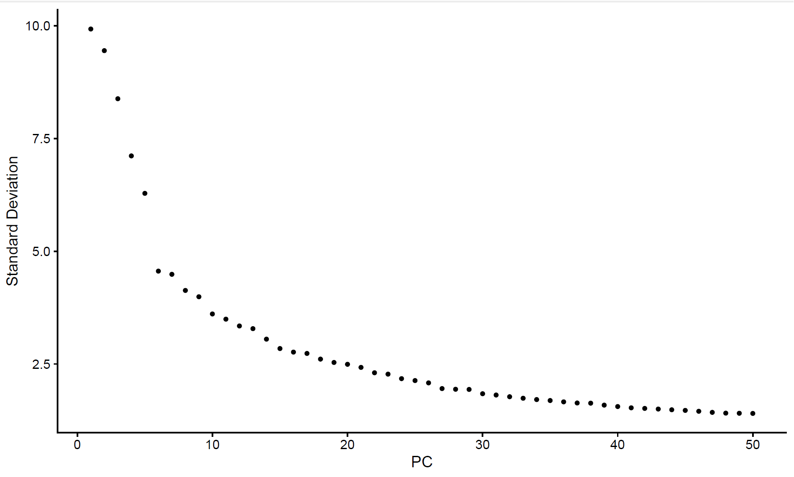
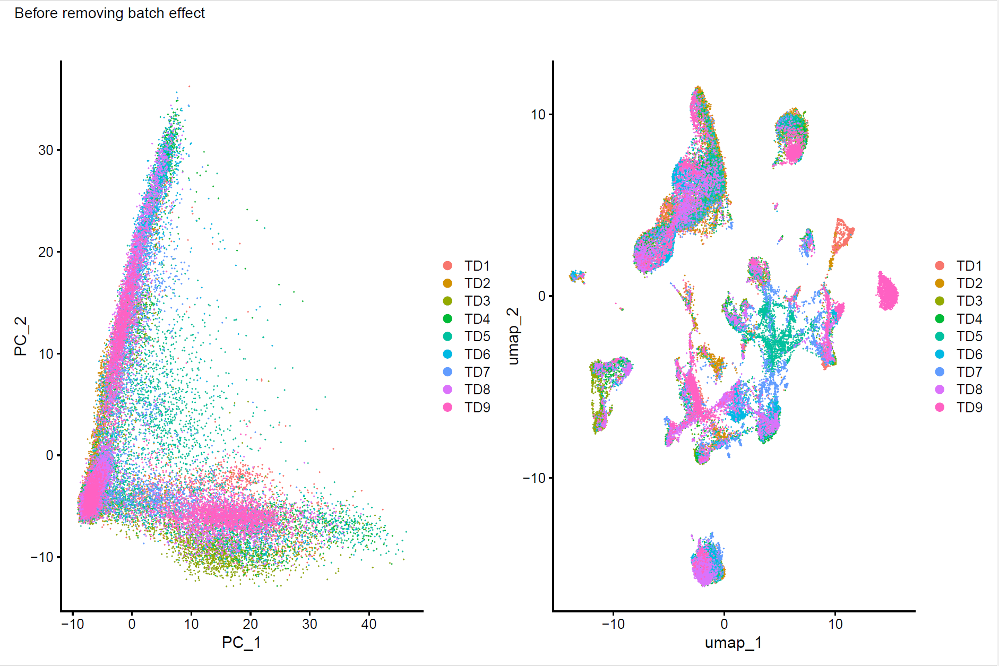
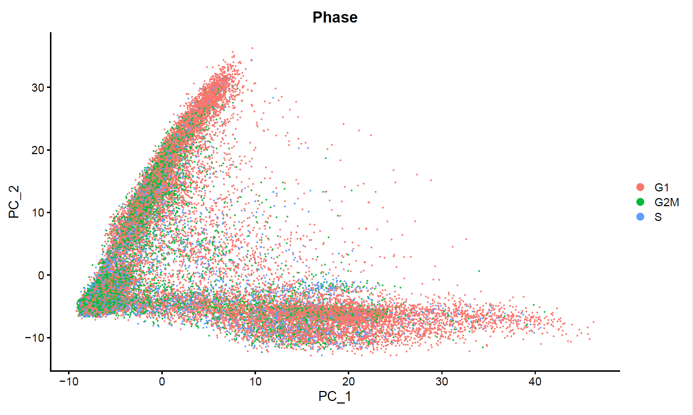
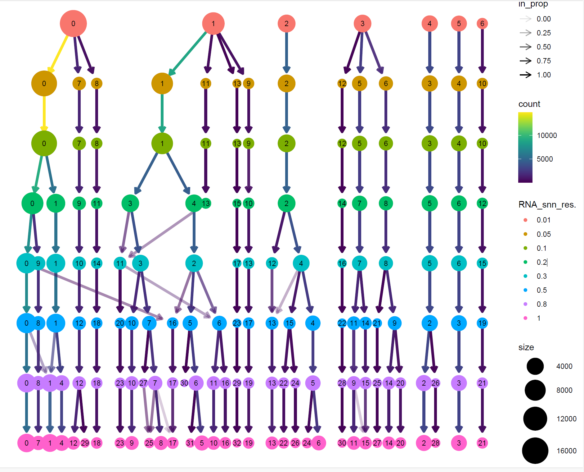
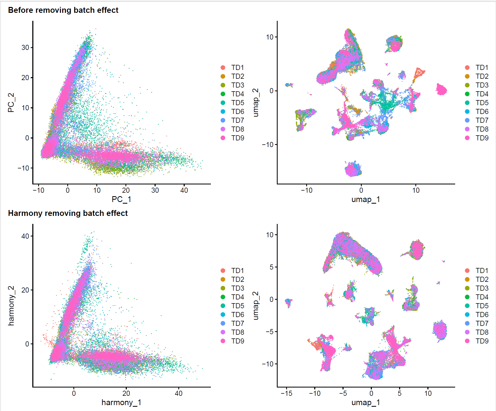
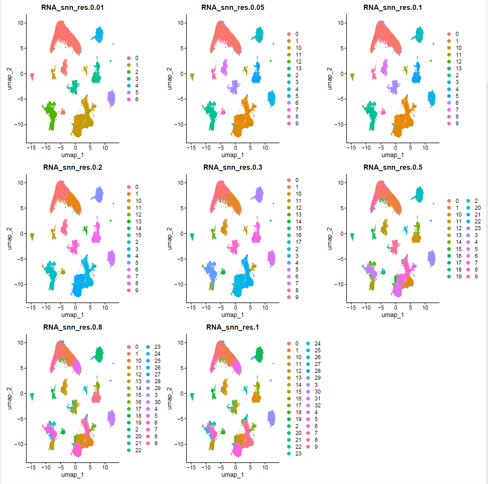
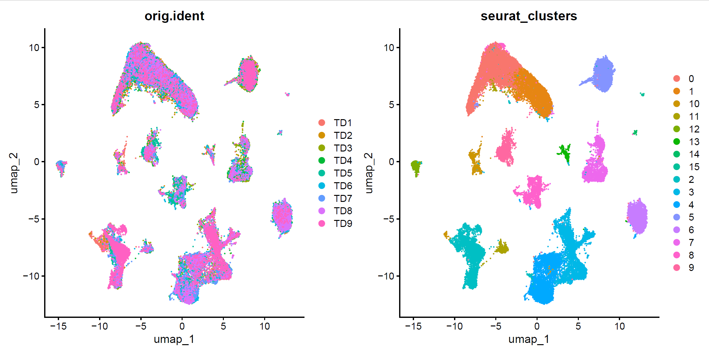

#### Integration of Multiple Single-Cell Samples
Author: "Xiaoqian Jiang"  
Date: "Created on Jan 02, 2025"  

#### Introduction
This step focuses on integrating data from 9 single-cell RNA-seq samples while addressing batch effects using the Harmony algorithm. The integration process aligns shared cell populations across samples, enabling unified downstream analyses and ensuring biological signals are preserved.

#### Step1: Set the clean environment and Load the required libraries
```{r setup, eval=FALSE}
Sys.setenv(LANGUAGE = "en")
options(stringsAsFactors = FALSE)
rm(list=ls())
set.seed(123456)
setwd("C:/Users/xqbus/Desktop/sg_rnaseq/")
getwd()

library(Seurat)
library(patchwork)
library(ggplot2)
library(harmony)
library(clustree)

```


#### Step2: Using sketch data as a new dataset and remove batch effect ####
```{r merge, eval=FALSE}
lnames = load("./rdata/sketchlist.Rdata")

# Merge the samples using seurat function Reduce and merge
scRNAmerge1 <- Reduce(function(x, y) merge(x, y), sketchlist)

# Perform standard_normalize analysis without integration, i.e, should be done in each sample before harmony
# Notice: function "seurat_standard_normalize_and_scale" should added firstly from file "all_functions.R" 
scRNAmerge1 <- seurat_standard_normalize_and_scale(scRNAmerge1, FALSE)

#Dimension reduction clustering
ElbowPlot(scRNAmerge1, ndims = 50)
ggsave("ElbowPlot.pdf", path = "results/",width = 10, height = 6)

```
The elbowplot and dimension = 30 was chosen.



```{r befor_batch_effect, eval=FALSE}
#dimension 30 is used according to ElbowPlot
scRNAmerge1 <- RunUMAP(scRNAmerge1, dims = 1:30, reduction = "pca", reduction.name = "umap")

# Or using SCT to replace the above standardization process
# scRNAmerge1 <- SCTransform(scRNAmerge1, vars.to.regress = "mt_percent", verbose = FALSE)

#check the data before remove batch effect
p1 <- DimPlot(scRNAmerge1, reduction = "pca", group.by = "orig.ident") + labs(title  = "")
p2 <- DimPlot(scRNAmerge1, reduction = "umap", group.by = 'orig.ident') + labs(title = "")
combined_plot_1 <- (p1 + p2) +  plot_annotation(title = "Before removing batch effect")
combined_plot_1

# The PCA and UMAP cluster before remove batch effect  
# 

# Save the file due to R disruption in following harmony process
# Time consuming: 1 minutes
save(scRNAmerge1,file = "./rdata/scRNAmerge1.Rdata")
```
Harmony integration

Seurat V5 provides five powerful methods for batch effect correction: Harmony, CCA, scVI, RPCA, and FastMNN. Among these options, Harmony was selected for this workflow due to its efficiency, scalability, and robust performance across diverse datasets. Harmony excels at aligning shared cellular structures while preserving subtle biological variations, making it particularly suitable for integrating multiple scRNA-seq samples from different conditions or experiments.  
```{r harmony, eval=FALSE}

scRNA_harmony <- IntegrateLayers(object = scRNAmerge1, 
                                 method = HarmonyIntegration, 
                                 orig.reduction = "pca", 
                                 new.reduction = "harmony",
                                 group.by.var = "orig.ident",
                                 verbose = FALSE)

# After harmony integration, the position of JoinLayers doesn't influence combined_plot_2 results.
scRNA_harmony <- JoinLayers(scRNA_harmony)

# Check and decide whether remove cell cycle effects, this step should be done after JoinLayers 
s.genes <- cc.genes$s.genes
g2m.genes <- cc.genes$g2m.genes
scRNA_harmony <- CellCycleScoring(scRNA_harmony, s.features = s.genes,
                                  g2m.features = g2m.genes, set.ident = TRUE)

DimPlot(scRNA_harmony, group.by = 'Phase', reduction = 'pca')
ggsave("CellCycleScoring.pdf", path = "results/",width = 10, height = 6)

```

Based on the provided plot, the cell cycle phases (G1, G2/M, and S) appear to be evenly distributed across the principal components, suggesting that the cell cycle has minimal influence on the overall structure of the data.  
 

```{r Cell_Cycle, eval=FALSE}
# Regress Out Cell Cycle Effects, here this step is unnecessary due to no significant effects
# scRNA_harmony <- ScaleData(scRNA_harmony, vars.to.regress = c("S.Score", "G2M.Score"),
#                        features = rownames(sce_Scale))
```

Run umap based on harmony correction.
```{r clustree, eval=FALSE}
# Here the resolution is selected 0.01-1 directly, and one will be selected according to the sample later
resolution_list = c(0.01, 0.05, 0.1, 0.2, 0.3, 0.5,0.8,1)

# Time consuming: 3 minutes with 45,000 cells 
scRNA_harmony <- FindNeighbors(scRNA_harmony, reduction = "harmony", dims = 1:30)
scRNA_harmony <- FindClusters(scRNA_harmony, resolution = resolution_list)
scRNA_harmony <- RunUMAP(scRNA_harmony, dims = 1:30, reduction = "harmony", reduction.name = "umap")

# Cluster tree to show the effect of different solution
clustree(scRNA_harmony)
ggsave(filename="Tree_diff_resolution1.pdf",path = "results/",width = 10, height = 8)

```
Cluster tree shows the effect of different solution. From the cluster tree, it appears that at a resolution around 0.2, the clustering is balanced and stable, with sufficient granularity to capture biological variation without over-splitting.  
 

Check the result of removing batch effect
```{r check_batch, eval=FALSE}

p3 <- DimPlot(scRNA_harmony, reduction = "harmony", group.by = "orig.ident")  + labs(title = "")
p4 <- DimPlot(scRNA_harmony, reduction = "umap", group.by = "orig.ident") + labs(title = "")
combined_plot_2 <- (p3 + p4) + plot_annotation(title = "Harmony removing batch effect")
combined_plot_2
p<- combined_plot_1 / (combined_plot_2 + plot_layout(tag_level = 'new') )+  
  plot_annotation(tag_levels = list("Before removing batch effect", "Harmony removing batch effect"))
ggsave(filename="Check_batch_effect1.pdf", p, path = "./results",width = 12, height = 10)

```
The result of removing batch effect.The plots demonstrate the improvement in data integration after removing batch effects with Harmony. Before correction, batch-specific clustering is evident, with cells from the same sample grouping together. After applying Harmony, cells are well-integrated, reflecting biological similarities rather than batch effects, indicating that the integration process successfully removed batch-specific biases while preserving meaningful biological signals.

 

```{r check_solution, eval=FALSE}

plot_list <- lapply(resolution_list, function(res) {
  name <- paste0("RNA_snn_res.", res)
  print(name)
  DimPlot(scRNA_harmony, reduction = "umap", group.by = name)
})

# Using reduce in  patchwork to combine all figures
combined_plot <- Reduce(`+`, plot_list) + plot_layout(ncol = ceiling(sqrt(length(resolution_list))))

pdf(file = "./results/resolution_diff2.pdf", width = 15, height = 15)
print(combined_plot)
dev.off()
```

The cluster results with different resolutions. Check the cluster results with different resolutions, which is consistent with cluster tree, demonstrating at a resolution 0.2, the clustering is balanced and stable.   

 

Resolution 0.2 was selected as the default classification according to the clust tree and umap plot in different resolutions.

```{r check_final, eval=FALSE}
#the cells were classified into 15 clusters with resolution 0.2 
scRNA_harmony$seurat_clusters <- scRNA_harmony$RNA_snn_res.0.2

#set the default resolution as 0.2
Idents(scRNA_harmony) <- "RNA_snn_res.0.2" 

DimPlot(scRNA_harmony, reduction = "umap",group.by = c("orig.ident","seurat_clusters"))
ggsave(filename="harmony_cluster.pdf",  path = "./results",width = 12, height = 6)
#colnames(scRNA_harmony@meta.data) 

```

The final chosen harmony results with resolution 0.2. On the left, the UMAP plot shows the cells colored by their original sample identities,  while on the right, the UMAP plot displays the cells colored by their assigned Seurat clusters.  
 

```{r save2, eval=FALSE}
#save the data 
save(scRNA_harmony,file = "./results/scRNA_harmony.Rdata")

```


