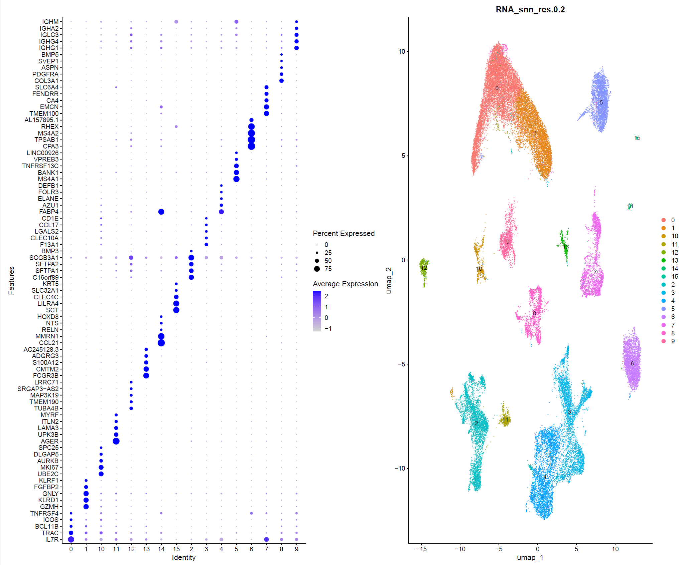
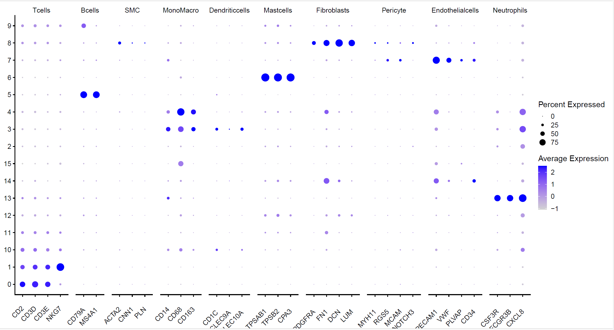
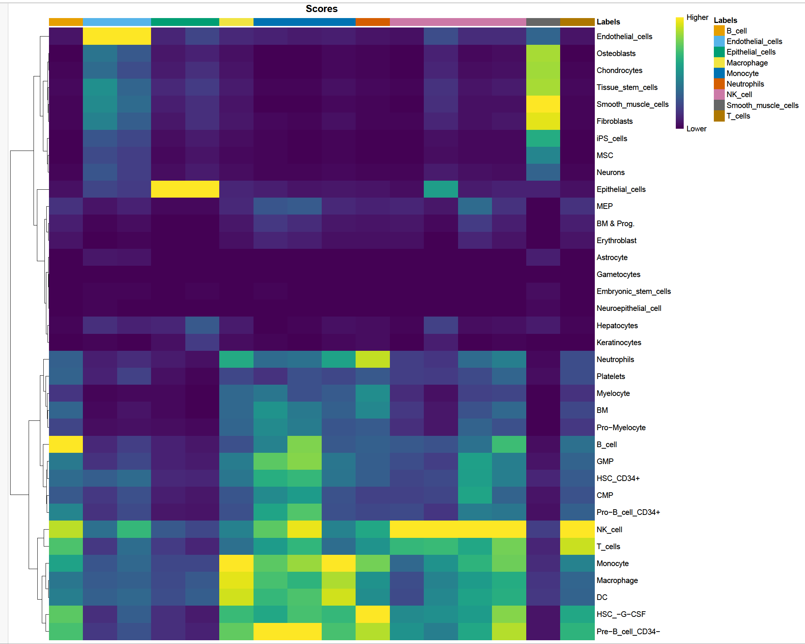
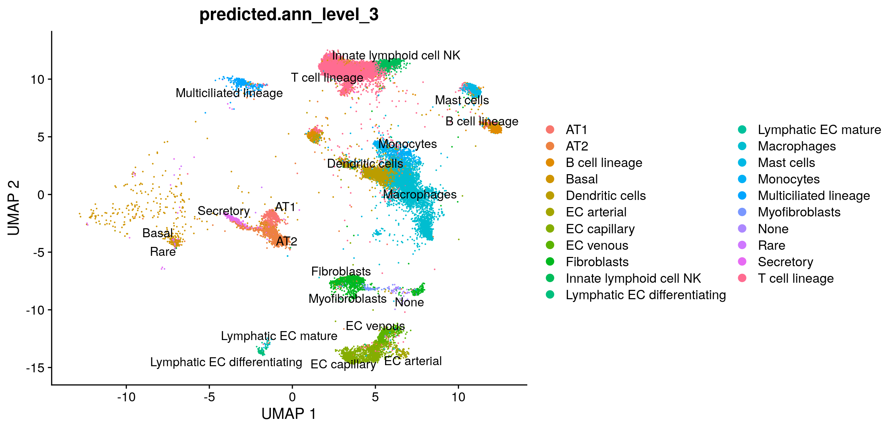
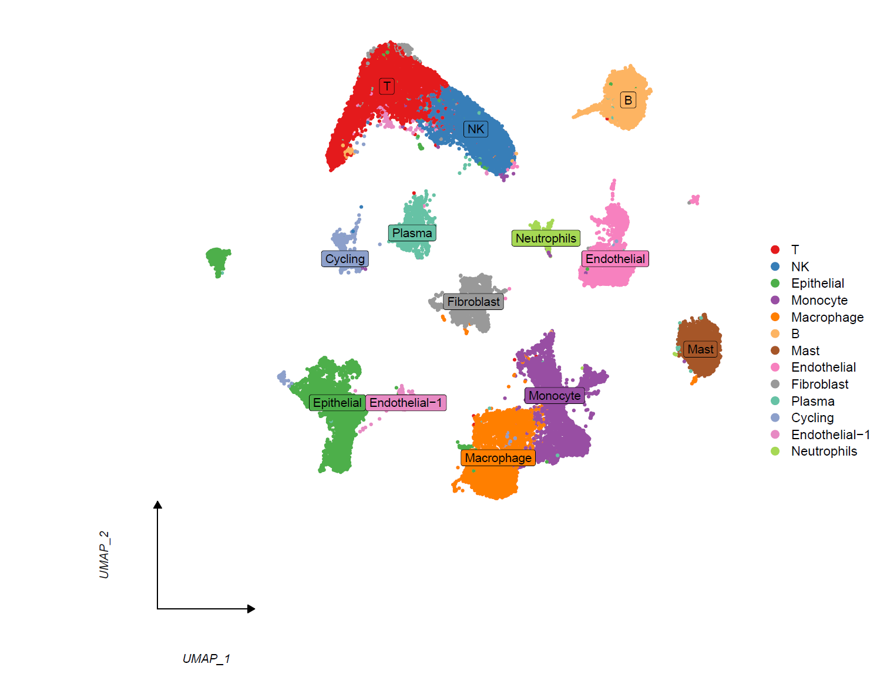
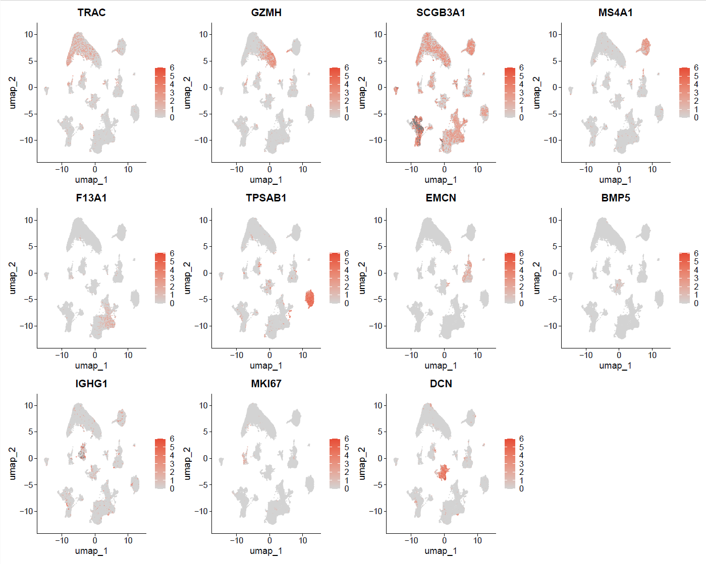
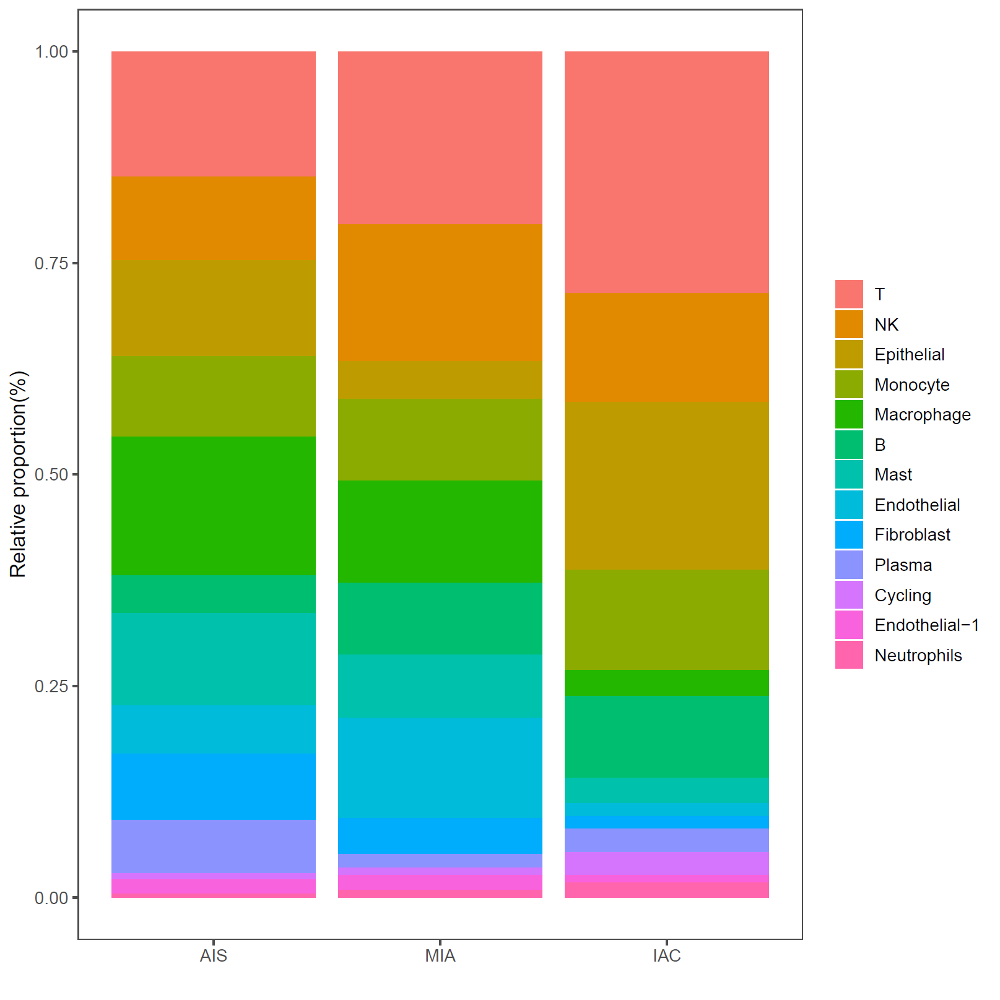

#### Cell Type Annotation
Author: "Xiaoqian Jiang"  
Date: "Created on  Jan 04, 2025"  

#### Introduction
This script performs cell type annotation in single-cell RNA sequencing (scRNA-seq) data using a combination of methods to achieve accurate and reliable results.   
Cell type identification relies on biological expertise to manually evaluate gene expression patterns and assign cell subpopulation labels. This involves analyzing dot plots of marker gene expression and cluster distributions in dimensionality reduction plots, such as UMAP. For clusters with ambiguous gene expression profiles, an extended set of marker genes is used to iteratively validate annotations. Additionally, fine-tuning pipeline parameters and periodically re-evaluating annotations are essential steps to ensure precision. This iterative process provides a deeper understanding of cellular heterogeneity in complex biological systems.  
Annotation methods used here include leveraging the most significant differentially expressed genes as input of CellMarker2, referencing well-known marker genes, and utilizing tools like SingleR and Azimuth for automated annotation.

#### Step 1: Set the clean environment and Load the required libraries and data


```{r setup, eval=FALSE}

Sys.setenv(LANGUAGE = "en")
options(stringsAsFactors = FALSE)
rm(list=ls())
set.seed(123456)
setwd("C:/Users/xqbus/Desktop/sg_rnaseq/")
getwd()

library(Seurat)
library(patchwork)
library(dplyr) 

lnames = load("./rdata/scRNA_harmony.Rdata")
scRNAall <- scRNA_harmony
table(Idents(scRNAall))


```

#### Step 2: Find top 10 DEG Markers in all 8 clusters and use CellMarker 2.0 to annotation 
```{r CellMarker, eval=FALSE}

# Test using MAST, wilcox is also used commonly
# Time consuming: 90 minutes by using 45,000 cells with 15 clusters in teh mode of test.use="MAST".
# If the cell number is huge (>50,000), should use downsample to reduce running time
# scRNAall_part =subset(scRNAall,downsample=100)

markers <- FindAllMarkers(object = scRNAall, test.use="MAST" , 
                          
                          # only keep the positive expression genes
                          only.pos = TRUE, 
                          
                          logfc.threshold = 0.5,
                          min.pct = 0.25)

write.csv(markers, file = "./rdata/markers1.csv", row.names = T)

# marker genes ranked in the top N lgFC of each cluster were selected
N=5
top = markers %>% group_by(cluster) %>% top_n(n = N, wt = avg_log2FC) 
deg_markers <- top$gene

# Save deg_markers in a txt file to as the input of CellMarker 2.0
write.table(paste(deg_markers, collapse = ","), 
            file = "./rdata/CellMarker_gene.txt", sep = ",", 
            row.names = FALSE, col.names = TRUE, quote = FALSE)


p1 <- DotPlot(scRNAall, features = unique(deg_markers),
              assay='RNA' )  + coord_flip()
p2 <- DimPlot(scRNAall, reduction = "umap", group.by = "RNA_snn_res.0.2", label = T)
p1|p2
ggsave(filename="marker_dotplot_umap.pdf",path = "results/",width = 18, height = 15)

```
The figure illustrates the top 5 differentially expressed genes for each cluster (left panel) and their corresponding cluster locations on the UMAP plot (right panel). In the dot plot, the size of the dots represents the percentage of cells expressing the gene within the cluster, while the color intensity reflects the average expression level. The UMAP plot highlights the spatial distribution of clusters.

 


```{r CellMarker_result, eval=FALSE}
# Use CellMarker 2.0 to annotate the cell type manually with http://117.50.127.228/CellMarker/CellMarker_annotation.jsp
# The annotation by cellmarker is as follows:

# "0"="Naive-T"，
# "1"="Anti-tumor T"，
# "2"="Alveolar epithelial(AT2)"， 
# "3"="Dendritic(cDC2)"，
# "4"="Alveolar macrophage"，
# "5"="Follicular B" ，
# "6"="Mast"，
# "7"="Endothelial"，
# "8"="Cancer-associated fibroblast"，
# "9"="Plasma"， 
# "10"="Cycling"，
# "11"="Alveolar"
# "12"="Epithelial/Ciliated-cell"， 
# "13"="Monocyte"，
# "14"="Lymphatic endothelial"，
# "15"="Basal-like"， 
```

#### Step 3: Using wellknown gene marker to annotation
```{r wellknown_maker, eval=FALSE}

# List the maker in the paper supplements as follows:
genes_to_check <- list(Tcells = c("CD2","CD3D","CD3E","NKG7"),
                       Bcells = c("CD79A","MS4A1"),
                       SMC = c("ACTA2","CNN1","PLN"),
                       MonoMacro = c("CD14","CD68","CD163"),
                       Dendriticcells = c("CD1C","CLEC9A","CLEC10A","LILR4"),
                       Mastcells = c("TPSAB1","TPSB2","CPA3"),
                       Fibroblasts = c("PDGFRA","FN1","DCN","LUM"),
                       Pericyte = c("MYH11","RGS5","MCAM","NOTCH3"),
                       Endothelialcells = c("PECAM1","VWF","PLVAP","CD34"),
                       Neutrophils = c('CSF3R','FCGR3B','CXCL8'))

p_all_markers <- DotPlot(scRNA_harmony, features =genes_to_check, assay = "RNA") + 
  theme(axis.text.x = element_text(angle = 45, vjust = 0.5, hjust=1),
        axis.title = element_blank()) 

p_all_markers
ggsave(filename="marker_dotplot_umap2.pdf",p_all_markers, path = "results/",width = 20, height = 8)

```
The figure illustrates the expression of known marker genes across different clusters, aiding in the identification of cell types. Each dot represents a marker gene's expression in a specific cluster, with dot size indicating the percentage of cells expressing the gene and color intensity reflecting the average expression level. 

 


```{r wellknown_result, eval=FALSE}
# The annotation by well-known markers is as follows:

# "0"="T"，
# "1"="T"，
# "2"="？"， 
# "3"="MonoMacro"，
# "4"="MonoMacro"，
# "5"="B" ，
# "6"="Mast"，
# "7"="Endothelial"，
# "8"="Fibroblast"，
# "9"="?"， 
# "10"="?"，
# "11"="?"
# "12"="?"， 
# "13"="Neutrophils"，
# "14"="Endothelial"，
# "15"="MonoMacro"， 
```


#### Step 4: Using SingleR to annotate single-cell RNA-seq data

```{r SingleR, eval=FALSE}
library(celldex)
library(SingleR)

# Download SingleR annotation database as local data.
ref <- celldex::HumanPrimaryCellAtlasData()

data <- LayerData(scRNAall, assay = "RNA", layer = "data")

cellpred <- SingleR(test = data, 
                    ref = ref, 
                    labels = ref$label.main,
                    clusters = scRNAall$RNA_snn_res.0.05,
                    assay.type.test="logcounts", 
                    assay.type.ref="logcounts",
                    num.threads = 3)

celltype <- data.frame(ClusterID = rownames(cellpred), celltype = cellpred$labels)
celltype
write.csv(celltype, file = "../rdata/SingleR_anno.csv", row.names = F)

#check the reliability of SingleR annotation
plotScoreHeatmap(cellpred)

# Keep the figure manually with filename="SingleR_anno_heatmap.pdf", width = 15, height = 12

```
The figure shows the annotation results generated using SingleR, where clusters are matched to reference cell types based on similarity scores. The heatmap displays the prediction scores for each cluster across various reference cell types, with higher scores (yellow) indicating stronger associations. The clear and distinct high-score regions for most clusters demonstrate the  accuracy of the SingleR annotation.  
 

```{r SingleR_result, eval=FALSE}
# The annotation by SingleR is as follows:
# "0"="T"，
# "1"="NK"，
# "2"="Epithelial"， 
# "3"="Monocyte"，
# "4"="Macrophage"，
# "5"="B" ，
# "6"="NK"，
# "7"="Endothelial"，
# "8"="Smooth_muscle"，
# "9"="NK"， 
# "10"="Monocyte"，
# "11"="NK"
# "12"="Epithelial"， 
# "13"="Neutrophils"，
# "14"="Endothelial"，
# "15"="Monocyte"， 

```


##### Step 5: Using Azimuth celltype prediction 
```{r Azimuth, eval=FALSE}
exp1=LayerData(scRNAall, assay="RNA", layer='data')
saveRDS(exp1,file = "exp.rds")

# upload the file to the website to get the annotation: https://azimuth.hubmapconsortium.org/
# Time consuming: 10 minutes with 45,000 cells

```
The annotation results from Azimuth are challenging to integrate directly with self-produced clustering results due to differences in cluster definitions. However, they can still serve as a valuable reference for comparison with self-clustered results, providing additional insights and validation for cell type identification.  
 

##### Step 6: Cell types annotation combined all methods and visualization.
```{r final_anno, eval=FALSE}

# Clusters (15) with very small cell numbers (<200) that cannot be annotated were removed here, to get a clean figure.
table(scRNAall$seurat_clusters)

scRNAall=subset(scRNAall,ident=c(0:14))
DimPlot(scRNAall)
table(scRNAall$seurat_clusters)

# Combined all the annotation results from different methods, the cell-type annotation is as follows:
# Time consuming: 2 hours repeat-checked manually

Idents(scRNAall)="seurat_clusters"
scRNAall <- RenameIdents(scRNAall,
                         `0` = "T",
                         `1` = "NK",
                         `2` = "Epithelial",
                         `3` = "Monocyte",
                         `4` = "Macrophage",
                         `5` = "B",
                         `6` = "Mast",
                         `7` = "Endothelial",
                         `8` = "Fibroblast",
                         `9` = "Plasma",
                         `10` = "Cycling",
                         `11` = "Endothelial-1",
                         `12` = "Epithelial",
                         `13` = "Neutrophils",
                         `14` = "Endothelial")

scRNAall$celltype = scRNAall@active.ident
table(scRNAall$celltype)

Idents(scRNA) <- scRNA$celltype
save(scRNAall, file = "./rdata/scRNAall.Rdata")

```
##### Step 6.1: DimPlot to show the different classification effect.
```{r DimPlot, eval=FALSE}
# Umap with group by cell types.
# Notice: function 5. "shrunk_dimplot" and 1. "my36colors" should added firstly from file "all_functions.R"  

shrunk_dimplot(scRNAall)
ggsave('Final_annotation_umap.pdf',path = "results/", width = 12,height = 9)


```
The UMAP plot showcases the final cell type annotations, with distinct clusters labeled according to their predicted identities. Major cell types identified include 13 celltypes: T cells, NK cells, epithelial cells, monocytes, macrophages, B cells, mast cells, fibroblasts, endothelial cells, plasma cells, and cycling cells, et.a,.    
 


##### Step 6.2: Feature Plot to show the distribution of marker gene expression in major cell types.
```{r Feature_plot, eval=FALSE}

#select high expression gene marker according to dotplot
gene <- c('TRAC','GZMH','SCGB3A1', 'MS4A1','F13A1', 'MS4A1', 'TPSAB1','EMCN','BMP5', 'IGHG1',
          'MKI67','DCN')

p1 <- FeaturePlot(scRNAall, features = gene, combine = FALSE,ncol=4,raster=FALSE )

#& NoLegend() & NoAxes() 
scalecol <- scale_color_gradientn( colours = c('lightgrey', "#E64A35"),  limits = c(0, 6))
p2 <- lapply(p1, function (x) x + scalecol)   
wrap_plots(p2, ncol = 4)
ggsave('FeaturePlot_marker.pdf',path = "results/", width = 15,height = 12)

```
Feature Plots illustrating the distribution of marker gene expression across major cell types identified in the dataset. Each plot corresponds to a specific marker gene, with color intensity indicating the expression level within the UMAP embedding. For example, genes such as TRAC and GZMH show specific expression patterns in T and NK cell populations, while SCGB3A1 and MS4A1 are enriched in epithelial and B cell clusters, respectively.   
 

##### Step 6.3: BarPlot to show the probability of major cell types in 3 cancer stage

```{r BarPlot, eval=FALSE}

scRNAall$sample = factor(scRNAall$group,levels = c('AIS','MIA','IAC'))
tmp=table(scRNAall$sample, scRNAall$celltype)
tmp

bar_ratio <- as.data.frame(tmp)%>% 
  group_by(Var1) %>%
  mutate(sum(Freq)) %>%
  mutate(percent = Freq / `sum(Freq)`)
#View(bar_ratio) 

p1 <- ggplot(bar_ratio, aes(x = percent, y = Var1)) +
  geom_bar(aes(fill = Var2) , stat = "identity") + 
  coord_flip() +labs(y = " ", fill = NULL) +
  labs(x = 'Relative proportion(%)') +
  theme(axis.ticks = element_line(linetype = "blank"),
        panel.background = element_rect(fill = NA),
        panel.grid.minor = element_line(colour = NA,linetype = "blank")) +
  theme_few()
p1

ggsave(p1, filename="cell_probability1.pdf",path = "results/",width = 8,height = 8)

```
The bar plot illustrates the relative proportions of major cell types across three stages: AIS (adenocarcinoma in situ), MIA (minimally invasive adenocarcinoma), and IAC (invasive adenocarcinoma). The distribution shows dynamic changes in the cellular composition, with certain cell types, such as epithelial cells and T cells, displaying varying proportions across the stages. Notably, immune cell types like macrophages and monocytes are consistently present, while other populations, such as fibroblasts and endothelial cells, show stage-specific differences.   
 


