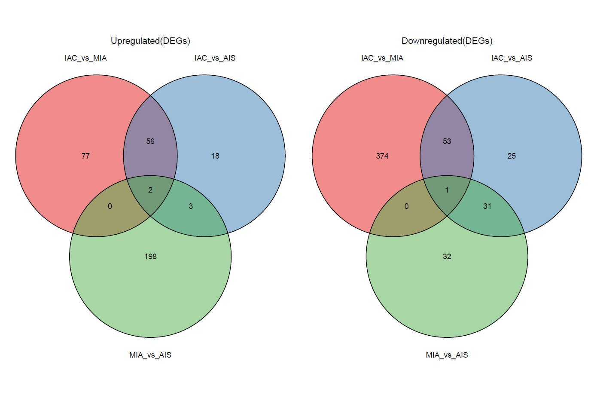
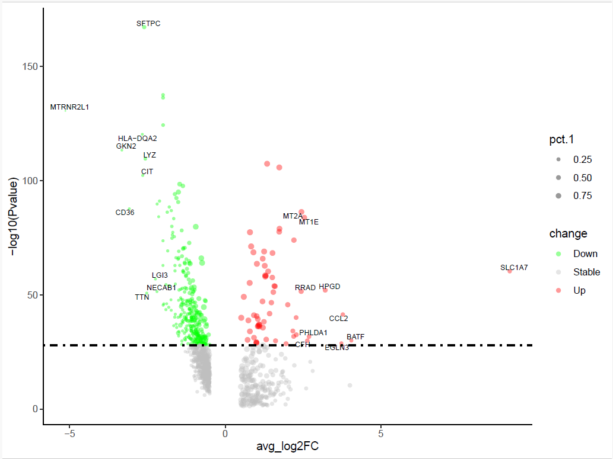

#### Differential Gene Expression Analysis
Author: "Xiaoqian Jiang"  
Date: "Created on  Jan 04, 2025" 

#### Introduction

This workflow identifies and analyzes differentially expressed (DE) genes to uncover key molecular signatures and biological insights. The results are visualized using tools such as volcano plots, heatmaps, and other graphical formats to highlight significant gene expression changes and patterns across conditions or clusters. This process provides a comprehensive understanding of the functional roles of DE genes in the studied system.

#### Step 1: Set the clean environment and Load the required libraries
```{r setup, eval=FALSE}
Sys.setenv(LANGUAGE = "en")
options(stringsAsFactors = FALSE)
rm(list=ls())
set.seed(123456)
setwd("C:/Users/xqbus/Desktop/sg_rnaseq/")
getwd()

library(Seurat)
library(patchwork)
library(ggplot2)
library(tidyverse)
library(pheatmap)

```

#### Step 2: Find Different Expression Genes
```{r Step2, eval=FALSE}

lnames = load("./rdata/scRNAall.Rdata")
lnames

scRNA = scRNAall
names(scRNA@meta.data)
as.character(unique(scRNA$orig.ident))
tmp <- c("IAC", "MIA", "AIS")

#Assign filter threshold of avg_log2FC and p_val_adj to define DEGs
logfoldchange = 0.5
pvalue = 0.05
pctvalue =0.25

```

##### Step 2.1: Find all the DEGs among 13 cell types
```{r Step2.1, eval=FALSE}

# Time consuming: 4 hours 30 minutes (270minutes) by using 45,000 cells with 15 celltypes with test.use="MAST" 
# Time consuming: 5 minutes with test.use="wilcox", and the results are similar.

markers_cluster <- FindAllMarkers(object = scRNA, test.use="wilcox" ,

                                  # keep the positive and negative expression genes
                                  only.pos = F,
                                  
                                  logfc.threshold = logfoldchange,
                                  min.pct = pctvalue
                                  )
markers_cluster$regulation <- ifelse(markers_cluster$avg_log2FC > 0, "Up", "Down")

write.csv(markers_cluster, file = "./rdata/markers_cluster.csv", row.names = T)

```

##### Step 2.2:  Find all the DEGs among 3 cancer types
```{r Step2.2, eval=FALSE}

table(Idents(scRNA)<- scRNA$celltype)

# Produce all possible combination except self.
sample_pairs <- combn(tmp, 2, simplify = FALSE)
  
# using maapply function to realize loops and speed.
# Notice: function 6. "My_findmarkers" should added firstly from file "all_functions.R"

markers_group <- mapply(function(x, y) {
  
  # Find markers between ident.1 and ident.2 for the current cell type
  My_findmarkers(scRNA, logfoldchange, pvalue, pctvalue, only.pos = FALSE,x,y)
  
},  x = sapply(sample_pairs, "[", 1), y = sapply(sample_pairs, "[", 2), SIMPLIFY = FALSE)

# Rename list elements
names(markers_group) <- sapply(sample_pairs, function(pair) paste(pair, collapse = "_vs_"))


```

##### Step 2.3: Find DEGs in each of 13 cell types among 3 cancer types

```{r step2.3, eval=FALSE}
# Define the celltype and groups
cell_types <- unique(scRNA$celltype)

combinations <- expand.grid(sample_pairs = sample_pairs, celltype = cell_types) %>%
  cbind(sample1 = sapply(sample_pairs, "[", 1), sample2 = sapply(sample_pairs, "[", 2)) 
combinations<-  combinations[,c(3,4,2)]

# Loop through combinations of groups and cell types to find DEGs and filter them
markers_celltype <- mapply(function(sample1, sample2, celltype) {
  
  # Subset the data for the current cell type
  scRNA_subset <- subset(scRNA, idents = celltype)
  
  # Find DEGs between the groups for the current cell type
  My_findmarkers(scRNA_subset, logfoldchange, pvalue, pctvalue, only.pos = FALSE,sample1,sample2)
  
}, combinations$sample1, combinations$sample2, combinations$celltype, SIMPLIFY = FALSE)

# Naming the list elements
names(markers_celltype) <- apply(combinations, 1, function(x) paste(x, collapse = "_vs_"))
#lapply(markers_celltype,nrow)


```

```{r savedeg, eval=FALSE}
Save all the DEGs info.
save(markers_cluster, markers_group, markers_celltype, file = "./rdata/markers_total.Rdata")

```
#### Step 3: Visualization of Differentially Expressed Genes (DEGs)

##### Step 3.1: Heatmap of Top DEGs Across Groups and Cell Types
Generate a heatmap to visualize the top DEGs across 39 classes, derived from the combination of 3 groups and 13 cell types.

```{r step3.1, eval=FALSE}

# Using lapply to deal with each markers_celltype
N <- 5 # Define the top N DEGs for each cell type
results_list <- lapply(seq_along(markers_celltype), function(i) {
  
  # Get the current data frame
  df <- markers_celltype[[i]]
  
  # Select the top N DEGs based on the adjusted p-value
  pos_genes <- df %>% 
    filter(regulation == "Up") %>% # Arrange by p-value in ascending order
    arrange(p_val_adj) %>%  # Select the top N rows
    slice_head(n = N)   # Extract the gene names 
  
  neg_genes <- df %>% 
    filter(regulation == "Down") %>% 
    arrange(p_val_adj) %>% 
    slice_head(n = N)  
  
  # return a list including all 2 types of DEGs 
  list(
    Combination = names(markers_celltype)[i],
    Pos_Genes = pos_genes,
    Neg_Genes = neg_genes)
})

# BUild heatmap data from results_list

heatmap_data <- lapply(seq_along(results_list), function(i) {
  
  # Abstract Pos_Genes,  Neg_Genes, and  Combination as group name
  data <- results_list[[i]]$Pos_Genes
  group_name <- results_list[[i]]$Combination
  
  # Choose gene name, avg_log2FC, and group name as dataframe. 
  data.frame(Gene = rownames(data), avg_log2FC = data$avg_log2FC, Group = group_name)
}) %>% 
  bind_rows() %>%  
  # fill NA value with 0  
  pivot_wider(names_from = Group, values_from = avg_log2FC, values_fill = list(avg_log2FC = 0))  %>%
  column_to_rownames(var = "Gene")

# Draw heatmap
pdf("./results/markers_top5_heatmap.pdf",  width = 8,height = 10)
p<- pheatmap(heatmap_data,  
         cluster_rows = FALSE, 
         cluster_cols = FALSE,
         show_rownames = TRUE,
         show_colnames = TRUE,
         fontsize = 6,
         color = colorRampPalette(c( "white", "red"))(20))
dev.off()


```
The heatmap displays the differentially expressed genes (DEGs) across various cell types, comparing three conditions: MIA versus AIS (M/A), IAC versus MIA (I/M), and IAC versus AIS (I/A). Upregulated DEGs are highlighted for each cell type, with the intensity of red indicating the degree of upregulation. This visualization provides an overview of gene expression changes across cell types and conditions, capturing key molecular alterations during the progression from AIS to MIA and IAC.  

 

##### Step 3.2: Venn Diagram to Display Upregulated and Downregulated DEGs Across 3 Groups

```{r step3.2, eval=FALSE}
library(ggvenn)

# Statistic the number of up and down regulation DEGs
marker_stat = as.data.frame(lapply(markers_group,function(x){
  Up_num = sum(x$regulation == "Up")
  Down_num = sum(x$regulation == "Down")
  Total = Up_num + Down_num
  return(c(Up_num, Down_num, Total))
}))
rownames(marker_stat) = c("Up","Down","Total")
#marker_stat

# Loop through the markers_group to extract gene names for Venn diagram
up_genes <- lapply(markers_group, function(degs) {rownames(degs)[degs$regulation == "Up"]})
down_genes <- lapply(markers_group, function(degs) {rownames(degs)[degs$regulation == "Down"]})  

# Draw the Venn diagram
# Notice: function 1. "my36colors" should added firstly from file "all_functions.R" 

p_up <- ggvenn(up_genes, show_percentage = FALSE,fill_color = my36colors, stroke_size = 0.5, set_name_size = 4) +
  ggtitle("Upregulated(DEGs)") +
  theme(plot.title = element_text(hjust = 0.5))
p_down <- ggvenn(down_genes, show_percentage = FALSE,fill_color = my36colors, stroke_size = 0.5, set_name_size = 4) +
  ggtitle("Downregulated(DEGs)") +
  theme(plot.title = element_text(hjust = 0.5))
p_up|p_down
ggsave(filename="venn_up_down.pdf",path = "results/",width = 12,height = 8)


```

The Venn diagrams illustrate the overlap and distribution of upregulated DEGs (left panel) and downregulated DEGs (right panel) among the three comparison groups: MIA vs AIS, IAC vs AIS, and IAC vs MIA. The diagrams highlight the shared and unique DEGs across the groups, providing insights into the gene expression changes associated with the progression of lung adenocarcinoma stages.  


##### Step 3.3: 3D PCA Plot of DEGs 
Generate a 3D PCA plot to visualize the differentially expressed genes (DEGs) among the three groups (similar to Figure 1g in the referenced paper). The spatial distance between dots reflects the differences in gene expression profiles between the groups, providing a clear overview of their separations and relationships.  
```{r step3.3, eval=FALSE}

library(scatterplot3d)

# PCA showing the DEGs among the three groups. The distance between dots represents the difference between groups
# Actually, it can show the distance between any classes, such as only show one or two cellytpes in 9 samples.
# sc.imm=subset(sc.combined,idents = c("Epithelial","Endothelial","Stem_cell"))

avg <- AverageExpression(object = scRNA, group.by = "orig.ident")
#avg <- AggregateExpression(object = scRNA, group.by = "orig.ident")

head(avg$RNA[1:5,1:5])
tmp = as.data.frame(avg$RNA)

# Abstract names of DEGs
DEGgene =  unique(unlist(lapply(markers_group, rownames)))
DEG = tmp[rownames(tmp) %in% DEGgene,]
str(DEG)
dat = as.data.frame(t(DEG))
pca_res <- prcomp(dat, scale. = T, center = T)
head(pca_res$x)
tmp <- as.data.frame(pca_res$x)

# Get the variance explained by by PC1, PC2, PC3
variance_explained <- round((pca_res$sdev^2) / sum(pca_res$sdev^2) * 100, 2)
labels <- sapply(1:length(variance_explained), function(i)  paste0("PC", i, " (", variance_explained[i], "%)"))

# Function to calculate range and adjust to avoid finite or zero range
adjust_range <- function(values) {
  range_values <- range(values)
  range_values <- c(range_values[1] - 0.1, range_values[2] + 0.1)
  return(range_values)
}
axis_ranges <- sapply(tmp, adjust_range)

# Build color for 3 cancer group
sample_to_group <- c(
  TD1 = "IAC", TD2 = "IAC", TD9 = "IAC",
  TD3 = "MIA", TD4 = "MIA", TD6 = "MIA",
  TD5 = "AIS", TD7 = "AIS", TD8 = "AIS"
)
group_colors <- c("AIS" = "red", "MIA" = "blue", "IAC" = "green")
#Build mapping color of group to sample
sample_colors <- group_colors[sample_to_group[rownames(tmp)]]

#group_order must be consistent with tmp
group_order <- rownames(tmp)

pdf("./results/pca_3d_1.pdf",  width = 8,height = 6)
scatterplot3d(tmp[,1:3], color = sample_colors,
              pch = 16, angle = 30,
              box = TRUE, type = "p",
              lty.hide = 2, lty.grid = 2,
              xlim = axis_ranges[,"PC1"], 
              ylim = axis_ranges[,"PC2"], 
              zlim = axis_ranges[,"PC3"],
              xlab =labels[1] , ylab = labels[2], zlab = labels[3]) 

# The position in legend: "top", "bottom", "left", "right", "center", "topright", "topleft", "bottomright", or "bottomleft"
# Or can use x = 6, y = 3.0 to adjust the position accurately.
# legend("topright", legend = names(group_colors),
#        fill = group_colors, box.col = NA, cex = 0.7)

legend(x = 6, y = 3.0, legend = names(group_colors),
           fill = group_colors, cex = 0.8, bty = "n")

dev.off()


```

The 3D Principal Component Analysis (PCA) plot visualizes the differentially expressed genes (DEGs) among the three groups (AIS, MIA, and IAC). While some separation can be observed between the groups, the clustering is not highly distinct, suggesting that the gene expression profiles may share considerable overlap across the groups. This indicates that additional analysis or refinement, such as identifying more specific DEGs or using alternative dimensionality reduction techniques, may be needed to achieve clearer distinctions.  


##### Step 3.4: Dotplot Displaying Differential Analysis for Two Comparisons: IAC_vs_MIA and MIA_vs_AIS

```{r step3.4, eval=FALSE}

# Produce similar plot of markers_celltype as in Fig.1h of the paper 

table(Idents(scRNA))

# choose 100 DEGs according to absolute p value.
IACMIA <- bind_rows(
  markers_group[[1]] %>% filter(regulation == "Down") %>% slice_head(n = 100),
  markers_group[[1]] %>% filter(regulation == "Up") %>% slice_head(n = 100)
)

MIAAIS <- bind_rows(
  markers_group[[3]] %>% filter(regulation == "Down") %>% slice_head(n = 100),
  markers_group[[3]] %>% filter(regulation == "Up") %>% slice_head(n = 100)
)

ids=intersect(rownames(IACMIA),
              rownames(MIAAIS))

markergene = markers_cluster[markers_cluster$gene %in% ids,]
markergene$gene_name = rownames(markergene)

#Obtain the avg_log2FC info of each DEG in cell type in two comparisons: IAC_MIA, MIA_AIS
df <- data.frame(
  IACMIA = IACMIA[markergene$gene,'avg_log2FC'],
  MIAAIS = MIAAIS[markergene$gene,'avg_log2FC'],
  celltype = markergene$cluster,
  gene = markergene$gene_name)  %>%
  mutate(gene = gsub("\\..*", "", gene)) %>%
  group_by(gene) %>%
  slice_sample(n = 1) %>%
  ungroup()


# The method of displaying differentially expressed genes (DEGs) across three groups and various cell types using dot plots is not ideal. 
# This is because a single DEG can appear in multiple cell types with different log fold changes, leading to overlapping or confusing representations in the plot. 
# This overlap makes it difficult to clearly distinguish the specific expression patterns of DEGs across different cell types.

colnames(df)
ggplot(df, aes(x=MIAAIS, y=IACMIA,color = celltype)) +
  geom_hline(yintercept= c(0, 0), color = "black",  size=0.5) + #add hline
  geom_vline(xintercept=c(0, 0), color = "black", size=0.5)+  # add vline
  geom_point(size = 1.5)+
  xlim(-1.5,1.6)+
  ylim(-1.8,1.8)+
  labs(x = "Log2FC MIA enriched(MIA vs AIS))",
       y = "Log2FC IAC enriched(IAC vs MIA)", title = "") + 
  theme(panel.grid = element_blank(), 
        axis.line = element_line(colour = 'black', size = 1), 
        panel.background = element_blank(), 
        plot.title = element_text(size = 14, hjust = 0.5), 
        plot.subtitle = element_text(size = 14, hjust = 0.5), 
        axis.text = element_text(size = 14, color = 'black'), 
        axis.title = element_text(size = 14, color = 'black'))+
  theme(legend.position = "right")+
  theme_few()+
  geom_text_repel(data=df, aes(label=gene), color="black", size=2, fontface="italic", 
                  max.overlaps = 10,
                  point.padding = 0.3, segment.color = 'black', segment.size = 0.3, force = 1, max.iter = 3e3)

ggsave(filename="dot_log2fc among 2 comparison_1.pdf",path = "results/",width = 8,height = 6)


```
The scatter plot illustrates changes in cell type-specific gene expression across the three stages of LUAD (AIS, MIA, and IAC). The x-axis represents the log2 fold change (Log2FC) for MIA vs. AIS, while the y-axis represents the Log2FC for IAC vs. MIA. Genes enriched in both comparisons are positioned closer to the diagonal quadrants, indicating their progressive upregulation or downregulation across the stages. The color coding highlights the specific cell types associated with each gene. 


##### Step 3.5:  Volcano plot

##### Step 3.5.1: Differential Gene Expression (DGE) Analysis Showing Upregulated and Downregulated Genes Across All 13 Cell Types


```{r step3.5.1, eval=FALSE}


r.deg <- subset(markers_cluster, pct.1 > 0.5 & abs(avg_log2FC) > 1)
r.deg <- r.deg %>%
  mutate(threshold = as.factor(ifelse(avg_log2FC > 0, 'Up', 'Down')),
         adj_p_signi = as.factor(ifelse(abs(avg_log2FC) > 2, 'Highly', 'Lowly')),
         thr_signi = paste0(threshold, "_", adj_p_signi),
         unm = as.numeric(factor(cluster, levels = names(table(Idents(scRNA))))) - 1)
dim(r.deg)

# Pick up the top log2FC gene to show their game
N <- 5
top_up_label <- r.deg %>% 
  subset(., threshold%in%"Up") %>% 
  group_by(cluster) %>% 
  top_n(n = N, wt = avg_log2FC) %>% 
  as.data.frame()

top_down_label <- r.deg %>% 
  subset(., threshold %in% "Down") %>% 
  group_by(cluster) %>% 
  top_n(n = -N, wt = avg_log2FC) %>% 
  as.data.frame()

top_label <- rbind(top_up_label,top_down_label)
top_label$thr_signi %<>% 
  factor(., levels = c("Up_Highly","Down_Highly","Up_Lowly","Down_Lowly"))


# Prepare the grey background data, i.e., the range of logFC of genes 
background_position <- r.deg %>%
  dplyr::group_by(unm) %>%
  # `summarise()` ungrouping output (override with `.groups` argument)
  dplyr::summarise(Min = min(avg_log2FC) - 0.2, 
                   Max = max(avg_log2FC) + 0.2, 
                   cluster = dplyr::first(cluster)) %>%
  mutate(unm = as.numeric(unm),  # unm should be numeric
         start = unm - 0.4,  
         end = unm + 0.4,
  )

# Prepare the middle color bar data 
cluster_bar_position <- background_position %>%
  mutate(start = unm - 0.5,  
         end = unm + 0.5,     
         unm = factor(unm, levels = as.character(0:max(as.vector(unm)))),
  )  


# plot  
p= ggplot() +
  # Add the grey backgound
  geom_rect(data = background_position, aes(xmin = start, xmax = end, ymin = Min, ymax = Max),
            fill = "#525252", alpha = 0.1) + 
  # Add the gene point 
  geom_jitter(data = r.deg, aes(x =unm, y = avg_log2FC, colour = thr_signi),
              size = 1,position = position_jitter(seed = 1)) +
  scale_color_manual(values = my36colors[c(2,5,8,1)]) +
  scale_x_continuous(limits = c(-0.5, max(r.deg$unm) + 0.5),# Adjust the axis range
                     breaks = background_position$unm,
                     label = background_position$cluster) + 
  # Add marker gene name based on top_label
  geom_text_repel(data = top_label, aes(x =unm, y = avg_log2FC, label = gene),
                  position = position_jitter(seed = 1), show.legend = F, size = 2.5,
                  box.padding = unit(0, "lines")) +
  # Add the middle color bar
  geom_rect(data = cluster_bar_position, aes(xmin = start, xmax = end, ymin = -0.4,
                                             ymax = 0.4, fill = cluster), color = "black", alpha = 1, show.legend = F) +
  scale_fill_manual(values = my36colors) +
  labs(x = "Cluster", y = "average log2FC") +
  theme_bw()
p

# Adjust the border and text of the figure manually and check
plot1 <- p + theme(panel.grid.minor = element_blank(), ##remove grid lines
                   panel.grid.major = element_blank(),
                   axis.text.y = element_text(colour = 'black', size = 14),
                   
                   # !!!!! using vjust to adjust the position of cluster names in the box according to ggsave setting
                   axis.text.x = element_text(colour = 'black', size = 10, vjust = 69), 
                   panel.border = element_blank(), ## remove axis 
                   axis.ticks.x = element_blank(), ## remove x-axis labels
                   axis.line.y = element_line(colour = "black")) #add y-axis labels
plot1

ggsave(plot1, filename="multiple_celltype_scattor.pdf",path = "results/",width = 12,height = 8)


```

The plot illustrates the differential gene expression analysis across all identified clusters, highlighting upregulated (red and pink) and downregulated (blue and orange) genes based on an adjusted p-value threshold of < 0.01. Each cluster is represented along the x-axis, with individual genes displayed as dots positioned according to their average log2 fold change (y-axis). Highly significant genes are marked in brighter colors (red for upregulated, blue for downregulated), providing a clear view of the most prominent expression changes across cell types. Top 5 marker genes such as SCGB3A1 in epithelial cells and S100A8 in neutrophils are prominently displayed, offering insights into the unique gene expression patterns within each cluster.  


##### Step 3.5.2: Single Volcano Plot for a Specific Cell Type (Epithelial Cells) Comparing Two Groups: IAC_vs_MIA 
```{r step3.5.2, eval=FALSE}
degdf <- markers_celltype$IAC_vs_MIA_vs_Epithelial
P.Value_t = 1e-28
degdf$change = ifelse(degdf$p_val_adj < P.Value_t & degdf$avg_log2FC < 0,"Down",
                      ifelse(degdf$p_val_adj < P.Value_t & degdf$avg_log2FC > 0,"Up","Stable"))

# Pick up the top log2FC gene to show their game
N <- 10
top_up_label <- degdf %>% 
  subset(., change%in%"Up") %>% 
  top_n(n = N, wt = avg_log2FC) 

top_down_label <- degdf %>% 
  subset(., change %in% "Down") %>% 
  top_n(n = -N, wt = avg_log2FC) 

top_label <- rbind(top_up_label,top_down_label)

# Volcano plot
p <- ggplot(degdf, aes(x=avg_log2FC,y=  -log10(p_val_adj),  size=pct.1)) +
  geom_point(alpha=0.4,  aes(color=change)) +
  ylab("-log10(Pvalue)")+
  scale_color_manual(values=c("green", "grey","red"))+
  geom_hline(yintercept = -log10(P.Value_t),lty=4,col="black",lwd=0.8) +
  
  geom_text_repel(data = top_label, aes(x =avg_log2FC, y = -log10(p_val_adj), label = rownames(top_label)),
                  position = position_jitter(seed = 1), show.legend = F, size = 2.5,
                  box.padding = unit(0, "lines")) +
  theme_bw() +
  theme(panel.border = element_blank(),panel.grid.major = element_blank(),
        panel.grid.minor = element_blank(),axis.line = element_line(colour = "black")) + 
  scale_size(range = c(0.2, 2))
p

ggsave(p, filename="volcano_IAC_vs_MIA_vs_Epithelial.pdf",path = "results/",width = 8,height = 6)

```
The volcano plot illustrates the differentially expressed genes (DEGs) in epithelial cells between the IAC and MIA groups. Genes with significant upregulation are shown in red (right side, positive log2 fold change), while significantly downregulated genes are in green (left side, negative log2 fold change). The x-axis represents the average log2 fold change (log2FC), indicating the magnitude of expression change, while the y-axis shows the negative log10-transformed p-values, highlighting the statistical significance of these changes. Larger points indicate a higher percentage of cells expressing the gene (pct.1).     



