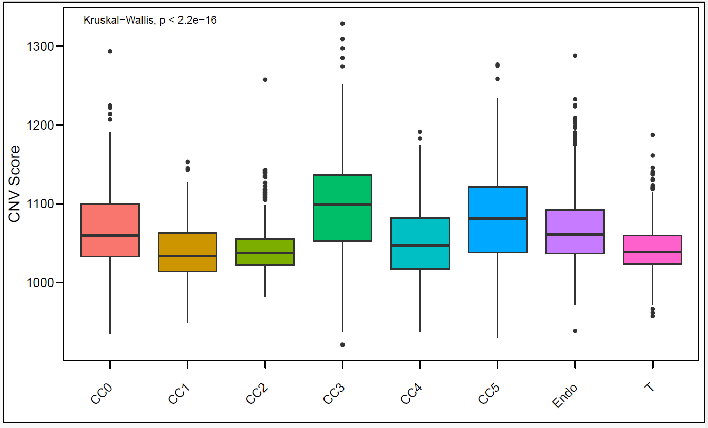

#### Analysis of Epithelial Cells: Subtype Identification and CNV Inference
Author: "Xiaoqian Jiang"  
Date: "Created on  Jan 06, 2025"  

#### Introduction
Lung cancer predominantly originates from epithelial cells, making them a critical focus for understanding tumor progression and heterogeneity. This analysis aims to identify epithelial cell subtypes, assess their potential transformation into cancerous states, and explore their roles in lung cancer development. A key component of this study is the inference of copy number variation (CNV) using inferCNV, which provides insights into genomic alterations that may drive tumorigenesis.   
The document outlines the methodologies employed for these analyses, including cell subtype classification, CNV profiling, and the integration of these findings to elucidate the epithelial cells' contribution to lung cancer progression.

#### Step 1: Set the clean environment and Load the required libraries 

```{r step1, eval=FALSE}

Sys.setenv(LANGUAGE = "en")
options(stringsAsFactors = FALSE)
rm(list=ls())
set.seed(123456)
setwd("C:/Users/xqbus/Desktop/sg_rnaseq/")
getwd()

library(Seurat)
library(patchwork)
library(ggplot2)
library(dplyr)
library(ggthemes)
library(tidyverse)
library(pheatmap)
library(magrittr)
library(ggrepel)
library(harmony)
library(clustree)

lnames = load("./rdata/scRNAall.Rdata")
table(Idents(scRNAall))

```

#### Step 2: Epithelial cell subclass
```{r step2, eval=FALSE}

# Repeat the part of cell type annotation process in "3.Annotation.R"

# Extract epithelial cells and Create a SeuratObject
Epi=subset(scRNAall,idents=c("Epithelial"))
Idents(Epi)<-Epi$orig.ident
#table(Idents(Epi))

# Construct a new Seurat object using extracted cells
Epi_sce = CreateSeuratObject(counts = GetAssayData(Epi, assay="RNA", layer='counts'),   
                             
                             # Keep all information in meta.data
                             meta.data = Epi@meta.data)  


## Conduct normalization, find high variable gene, and run pca, umap
Epi_sce <- NormalizeData(Epi_sce) %>% FindVariableFeatures() %>% ScaleData() %>% 
  RunPCA(verbose=FALSE)

ElbowPlot(Epi_sce, ndims=50, reduction="pca")
Epi_sce <- FindNeighbors(Epi_sce, reduction = "pca", dims = 1:20)  

resolution_list = c(0.01, 0.05, 0.1, 0.2, 0.3, 0.5,0.8,1)
Epi_sce = FindClusters(Epi_sce,resolution = resolution_list)
Epi_sce <- RunUMAP(Epi_sce, reduction = "pca", dims = 1:20, reduction.name = "umap")

#Cluster tree and dimplot to show the effect of different solution
clustree(Epi_sce)
ggsave(filename="Tree_diff_epithial.pdf",path = "results/",width = 10, height = 8)

plot_list <- lapply(resolution_list, function(res) {
  name <- paste0("RNA_snn_res.", res)
  print(name)
  DimPlot(Epi_sce, reduction = "umap", group.by = name)
})

combined_plot <- Reduce(`+`, plot_list) + plot_layout(ncol = ceiling(sqrt(length(resolution_list))))
pdf(file = "./results/resolution_diff2_epithial.pdf", width = 15, height = 15)
print(combined_plot)
dev.off()

#Check the resolution to find the best cluster, and here 0.1 was chosen.
Epi_sce$seurat_clusters <- Epi_sce$RNA_snn_res.0.1
Idents(Epi_sce) <- Epi_sce$seurat_clusters 

p1<- DimPlot(Epi_sce, reduction = "umap", cols = my36colors, group.by = "seurat_clusters") 


# Find top 10 DEG Markers in all 6 clusters and use CellMarker 2.0 to annotation
markers <- FindAllMarkers(object = Epi_sce, test.use="wilcox" , 
                          
                          # only keep the positive expression genes
                          only.pos = TRUE, 
                          
                          logfc.threshold = 0.5,
                          min.pct = 0.25)

top = markers %>% group_by(cluster) %>% top_n(n = 5, wt = avg_log2FC) 
deg_markers <- top$gene
p2 <- DotPlot(Epi_sce, features = unique(deg_markers),
        assay='RNA' )  + coord_flip()
p1+p2
ggsave(filename="marker_dotplot_epithelial_1.pdf", path = "results/",width = 20, height = 8)

```

The UMAP plot (left) displays epithelial cell clusters, and the dot plot (right) illustrates the expression levels of marker genes associated with normal or cancerous states across these clusters.   
     
Based on the marker gene expression:
Cluster 1 (high expression of DCN) is inferred to represent normal epithelium.  
Clusters 0 (high expression of MEG3) and 3 (high expression of IGFBP3) are identified as cancerous epithelial cells.  
Clusters 2, 4, and 5 exhibit mixed or uncertain expression patterns, and their cancer status cannot be confidently determined.  
Further validation may be required for clusters with uncertain states.

#### Step 3:  Identify tumor cells by inferCNV and cnvscore  

##### Step 3.1: Prepare all the input files of infercnv  
inferCNV requires three types of input files:  
Gene Expression Matrix: This file contains the gene expression data.  
Gene Ordering File: This file lists the genes in the order they are analyzed.  
Cell Annotation File (Reference File): This file categorizes cells, typically into normal and cancerous cells.  

The choice of the reference group (ref_group) is critical for accurate inferCNV analysis:  
Optimal Scenario: Ideally, a group of normal cells should be used as the reference.   
Alternative Option: Immune cells can serve as a reference but are not universally ideal.  

```{r step3.1, eval=FALSE}

library(infercnv)
library(readr)

# Downloaded gene annotation file: using human hg38 "hg38_gencode_v27.txt": https://data.broadinstitute.org/Trinity/CTAT/cnv/hg38_gencode_v27.txt
gencode <- read_tsv("./rdata/hg38_gencode_v27.txt", col_names = c("gene", "chr", "start", "end"))

# Preparing cell annotation file
# Adding C first, and change cluster name, check data
Epi_sce$cnv <- paste0("C", Idents(Epi_sce))
table(Epi_sce$cnv)
Idents(Epi_sce) = Epi_sce$cnv

#This infer CNV step is time consuming, so only keep N cells in each cluster  
N=250

seurat_object <- subset(Epi_sce, downsample=N)
table(Idents(seurat_object))

# Abstract Endothelial and T cells as reference cell
table(scRNAall$celltype)

Endothelial = scRNAall[, scRNAall$celltype %in% c( 'Endothelial' )]
table(Endothelial$celltype)
Endothelial <- subset(Endothelial, downsample=4*N)

T = scRNAall[, scRNAall$celltype %in% c( 'T' )]
table(T$celltype)
T <- subset(T, downsample=4*N)

endoMat <-as.data.frame(Endothelial[["RNA"]]$counts )  
TMat <- as.data.frame(T[["RNA"]]$counts) 

spike_mat1 = endoMat
spike_mat2 = TMat

epiMat <- as.data.frame(Epi_sce[["RNA"]]$counts) 

epiMat <- as.data.frame(seurat_object[["RNA"]]$counts) 
epiMat <- epiMat [,unique(colnames(epiMat))]
spike_mat1 = spike_mat1 [,unique(colnames(spike_mat1))]
spike_mat2 = spike_mat2 [,unique(colnames(spike_mat2))]
save(spike_mat1,spike_mat2,file = './rdata/reference_mat.Rdata') 
#lnames = load("reference_mat.Rdata")


# Take epiMat and spike_mat1 gene intersection
ids = intersect(rownames(epiMat),rownames(spike_mat1))
dim(spike_mat1[ids,])
dim(spike_mat2[ids,])
dim(epiMat[ids,])
this_dat=cbind(epiMat[ids,],spike_mat1[ids,],spike_mat2[ids,])

#Take gencode and single cell gene intersection
gencode <- gencode[!duplicated(gencode$gene),]
common_genes <- intersect(gencode$gene, rownames(this_dat))
length(common_genes)
dat= this_dat[common_genes,]
phe = seurat_object@meta.data
(phe$cnv)[1:5]

# ref-1, ref-2 as refence groups, stands for Endo and t cell, respectively
groupinfo=data.frame(v1=colnames(dat),
                     v2=c( phe$cnv ,
                           rep('ref-1',length(spike_mat1[ids,])),
                           rep('ref-2',length(spike_mat2[ids,])))
)
rownames(groupinfo) <- groupinfo$v1
groupinfo$v1 <- NULL
head(groupinfo) 
groupFiles='./rdata/groupFiles.txt'
table(groupinfo$v2)
write.table(groupinfo,file = groupFiles,
            sep = '\t',quote = F,col.names = F,row.names = TRUE)
print(dim(dat))

#preparing the gene expression matrix
matrix_counts <- as.data.frame((GetAssayData(Epi_sce, assay="RNA", layer='counts'))[common_genes,])

#include ref-1, ref-2 gene expression matrix in the raw_counts_matrix
matrix <-  cbind(matrix_counts,spike_mat1[common_genes,], spike_mat2[common_genes,])

```


##### Step 3.2: Run infercnv
```{r step3.2, eval=FALSE}

infercnv_obj = CreateInfercnvObject(raw_counts_matrix=matrix,
                                    annotations_file=groupinfo,
                                    delim="\t",
                                    
                                    #Must use the file.txt rather than genecode
                                    gene_order_file= "./rdata/hg38_gencode_v27.txt", 
                                    ref_group_names=c('ref-1',
                                                      'ref-2'))  

# Time consuming: 8 minutes by using 1500 cells as input and 2000 cells as reference with 5 node.
# Notice that all the TRUE must be TRUE, cannot be written by "T"
infercnv_obj2 = infercnv::run(infercnv_obj,
                              # cutoff=1 works well for Smart-seq2, and cutoff=0.1 works well for 10x Genomics
                              cutoff=0.1, 
                              
                              #analysis results folder name, automatically created to the current path
                              out_dir="./results/infercnv/",  
                              
                              no_prelim_plot = TRUE,
                              cluster_by_groups=TRUE,#Whether based on patient type
                              
                              #If remove background noise, choose HMM=F to save time and not affect the result
                              denoise=TRUE,# denoise
                              HMM=F,
                              
                              min_cells_per_gene = 10,
                              num_threads=5, #Number of threads
                              # num_threads = parallel::detectCores(),  
                              # Number of threads used, which is set to use all available CPU cores
                              
                              write_expr_matrix = TRUE #appear infercnv.Observations.txt results file
)

save(groupinfo,matrix,infercnv_obj2, Epi_sce,file = './results/infercnv.Rdata')


```


##### Step 3.3: Output inferCNV result
```{r step3.3, eval=FALSE}

# After the analysis is complete there will be a lot of files in the infercnv folder, including the heat maps that have been seen in most literature
# Most of the files are not necessary, the useful files are:
#infercnv.png
#infercnv.observations.txt
#infercnv.references.txt
#run.final.infercnv_obj

# Infercnv.png is the default output, infercnv also provides a mapping function, we can modify the heat map color
# load(file = './rdata/infercnv.Rdata')

infercnv::plot_cnv(infercnv_obj2,
                   output_filename = "./results/inferCNV_heatmap",
                   output_format = "pdf",
                   custom_color_pal = color.palette(c("#2067AE","white","#B11F2B")))


```
The inferCNV plot visualizes large-scale copy number variations (CNVs) across genomic regions in epithelial cells compared to reference normal cells, such as endothelial and T cells.   
   
Key observations include:
Significant CNVs were identified in cancer-associated subclusters Epi-C0, Epi-C3, and Epi-C5, indicated by regions of amplified (red) and deleted (blue) signals.
Reference clusters (normal endothelial and T cells) show relatively uniform expression patterns, highlighting their genomic stability.
This analysis supports the notion that Epi-C0, Epi-C3, and Epi-C5 exhibit chromosomal instability characteristic of cancerous transformation.


##### Step 3.4: Calculating CNV score
```{r step3.4, eval=FALSE}  
# I checked the data in object "run.final.infercnv_obj", the expr.data is the same with "infercnv.observations.txt".

infer_CNV_obj<-readRDS('./results/infercnv/run.final.infercnv_obj')
expr <- infer_CNV_obj@expr.data
test <- do.call(cbind, lapply(infer_CNV_obj@observation_grouped_cell_indices, function(indices) {
  expr[, indices]
}))

ref <- do.call(cbind, lapply(infer_CNV_obj@reference_grouped_cell_indices, function(indices) {
  expr[, indices]
}))
obs= cbind(test,ref)
dim(obs)

#check the maximum and minimum of the CNV scores
max(obs)
min(obs)

library(scales)  
library(ggpubr)
# Define cnvScore funciton to calculate CNV score
cnvScore <- function(data) {
  
  data <- data %>%
    as.matrix() %>% # Converts the data to a matrix
    t() %>% # transpose matrix
    scale() %>% # Normalizes the data so that the mean is 0 and the standard deviation is 1
    rescale(to = c(-1, 1)) %>% # Rescale the data,rangeing from -1 to 1
    t() # transpose the matrix again, returning it to its original shape
  
  # Calculates the sum of squares for each column and converts it to a data frame
  cnv_score <- as.data.frame (colSums(data * data)) 
  
  
  return(cnv_score) # Returns the CNV score data box
}
cnv_score <- cnvScore(obs)

# Combine cluster names in groupinfo into cnv score
group_info <- groupinfo
group_info$v2 = gsub("ref-1", "Endo", group_info$v2)  
group_info$v2 = gsub("ref-2", "T", group_info$v2) 

combined <- merge(cnv_score, group_info, by = "row.names")
rownames(combined) <- combined$Row.names
combined$Row.names <- NULL

colnames(combined)=c("score","cluster")
cnv_score <- combined

# cnvscore boxplot
p1 <- ggplot(cnv_score, aes(x = cluster, y = score, fill = cluster)) +
  geom_boxplot() +theme_base()+   
  theme(legend.position = "none") +
  labs(x = "", y = "CNV Score") +
  theme(axis.text.x = element_text(angle = 45, hjust = 1, vjust = 0.5)) +
  stat_compare_means()
p1
ggsave('boxplot_infercnv_1.pdf',path = "results/",width = 10,height = 6)


```
The boxplot illustrates the CNV scores across different cell clusters: cancer-associated clusters C0, C3, and C5 exhibit significantly elevated CNV scores compared to reference clusters (T cells and endothelial cells). 
Among cancer clusters, C3 shows the highest variability in CNV levels, which might indicate heterogeneity within this cluster.The findings from this boxplot align with the results of the above inferCNV heatmap.  
 

#### Step 4: Annotate Epithelial cell  with cnv and gene markers
```{r step4, eval=FALSE}


# Annotation according to marker gene.
# List the maker in the paper supplements as follows:
genes_to_check <- list(TM4SF1 = c('TM4SF1'), #cancer: TM4SF1  
                       CRABP2 = c('CRABP2'), #cancer: CRABP2  
                       UBE2C = c('UBE2C'), #cancer: UBE2C  
                       Clara_Can = c( "MUC5AC", "SOX2", "EGFR", "MKI67", "TP53", "KRAS"), #cancer: Clara-like  
                       
                       AT1 = c("AGER", "PDPN", "HOPX", "CAV1", "AQP5" ), #AT1   
                       Ciliated = c("FOXJ1", "TP73", "DNAH5", "TEKT1", "CFAP46", "CCDC39"), #Ciliated  
                       AT2 = c("SFTPC", "SFTPB", "ABCA3", "NAPSA", "LAMP3", "SFTPA1" ), #AT2 
                       Clara = c("SCGB1A1", "CYP2F1", "UGT1A6", "SCGB3A2", "LTF") # Clara
)

DotPlot(Epi_sce, features =genes_to_check, assay = "RNA") + 
  theme(axis.text.x = element_text(angle = 45, vjust = 0.5, hjust=1),
        axis.title = element_blank()) 

ggsave(filename="marker_dotplot_epithelial_2.pdf", path = "results/",width = 14, height = 8)

# Add annotation of subcell type to epithelial
Idents(Epi_sce)="seurat_clusters"
Epi_sce <- RenameIdents(Epi_sce,
                         `0` = "TM4SF1(Cancer)",
                         `1` = "AT1",
                         `2` = "AT2",
                         `3` = "CRABP2(Cancer)",
                         `4` = "Clara",
                         `5` = "Clara(Cancer)"
                         )


Epi_sce$celltype = Epi_sce@active.ident
table(Epi_sce$celltype)

Idents(Epi_sce) <- Epi_sce$celltype
save(Epi_sce, file = "./rdata/Epi_sce.Rdata")

# Umap with group by cell types.
# Notice: function 5. "shrunk_dimplot" and 1. "my36colors" should added firstly from file "all_functions.R"  

shrunk_dimplot(Epi_sce)
ggsave('Epi_final_annotation.pdf',path = "results/", width = 12,height = 9)


```
The UMAP plot illustrates the distribution of epithelial cell subtypes, highlighting both normal and cancer-associated populations. Cancer-associated clusters are spatially distinct from normal epithelial subtypes, reflecting their genomic and transcriptomic divergence.       
   

Area plot to show the changes in epithelial cell subtype proportions across LUAD stages
```{r step4_continue, eval=FALSE}

object = Epi_sce
seurat_by = "group"
pheno_by = "celltype"

# using dplyr and all_of() is useful if you want to maintain compatibility with more complex data wrangling workflows
# plot_data <- object@meta.data %>% 
#   dplyr::select({{pheno_by}}, {{seurat_by}})

plot_data <- object@meta.data[c(pheno_by, seurat_by)]

plot_data <- table(plot_data[[seurat_by]], plot_data[[pheno_by]]) %>%
  as.data.frame() %>%
  group_by(Var2) %>%
  mutate(Total = sum(Freq),
         Proportion = round((Freq / Total)*100,2),
         labels = scales::percent(Freq / Total)) %>%
  mutate(text_y = Total - (Freq/2)) %>%
  dplyr::rename(pheno_by = "Var2") %>%
  dplyr::rename(seurat_by = "Var1")

plot_data$seurat_by = factor(plot_data$seurat_by ,levels = c('AIS' ,'MIA' ,'IAC' ))
plot_data$pheno_by = factor(plot_data$pheno_by ,
                            levels = c('AT1' ,  'AT2' ,'Clara', 
                                       'TM4SF1(Cancer)',  'CRABP2(Cancer)','Clara(Cancer)'))

# Pie plot

p1 <- ggplot(plot_data, aes(x = '', y = Proportion, fill = seurat_by)) +
  geom_bar(width = 1, stat = "identity", color = "white") +
  coord_polar(theta = "y", start = 0) + 
  theme_void() +
  facet_wrap(~ pheno_by, ncol = 3, nrow = 3) +
  labs(fill = seurat_by) +
  xlab("") +
  scale_color_manual(values = my36colors) +
  scale_fill_manual(values = my36colors)
p1

#line plot
p2 =  ggplot(plot_data, aes(x = seurat_by, y = Proportion,color = seurat_by)) +
  geom_line(aes(group = 1), color = '#64A36C', size = 1.5) +
  geom_point(size = 5) +
  facet_wrap(~ pheno_by, ncol = 3, nrow = 3) +
  theme_bw()+
  scale_color_manual(values = my36colors) +
  scale_fill_manual(values = my36colors)
p2
p1+p2
p1 + p2 + plot_layout(ncol = 1) 
ggsave('Epi_pie_lineplot.pdf',path = "results/",width = 10,height = 7)


```
The figure illustrates the dynamic changes in the proportions of six epithelial cell subtypes (AT1, AT2, Clara, TM4SF1(Cancer), CRABP2(Cancer), and Clara(Cancer)) across the three stages of lung adenocarcinoma (LUAD): AIS , MIA , and IAC. 
AT1 cells (top left) are predominantly present in AIS, but their proportion declines sharply in MIA and IAC.AT2 and Clara cells show a relatively steady proportion, with a slight increase in later stages (IAC).
TM4SF1(Cancer) and CRABP2(Cancer) subtypes (bottom left and middle) are nearly absent in AIS and MIA but show a sharp increase in proportion in IAC, indicating their potential role in advanced tumor stages. Clara(Cancer) cells also exhibit a progressive increase in proportion from AIS to IAC.

 


