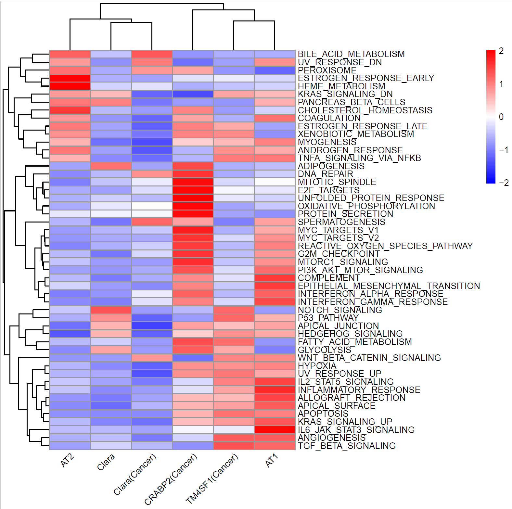
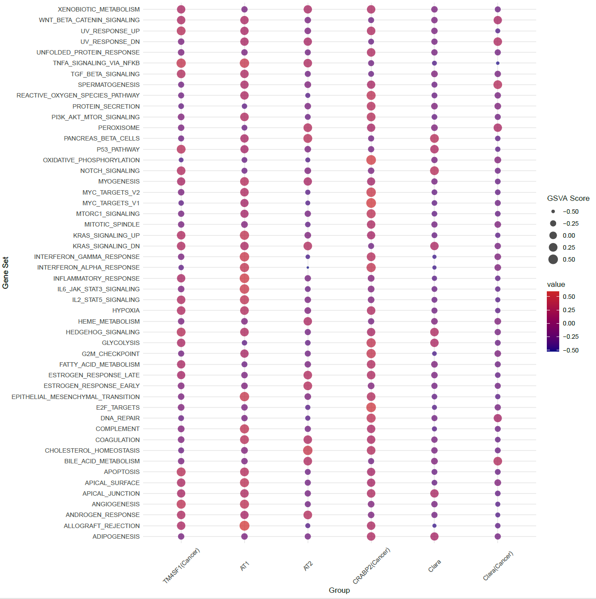
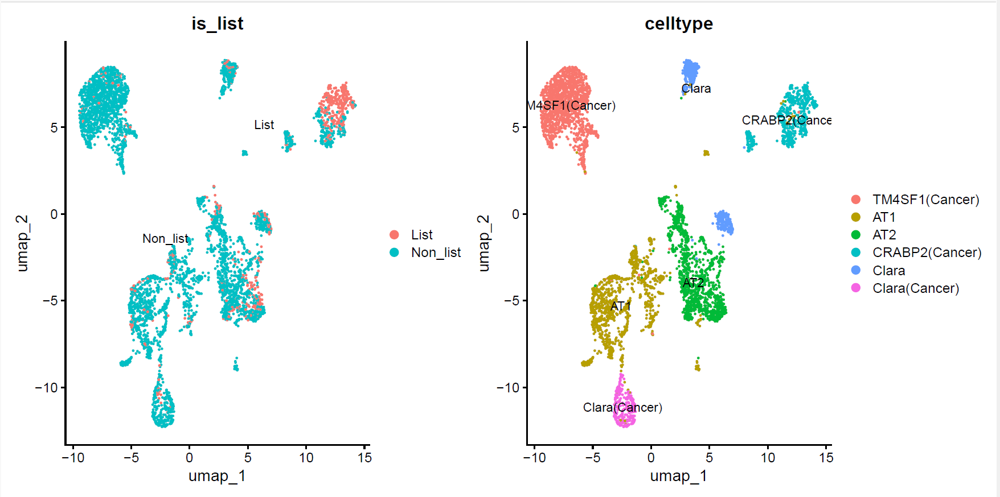
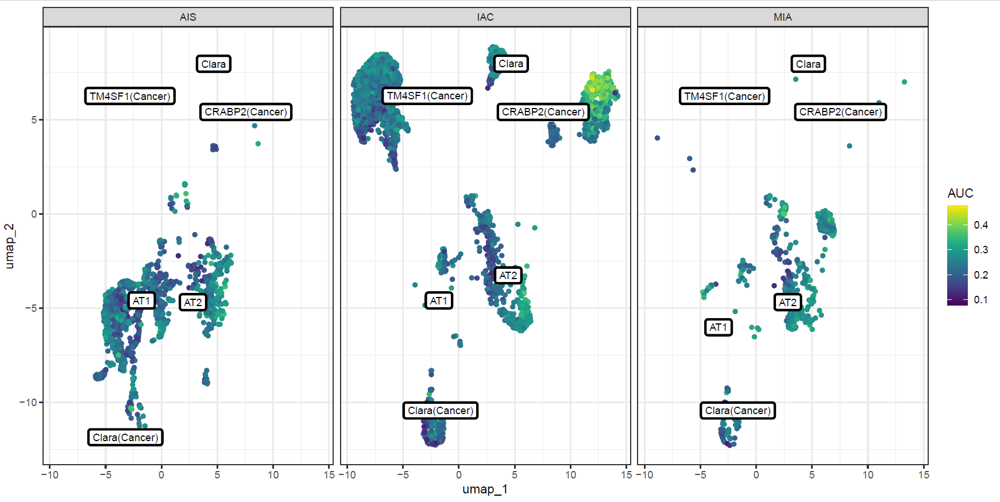
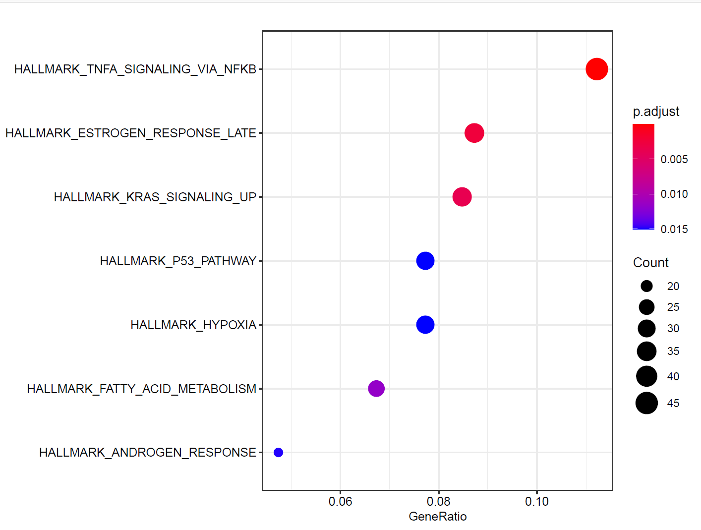
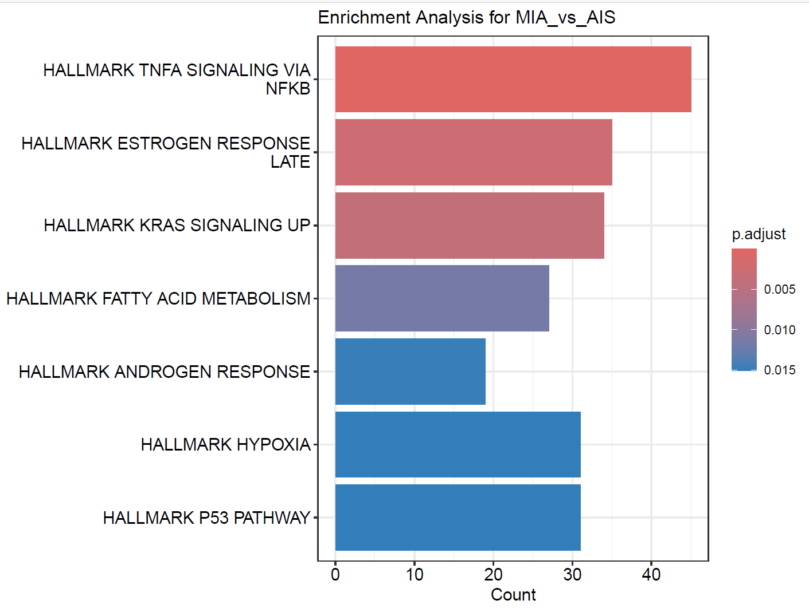
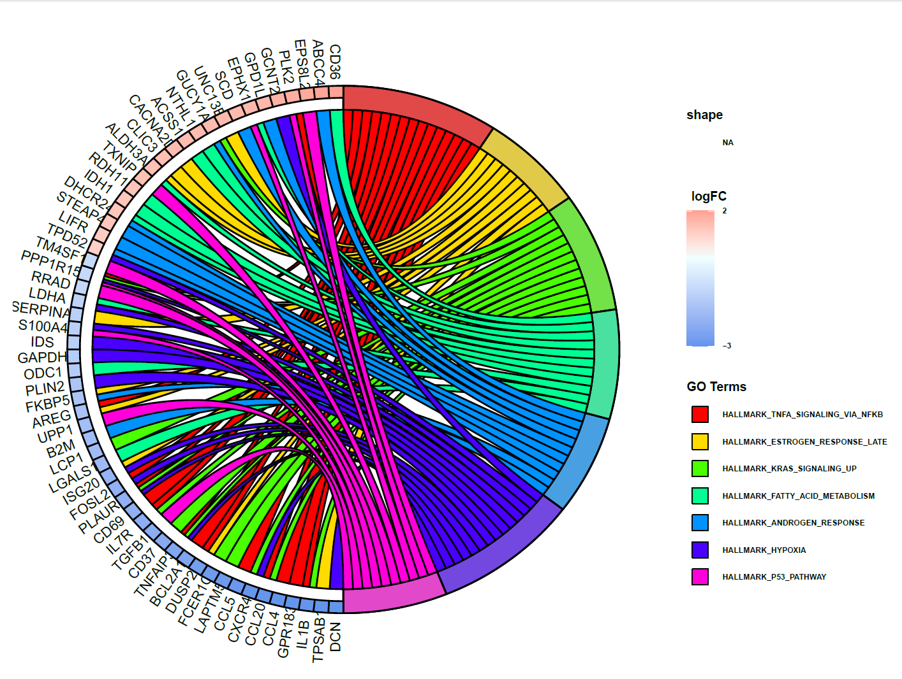

#### Pathway score and enrichment analysis
Author: "Xiaoqian Jiang"  
Date: "Created on  Jan 07, 2025"  

#### Introduction
Pathway score analysis quantifies the activity level of pathways in individual samples, while enrichment analysis assesses the overall association of gene sets with phenotypic differences across a dataset. These analyses are part of a broader category known as Pathway Annotation, which helps in identifying the roles of genes within the intricate networks of biological pathways.

This document presents the analysis utilizes GSVA (Gene Set Variation Analysis),AUC (Area under curve) scores, and ORA (Over-Representation Analysis ) to interpret the biological significance behind gene expression patterns. Here, we analysis epithelial cells, actually, the process could use for any celltype or the entire data.


#### Step 1: Set the clean environment and Load the required libraries
```{r setup, eval=FALSE}

Sys.setenv(LANGUAGE = "en")
options(stringsAsFactors = FALSE)
rm(list=ls())
set.seed(123456)
setwd("C:/Users/xqbus/Desktop/sg_rnaseq/")
getwd()

library(GSVA) 
library(GSEABase)
library(msigdbr)
library(org.Hs.eg.db)
library(grid)
library(gridExtra)
library(ggthemes)
library(data.table)
library(AUCell)
library(clusterProfiler)
library(enrichplot)
library(ComplexHeatmap)
library(GOplot)

lnames = load("rdata/Epi_sce.Rdata")

table(Idents(Epi_sce))
names(Epi_sce@meta.data)
scRNA = Epi_sce


```

#### Step 2: Pathway Score Analysis
Get the pathway gene set from function get_gene_sets, here using 50 hallmark genesets from MSigDB as reference.
```{r Step2, eval=FALSE}

# Notice: function 7. "get_gene_sets" should added firstly from file "all_functions.R" 
genesets <- get_gene_sets(species = "Homo sapiens", category = 'H')

# Modify the names of the pathways in your genesets list by removing the "HALLMARK" prefix
for (i in seq_along(genesets)) {
  # Using sub() to remove everything up to and including the first underscore
  genesets[[i]]@setName <- sub("^[^_]*_", "", genesets[[i]]@setName)
}

View(genesets)

```

##### Step 2.1: Using GSVA to calculate pathway score  
```{r Step2.1, eval=FALSE}

# Get the average gene expression data for each sub-celltype
expr <-AverageExpression(scRNA ,
                         Group.by = "celltype",
                         assays = "RNA",
                         slot = "data")

# Convert the first element of expr to a matrix if non-zero genes sum more than 0.001
expr <- as.matrix(expr[[1]][rowSums(expr[[1]]) > 0.001, ])
head(expr)


# GSVA analysis
gsva_data <- gsvaParam (expr, genesets,kcdf = "Gaussian",maxDiff = FALSE) # Uses standardized enrichment scores (NES) instead of maximum differences
gsva_result <- gsva(gsva_data)


# Pheatmap plot
p <- pheatmap::pheatmap(gsva_result, #data of heatmap
                        cluster_rows = T,
                        cluster_cols =T,#show the difference among samples
                        show_colnames=T,
                        scale = "row", #very useful function: scale the row data
                        angle_col = "45",
                        color =colorRampPalette(c("blue", "white", "red"))(100))

pdf('./results/pheatmap_GSVA_hallmark.pdf', width = 8,height =8)
p
dev.off()

# Dotplot
gsva_long <- melt(gsva_result, id.vars = "Genesets")
ggplot(gsva_long, aes(x = Var2, y = Var1, size = value, color = value)) +
  geom_point(alpha = 0.7) + # alpha sets the transparency of the point
  scale_size_continuous(range = c(1, 6)) + # Sets a range for the bubble size
  theme_minimal() +
  scale_color_gradient(low='navy',high="firebrick3") +
  labs(y = "Gene Set", x = "Group", size = "GSVA Score")+
  theme(axis.text.x = element_text(angle = 45,vjust = 0.5,hjust = 0.5))
ggsave('dotplot_GSVA_1.pdf',path = "./results", width = 12,height = 12)

```
Differences in pathway activities scored per cell by GSVA between the different epithelial clusters. CRABP2(Cancer) cells (Epi-C3) were mainly enriched in the following gene sets: MYC target V1, AKT and TGF-β signaling pathways and other gene sets.  
These two figures present pathway activity differences across epithelial cell subtypes, scored using GSVA (Gene Set Variation Analysis). The heatmap visualizes pathway activity scores for individual epithelial subtypes. The dot plot further quantifies the pathway enrichment scores across subtypes. Larger dots indicate higher activity levels of pathways in specific subtypes.  
CRABP2(Cancer) cells show strong enrichment in pathways related to cancer progression, including: MYC Targets V1, PI3K-AKT-mTOR signaling, TGF-β signaling  
     

##### Step 2.2:  Using AUCell to calculate pathway score
```{r step2.2, eval=FALSE}


# Calculate the AUC Pathway score for all cells

exp = LayerData(scRNA, assay="RNA", layer='data')
cells_rankings <- AUCell_buildRankings(exp, plotStats=TRUE)

#Get the auc scores matrix
cells_AUC <- AUCell_calcAUC(genesets, cells_rankings,nCores =1,
                            
                            #consider top 10% of the genes
                            aucMaxRank=nrow(cells_rankings)*0.1) 

# # Pick up the top 10 significant pathway or any interested pathway to show
# auc_scores <- getAUC(cells_AUC)
# top_indices <- order(rowMeans(auc_scores, na.rm = TRUE), decreasing = TRUE)[1:10]
# top_gene_sets <- rownames(auc_scores)[top_indices]
# top_gene_sets_data <- auc_scores[top_indices, ]
# cells_assignment <- AUCell_exploreThresholds(cells_AUC[rownames(top_gene_sets_data), ], 
#                                              plotHist = TRUE, assign = TRUE)


# Time consuming: 13 minutes by using 5000 cells and 50 hallmark pathways as input, with nCores = 6.
# Can use the above code to select interested pathways to shorten time.

pdf(file = "./results/auc_epi_threshold1.pdf", width = 20, height = 20)
par(mfrow=c(8,7)) # Plot is divided into 7 row and 7 columns
par(mfrow=c(8,7), mar=c(1,1,1,1))  # Setting smaller margins: bottom, left, top, right

thresholds <- AUCell_exploreThresholds(cells_AUC, 
                                       nCores = 6,
                                       plotHist = TRUE, 
                                       assignCells = TRUE)
dev.off()


# Get the threshold of each pathway, and show interested pathway
thr = sapply(thresholds, function(gene_set){
  tmp = gene_set$aucThr$selected
  names(tmp) = str_split(tmp,'.',simplify = T)[,1]
  return( tmp)
}, simplify = TRUE, USE.NAMES = TRUE)
thr["MYC_TARGETS_V1"]


# Select the interested pathway to show   #  MYC_TARGETS_V1 ,  TGF_BETA_SIGNALING , DNA_REPAIR
# Classify cells in one pathway based on thr into two groups: List, Non-list
pathway_name <- "MYC_TARGETS_V1"  

# Alternative 1: assign cells according to the 'automatic' threshold
# threshold_value <- thr[pathway_name]

# Alternative 2: choose a threshold manually and assign cells
threshold_value <- 0.3

new_cells <- names(which(getAUC(cells_AUC)[pathway_name, ] > threshold_value))
scRNA$is_list <- ifelse(colnames(scRNA) %in% new_cells, "List", "Non_list")

tab <- table(scRNA$is_list, scRNA$celltype)
View(tab)
p = DimPlot(object = scRNA, group.by = "is_list", label = TRUE) + 
  DimPlot(object = scRNA, group.by = "celltype", label = TRUE)
p
ggsave('aucell_umap_epi1.pdf',p, path = "./results", width = 12,height = 6)


```

These UMAP plots visualize the activity of the "MYC_TARGETS_V1" pathway across epithelial subcell types, scored using AUC values, and highlight the relationship between pathway activity and cell identity.
Left Panel: AUC Scores for "MYC_TARGETS_V1" Pathway. Cells are divided into two groups based on their pathway activity: Red (List): Cells with an AUC score > 0.3, indicating significant enrichment of the "MYC_TARGETS_V1" pathway. Green (Non_list): Cells with an AUC score < 0.3, representing low or no enrichment of the pathway. A majority of List cells are concentrated in specific clusters, suggesting that "MYC_TARGETS_V1" activity is not uniformly distributed across all epithelial subtypes.  
Right Panel: Cell Type Annotations. Corresponding cell type annotations provide insight into which epithelial subtypes are associated with high "MYC_TARGETS_V1" pathway activity: CRABP2(Cancer) and TM4SF1(Cancer) clusters show the highest enrichment in the pathway, aligning with their cancer-associated status.



```{r step2.2_continue, eval=FALSE}

# Retrieve one pathway to display in umap
pathway_name <- "MYC_TARGETS_V1" 
aucs <- as.numeric(auc_scores[pathway_name, ])
scRNA$AUC <- aucs
df <- data.frame(scRNA@meta.data, scRNA@reductions$umap@cell.embeddings)
colnames(df)

class_avg <- df %>%
  group_by(celltype) %>%
  summarise(
    umap_1 = median(umap_1),
    umap_2 = median(umap_2)
  )
p1 <- ggplot(df, aes(umap_1, umap_2))  +
  geom_point(aes(colour  = AUC)) + viridis::scale_color_viridis(option="D") +
  ggrepel::geom_label_repel(aes(label = celltype),
                            data = class_avg,
                            size = 3,
                            label.size = 1,
                            segment.color = NA
  )+   theme(legend.position = "none") + theme_bw() + facet_grid(.~group)

ggsave('aucell_umap_epi2.pdf',p1, path = "./results", width = 12,height = 6)

```

This figure shows UMAP plots of "MYC_TARGETS_V1" pathway activity across epithelial subcell types in the three lung adenocarcinoma stages: AIS, MIA, and IAC. The color gradient represents the AUC scores of the pathway in each cell, with yellow indicating high activity and blue indicating low activity. CRABP2(Cancer) in IAC shows the highest pathway activity (yellow regions), reflecting their strong involvement in tumor progression.  


#### Step 3:  Using clusterProfile to conduct pathway enrichment analysis with ORA 

##### Step 3.1:   Find all the DEGs in epithelial cells among 3 cancer stages   
```{r step3.1, eval=FALSE}

tmp <- c("IAC", "MIA", "AIS")
#Assign filter threshold of avg_log2FC and p_val_adj to define DEGs
logfoldchange = 0.5
pvalue = 0.05
pctvalue =0.25
table(Idents(scRNA)<- scRNA$celltype)

# Produce all possible combination except self.
sample_pairs <- combn(tmp, 2, simplify = FALSE)

# Notice: function 6. "My_findmarkers" should added firstly from file "all_functions.R"

markers_group <- mapply(function(x, y) {
  
  # Find markers between ident.1 and ident.2 for the current cell type
  My_findmarkers(scRNA, logfoldchange, pvalue, pctvalue, only.pos = FALSE,x,y)
  
},  x = sapply(sample_pairs, "[", 1), y = sapply(sample_pairs, "[", 2), SIMPLIFY = FALSE)

# Rename list elements
names(markers_group) <- sapply(sample_pairs, function(pair) paste(pair, collapse = "_vs_"))


```

##### Step 3.2: Run Hallmark pathway enrichment with DEGs from markers_group (3 group comparison), with designed 

Complex processes are encapsulated within a section to simplify the user interface, offering a one-stop solution for comprehensive analysis and visualization of enrichment results.   
 
```{r step3.2, eval=FALSE}

# Notice that: this section (the part #8. from file "all_functions.R") includes two key functions: myGOChord and perform_enrichment_analysis, which should be added firstly. 
# Function "myGOChord" is used for circle plot with input of enrichment results, changed from package GOplot::GOChord.
# Function "perform_enrichment_analysis" to run the entire enrichment analysis with 5 input parameters: 
# species: human or mouse 
# category: any category from msigdb, such as H, C1, C2 
# subcategory: subcategory from category, such as BP in C5 
# markers_group: Data (DEG list) for comparison, such MIA_VS_IAC
# top_n : The top significant pathway number to show in the plot
# which are capable of generating four types of visual representations: dot plots, heat maps, circular plots, and bar plots. 


results <- perform_enrichment_analysis("Homo sapiens", "H", NULL, markers_group, top_n = 10)

# Other enrichment analysis using different database is similar
# # Run GO pathway enrichment analysis: BP, MF, or CC
# results <- perform_enrichment_analysis("Homo sapiens", "C5", "BP", markers_group, top_n = 10)
#  
# # Run KEGG pathway enrichment analysis
# results <- perform_enrichment_analysis("Homo sapiens", "C2", "KEGG", markers_group, top_n = 10)

results_kegg <- perform_enrichment_analysis("Homo sapiens", "C5", "BP", markers_group, top_n = 10)
results_kegg[[3]]$bar_bar
# Output different plots for each group comparison, here I displayed one result AIC_VS_MIA

# N= length(results)
# pdf(file = "./results/enrichment_cir_H.pdf", width = 20, height = 15/N) #adjust the size
# grid.arrange(grobs = lapply(results, function(res) res$plot_cir), ncol = N)
# dev.off()
# pdf(file = "./results/enrichment_heat_H.pdf", width = 10, height = 15) #adjust the size
# lapply(results, function(x) x$plot_heat)
# dev.off()
# pdf(file = "./results/enrichment_dot_H.pdf", width = 20, height = 15/N) #adjust the size
# grid.arrange(grobs = lapply(results, function(res) res$plot_dot), ncol = N)
# dev.off()
# pdf(file = "./results/enrichment_bar_H.pdf", width = 20, height = 15/N) #adjust the size
# grid.arrange(grobs = lapply(results, function(res) res$plot_bar), ncol = N)
# dev.off()

results[[3]]$plot_dot 
results[[3]]$plot_cir

ggsave('plot_dot_AIC_VS_MIA.pdf',results[[3]]$plot_dot, path = "./results", width = 8,height = 6)
ggsave('plot_cir_AIC_VS_MIA.pdf',results[[3]]$plot_cir, path = "./results", width = 8,height = 6)
ggsave('plot_bar_AIC_VS_MIA.pdf',results[[3]]$plot_bar , path = "./results", width = 8,height = 6)

# pdf(file = "./results/plot_heat_AIC_VS_MIA.pdf", width = 15, height = 6) #adjust the size
# results[[3]]$plot_heat
# dev.off()


```
The two figures illustrate the top enriched pathways in the IAC group compared to the MIA group.
Dot Plot (Left): Each dot represents a hallmark pathway, with the gene ratio on the x-axis indicating the proportion of genes in the pathway that are differentially expressed. The size of the dots corresponds to the count of significant genes, and the color reflects the adjusted p-value, with red indicating higher statistical significance. Key enriched pathways include TNFA signaling via NFKB, Estrogen Response Late, and KRAS signaling up.
Bar Plot (Right): This plot summarizes the same data in a bar format, where the length of the bars represents the count of significant genes associated with each pathway.  

 

This circular diagram illustrates the enrichment of hallmark pathways in epithelial cells, comparing the IAC to the MIA group. Each gene on the outer ring is linked to the hallmark pathways (color-coded sections) that it is associated with. The colored connections represent the contribution of specific genes to enriched pathways. The intensity of the colors in the gene annotations indicates the direction and magnitude of gene expression changes (log fold change). Red represents upregulated genes, while blue represents downregulated genes. 
The comprehensive visualization highlights specific genes driving these changes, providing insights into the molecular mechanisms underpinning cancer progression.



