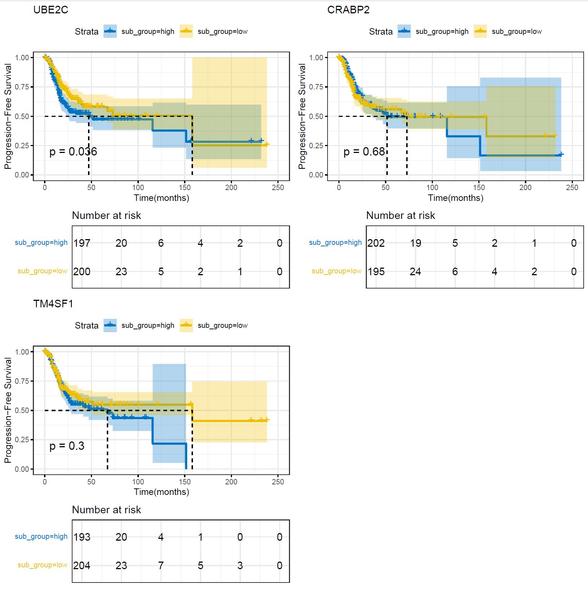

####  Survival Analysis Pipeline Using Kaplan-Meier estimator
Author: "Xiaoqian Jiang"  
Date: "Created on  Jan 08, 2025"    


#### Introduction

Survival analysis is a pivotal statistical technique in medical research, utilized to estimate the impact of variables on survival times. The most commonly used methods in survival analysis are the Kaplan-Meier (KM) estimator and the Cox Proportional Hazards (Cox) model.  The Kaplan-Meier curve provides a simple yet effective way to visualize the survival function, while Cox Proportional Hazards Model evaluates the influence of several covariates on survival, providing insights into the relative risks associated with each factor.  
This document delineates a comprehensive pipeline integrating Kaplan-Meier (KM) estimators (and Cox Proportional Hazards models) with public lung bulk RNAseq data by using R package survival (v3.3.1).   
Here's my analysis strategy, outlined in a few simple steps:  
Identify Differential Genes: Use single-cell RNA sequencing data to identify differentially expressed genes across various cell populations.
GSVA Scoring: Apply Gene Set Variation Analysis (GSVA) to transform the list of differentially expressed genes into gene set enrichment scores for each cell population, reflecting the activity level of specific biological pathways.  
Survival Analysis Integration: Combine the GSVA scores with clinical information, to conduct survival analysis using methods the Kaplan-Meier estimator to assess the impact of gene set activities on patient outcomes.  


#### Step 1: Set the clean environment and Load the required libraries 
```{r setup, eval=FALSE}

Sys.setenv(LANGUAGE = "en")
options(stringsAsFactors = FALSE)
rm(list=ls())
set.seed(123456)
setwd("C:/Users/xqbus/Desktop/sg_rnaseq/")
getwd()


library(data.table)
library(AnnoProbe)
library(tidyverse)
library(tinyarray) 
library(stringr)
library(survival)
library(Seurat)
library(GSVA) 
library(GSEABase)
library(pheatmap)
library(survminer)

```


#### Step 2: Input data preparation: bulk RNAseq data are from TCGA-LUAD
```{r step1, eval=FALSE}

# Download TCG1 LUAD data from  GDC TCGA Lung Adenocarcinoma (LUAD),with 585 gene expression data, 877 phenotype data and 738 survival data
# https://xenabrowser.net/datapages/?cohort=GDC%20TCGA%20Lung%20Adenocarcinoma%20(LUAD)&removeHub=https%3A%2F%2Fxena.treehouse.gi.ucsc.edu%3A443
 
list.files("./TCGA_LUAD")
# [1] "TCGA-LUAD.GDC_phenotype.tsv.gz" "TCGA-LUAD.htseq_counts.tsv.gz"  "TCGA-LUAD.survival.tsv"   

clinical = read.delim(paste0("./rdata/TCGA_LUAD/","TCGA-LUAD.GDC_phenotype.tsv.gz"),fill = T,header = T,sep = "\t")

surv = read.delim(paste0("./rdata/TCGA_LUAD/","TCGA-LUAD.survival.tsv"),header = T) 

dat <- data.table::fread('./rdata/TCGA_LUAD/TCGA-LUAD.htseq_counts.tsv.gz',
                         data.table = F)  

head(dat[,1:4])
tail(dat[,1:10]) 
dat = dat[1:(nrow(dat)-5),]
rownames(dat) = dat$Ensembl_ID
a = dat
a = a[,-1]
# Obtain the raw counts rather than log values
a = as.matrix(2^a - 1)

head(a[,1:4])
tail(a[,1:4]) 

# Apply to integer
exp = apply(a, 2, as.integer)
rownames(exp) = rownames(dat)
#get log CPM
exp= log(edgeR::cpm(exp)+1)
head(rownames(exp))

# Get the gene symbol as rownames
rownames(exp) = substr(rownames(exp), 1, 15) 
re = annoGene(rownames(exp),ID_type = "ENSEMBL");head(re)
exp = trans_array(exp,ids = re,from = "ENSEMBL",to = "SYMBOL")  

head(exp[,1:4])
tail(exp[,1:4]) 

# General rule of thumb for distinguishing tumor from normal samples in TCGA barcodes.
Group = ifelse(as.numeric(str_sub(colnames(exp),14,15)) < 10,'tumor','normal')  
Group = factor(Group,levels = c("normal","tumor"))
print(table(Group))

# Keep tumor samples for survival analysis
exprSet = exp[,Group=='tumor']

# Add Progression-Free Survival (PFS) analysis information needed: time and event
clinical_data<- clinical

# Time to progression or last follow-up
clinical_data$time_pfs <- ifelse(!is.na(clinical$days_to_new_tumor_event_after_initial_treatment),
                                 clinical$days_to_new_tumor_event_after_initial_treatment,
                                 clinical$days_to_last_follow_up.diagnoses)

# Converts days to months
clinical_data$time_pfs <- clinical_data$time_pfs/30.44  

# Define event_pfs: 1 for progression (YES), 0 for no progression (NO), NA for missing
clinical_data$new_tumor_event_after_initial_treatment[clinical_data$new_tumor_event_after_initial_treatment == ""] <- NA
clinical_data$event_pfs <- ifelse(clinical_data$new_tumor_event_after_initial_treatment == "YES", 1,
                                  ifelse(clinical_data$new_tumor_event_after_initial_treatment == "NO", 0, NA))

# Change tumor stage information 
clinical_data$tumor_stage <- sub("^stage ", "", clinical_data$tumor_stage.diagnoses)
# clinical_data$tumor_stage[clinical_data$tumor_stage == "not reported"] <- NA

# Keep samples have information in both clinical and surv
meta = inner_join(surv,clinical_data,by = c("sample"= "submitter_id.samples"))
head(meta[,1:4])
tail(meta[,1:4]) 
dim(meta)

# Remove survival time less than 30 days
# Add  Cox Proportional Hazards models information: gender,  race, tumor_stage, cigarettes_per_day
meta = meta[meta$OS.time >= 30, c( 'sample', 'OS','OS.time', 'time_pfs','event_pfs', 
                                    'gender.demographic', 'race.demographic', 'tumor_stage', 'cigarettes_per_day.exposures')] 

colnames(meta)=c('ID','event','time','time_pfs','event_pfs','gender', 'race', 'tumor_stage', 'smoke')
# meta <- na.omit(meta)

# Transform days into months as paper shows
meta$time = meta$time/30.44
rownames(meta) <- meta$ID

s = intersect(rownames(meta),colnames(exprSet))
exprSet = exprSet[,s]
meta = meta[s,]

identical(rownames(meta),colnames(exprSet)) # keep 503 patient info

# Check the data, the result should be zero
inconsistent_pfs_os <- meta[meta$event_pfs == 0 & meta$OS == 1, ] 

save(exprSet,meta,file = "./rdata/TCGA_LUAD/survival.Rdata" ) 
lnames = load("./rdata/TCGA_LUAD/survival.Rdata")


```


#### Step 3: Got GSVA score based on single cell gene expression data in subcelltype in different groups
```{r step2, eval=FALSE}

load("./rdata/Epi_sce.Rdata")
load("./rdata/Epi_markers.Rdata")

markers1 = markers[markers$p_val_adj <0.01 & markers$avg_log2FC >2,]

markers1$cluster <- as.factor(markers1$cluster)
deg_list <- split(markers1$gene, markers1$cluster)
gs = lapply(deg_list, toupper) 
geneset <- GeneSetCollection(mapply(function(geneIds, keggId) {
  GeneSet(geneIds, geneIdType=EntrezIdentifier(),
          collectionType=KEGGCollection(keggId),
          setName=keggId)
}, gs, names(gs)))
geneset

# Run gsva, use all cores as default
X <- as.matrix(exprSet)
Y <- gsvaParam (X, geneset,kcdf = "Gaussian",maxDiff = FALSE) 
es.max <- gsva(Y)
# pheatmap(es.max) 

```

#### Step 4:  Survival analysis: Conducting OS and PFS analysis based on gsva score
Complex processes are encapsulated within a function to simplify the user interface, offering a one-stop solution for analysis and visualization.
```{r step3, eval=FALSE}

# Notice: function 9. "my_survival_analysis" should added firstly from file "all_functions.R"

# Function "my_survival_analysis" to run the entire survival analysis with 4 input parameters: 
# score: matrix of gsva scores or gene expression for each cluster of each patient
# meta: meta data of patient from clinical database
# type_input : using 'GSVA':gsva_score, or 'LIST':interested gene_list, should be consistent with parameter score
# category: assigning to conduct OS(overall survival) or PFS (Progression-Free Survival) analysis  

source('all_functions.R')


# Define time and event based on category
assign_vars <- function(category) {
  # <<- will put the variables into global environments 
  time_var <<- if (category == 'PFS') 'time_pfs' else 'time'
  event_var <<- if (category == 'PFS') 'event_pfs' else 'event'
}


```

Conducting OS and PFS analysis based on gsva score.

```{r step4, eval=FALSE}

# Conducting OS analysis based on gsva score
assign_vars('OS')

# Kaplan‒Meier comparative survival analyses
my_survival_analysis(score = es.max, meta = meta, type_input = 'GSVA', category = 'OS',model = 'KM') 

# Cox Proportional Hazards models
# my_survival_analysis(score = es.max, meta = meta, type_input = 'GSVA', category = 'OS', model = 'COX') 

# Conducting PFS analysis based on gsva score
assign_vars('PFS')
my_survival_analysis(score = es.max, meta = meta, type_input = 'GSVA',  category = 'PFS',model = 'KM') 


```

The provided survival curves display the progression-free survival (PFS) (upper panel) and overall survival (OS) (lower panel) of LUAD patients in the TCGA-LUAD dataset (503 cases) stratified by the expression levels of gene signatures from six epithelial subtypes.The shaded regions around the survival curves represent the 95% confidence intervals (CIs), highlighting the variability of survival estimates. Narrower confidence intervals suggest greater precision, while wider intervals (especially evident at later time points) indicate higher uncertainty due to fewer patients at risk.

Progression-Free Survival (PFS):   
Patients with high expression levels of CRABP2(Cancer) exhibit significantly poorer progression-free survival compared to those with low expression levels (P = 0.031).Other subtypes (TM4SF1(Cancer), AT1, Clara, Clara(Cancer)) show no significant impact on survival outcomes in this analysis.
These findings highlight the clinical importance of CRABP2(Cancer) expression in LUAD prognosis and suggest it as a potential target for further investigation.

  

Overall Survival (OS):  
CRABP2(Cancer): High expression of CRABP2(Cancer) is strongly associated with poorer overall survival (P = 0.0026).  

  


Using assigned gene names and gene expression to conduct survival analysis. 
```{r step5, eval=FALSE}
# Using assigned gene names and gene expression to conduct survival analysis 

gene = c("UBE2C","TM4SF1", "CRABP2")
genes= exprSet[gene,]

colnames(genes) <- colnames(exprSet)
table(colnames(genes)==colnames(es.max))
rownames(genes) <- gene

 
# Conducting OS analysis based on assigned gene expression 
assign_vars('OS')
my_survival_analysis(score = genes, meta = meta, type_input = 'GENELIST', category = 'OS') 


# Conducting PFS analysis based on assigned gene expression 
assign_vars('PFS')
my_survival_analysis(score = genes, meta = meta, type_input = 'GENELIST', category = 'PFS') 


```

These Kaplan-Meier survival curves illustrate the progression-free survival (PFS, upper panel) and overall survival (OS, lower panel) of LUAD patients in relation to the expression levels of three genes: UBE2C, CRABP2, and TM4SF1. 
Patients with high UBE2C expression exhibited significantly worse PFS and OS compared to those with low expression levels (P = 0.036). 

Progression-Free Survival (PFS):  
 


Overall Survival (OS):  
 


