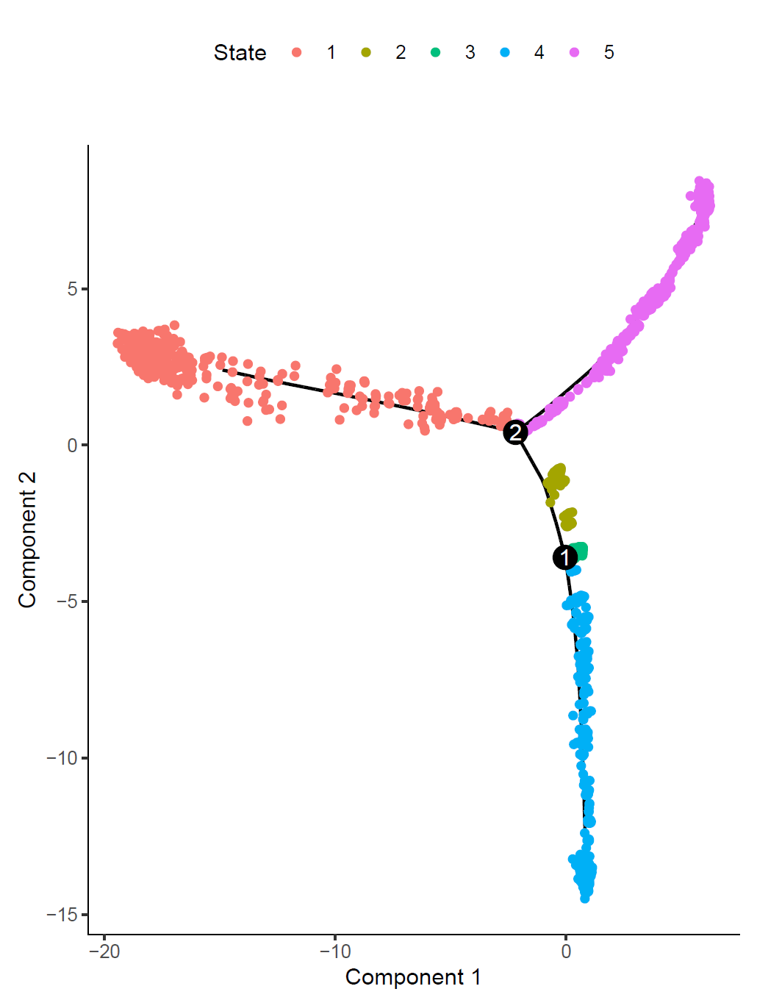
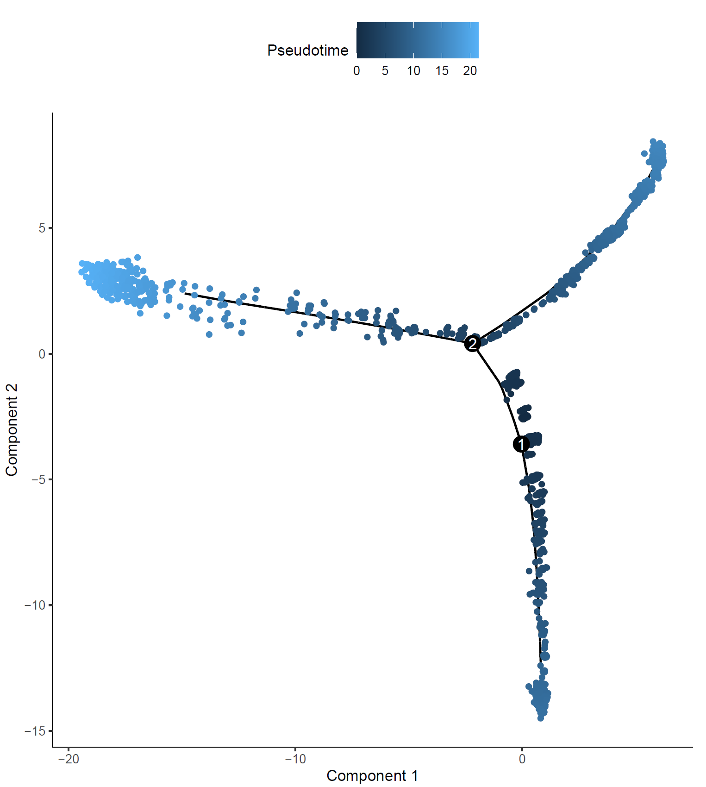
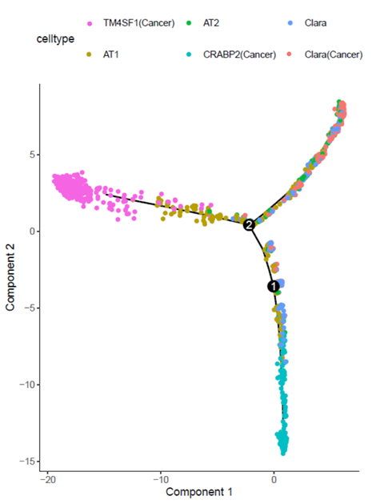
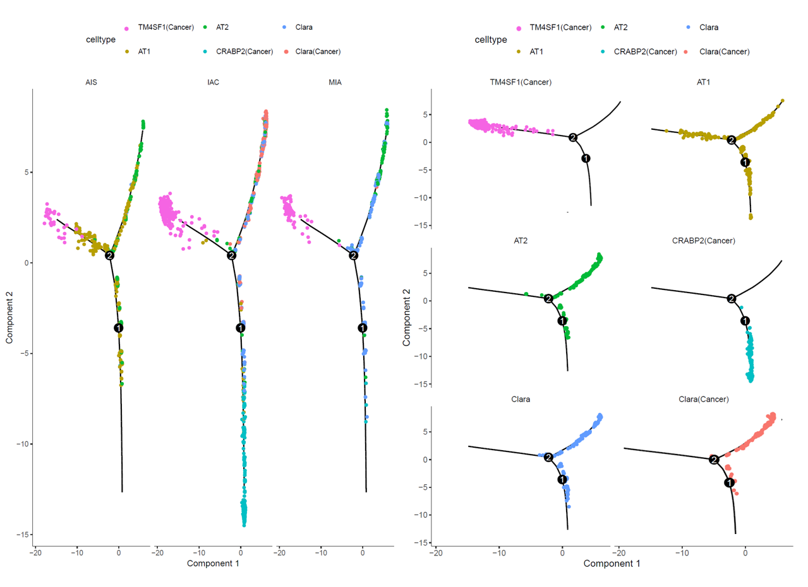
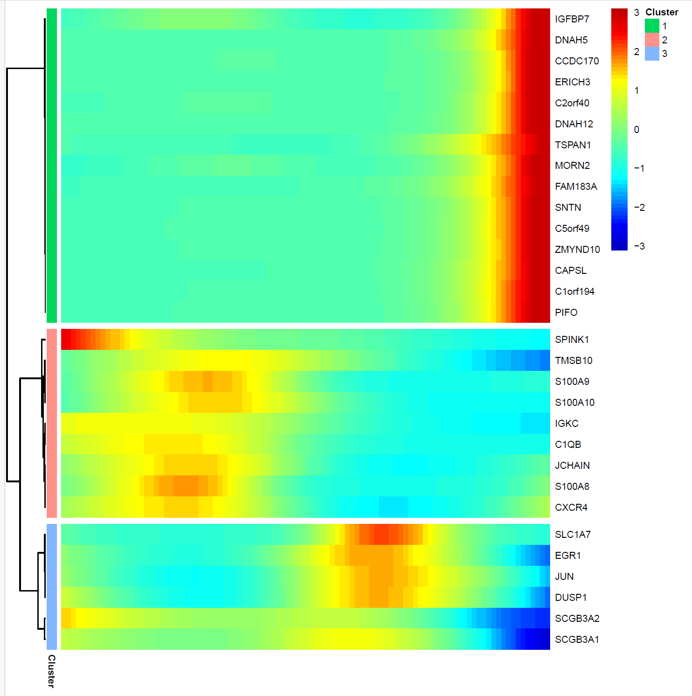
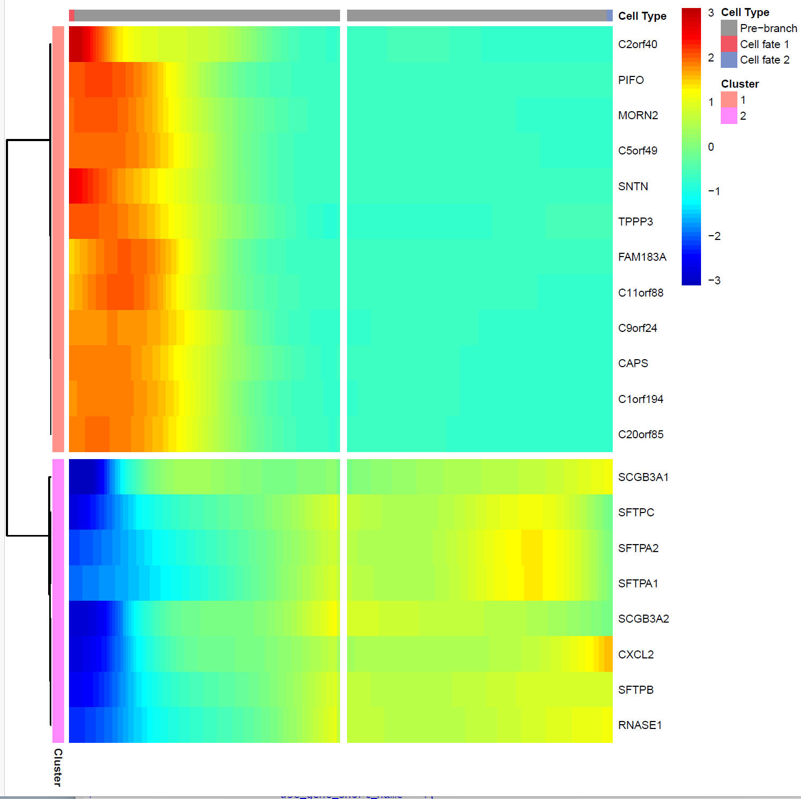
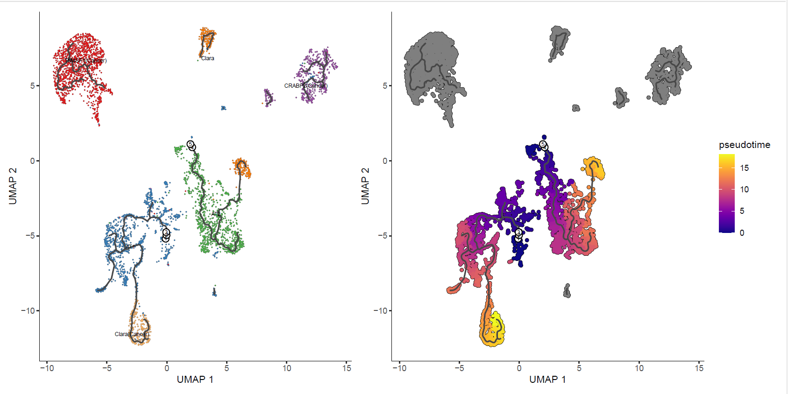

#### Unraveling Cellular Dynamics: Trajectory Analysis with Monocle 2 and 3 
Author: "Xiaoqian Jiang"  
Date: "Created on  Jan 09, 2025"  

#### Introduction   
Trajectory analysis is a powerful technique in single-cell RNA sequencing studies to uncover the dynamic changes in gene expression over time or developmental stages. In this step,  Monocle 2 and 3 was used to perform trajectory analysis and reveal the pseudo-temporal ordering of cells.  
This section of the document will guide you through the process of setting up and running Monocle 2, from preprocessing the data to visualizing the trajectories of cells as they progress through different states or conditions. 


#### Step 1: Set the clean environment and Load the required libraries ####
```{r step1, eval=FALSE}
Sys.setenv(LANGUAGE = "en")
options(stringsAsFactors = FALSE)
rm(list=ls())
set.seed(123456)
setwd("C:/Users/xqbus/Desktop/sg_rnaseq/")
getwd()

library(viridis)
library(data.table) 
library(Seurat)
library(ggplot2)
library(clustree)
library(cowplot)
library(dplyr)
library(patchwork)

lnames = load("rdata/Epi_sce.Rdata")
table(Idents(Epi_sce))
names(Epi_sce@meta.data)

```


#### Step 2: Trajectory analysis by using monocle2: Build the CDS object

```{r step2, eval=FALSE}

# Trajectory analysis should be conduced in celltypes which have evolutionary relationships.
library(monocle)

# Build the CDS object needs 3 files as input: matrix expr.matrix, pd, fd
# Each group keep N cells randomly to affordable time.

allType = levels(Idents(Epi_sce))
allCells=names(Idents(Epi_sce))

# Using at most N cells in each celltype to save time
N = 500
choose_Cells = unlist(lapply(allType, function(x){
  cgCells = allCells[Idents(Epi_sce) == x]
  if (length(cgCells) < N) {
    cg = cgCells  # If not enough, keep all the cells
  } else {
    cg = sample(cgCells, N)  # sample N cells if enough cells
  }
  cg
}))

seurat = Epi_sce[, allCells %in% choose_Cells]
table(Idents(seurat))

expr_matrix <- LayerData(seurat, assay = "RNA", layer = "counts")

# @meta.data in seurat is as phenodata
sample_sheet<-seurat@meta.data

# Build featuredata，one column is gene_id, another is gene_short_name,row, conresponding to counts' rownames

gene_annotation=data.frame(gene_short_name=rownames(seurat))
rownames(gene_annotation)=rownames(seurat)

pd <- new("AnnotatedDataFrame", data = sample_sheet)
fd <- new("AnnotatedDataFrame", data = gene_annotation)

```


#### Step 3:  Build new cell data set and conduct trajectory analysis for monocle2
```{r step3, eval=FALSE}

# Using negbinomial.size() for "counts" data, while counts is recommended from monocle2 author.
cds <- newCellDataSet(expr_matrix, phenoData = pd, featureData = fd,expressionFamily=negbinomial.size())
cds

# Scale the data
cds <- estimateSizeFactors(cds) 
cds <- estimateDispersions(cds)

# Filter the low expression gene
cds <- detectGenes(cds, min_expr = 0.1)
expressed_genes <- row.names(subset(fData(cds),num_cells_expressed >= 10))

# Finding DEGs to choose pseudotime related genes, time consuming
diff_celltype <- differentialGeneTest(cds[expressed_genes,],fullModelFormulaStr = "~celltype",cores=4) 
save(diff_celltype, file ='rdata/diff_celltype_monocle2_300sample.Rdata')

#load('rdata/diff_celltype_monocle2_300sample.Rdata')

head(diff_celltype)

# Order cells with qval increasing
diff_celltype<- diff_celltype[order(diff_celltype$qval),]

# Choose the first 2000 DEGs
ordering_genes <- row.names(diff_celltype[1:2000,])  
#ordering_genes <- row.names(diff_celltype[diff_celltype$qval < 0.01,]) 

cds <- setOrderingFilter(cds,ordering_genes = ordering_genes) 
plot_ordering_genes(cds)

# Using DDRtree to reduce dimension ####
cds <- reduceDimension(cds, max_components = 2, method = 'DDRTree') #calculate psudotime

# Shows error when running orderCells(cds) by using igraph version > 2.1, need to downgraded to 2.0.3 instead by:
# remove.packages(igraph)
# remotes::install_version('igraph', '2.0.3') 
# packageVersion("igraph")

cds <- orderCells(cds)
head(pData(cds),3)

```


#### Step 4: Visulization of pseudotime and trajectory
```{r step5, eval=FALSE}

p1 = plot_cell_trajectory(cds,color_by="State", size=1,show_backbone=TRUE)
p2 = plot_cell_trajectory(cds,color_by="Pseudotime", size=1,show_backbone=TRUE) 
p3 = plot_cell_trajectory(cds,color_by="celltype", size=1,show_backbone=TRUE)

p1+p2+p3
ggsave('monocle2_state_pseu_cell_500sample.pdf', p1+p2+p3, path = "results/",width = 15,height = 7)

# Faceted display
p4 = plot_cell_trajectory(cds, color_by = "celltype") + facet_wrap("~group", nrow = 1)
p4
ggsave('monocle_group_500sample.pdf',path = "results/",width = 14,height = 8)

# Use the root_state argument to set the root of the pseudo-timeline ####
# Define a function:GM_state, calculation the state including one celltype AT2 most，return the state number
GM_state <- function(cds){
  if (length(unique(pData(cds)$State)) > 1){
    T0_counts <- table(pData(cds)$State, pData(cds)$celltype)[,"Clara"]
    return(as.numeric(names(T0_counts)[which(T0_counts == max(T0_counts))]))
  } else {return (1)}
}
GM_state(cds)

# Assign state 3 as the start time
cds <- orderCells(cds, root_state = 3) 
head(pData(cds),3)

# After assigning the start point, re-plot pseudotime and trajectory figure. 

p3 = plot_cell_trajectory(cds, color_by = "celltype") + facet_wrap("~group", nrow = 1)
p4 = plot_cell_trajectory(cds, color_by = "celltype")+
  facet_wrap(~celltype, nrow = 5) + theme(text = element_text(size = 12)) 

p3+p4 
ggsave('monocle_group_cell_500sample.pdf', p3+p4, path = "results/",width = 14,height = 10)

```

The figure shows the potential developmental trajectory of six epithelial sub-cell types inferred using Monocle2. The pseudotime trajectory is divided into five distinct states: State 1 (S1), State 2 (S2), State 3 (S3), State 4 (S4), and State 5 (S5).
The central branching point (labeled as node 1) represents a common progenitor state from which cells diverge into two primary developmental directions. The middle panel illustrates the pseudotime progression with a gradient from dark to light blue. Cells at the root (dark blue) represent the earliest stages, while cells at the branch tips (light blue) represent more advanced states in the trajectory.The right panel displays the spatial distribution of different epithelial sub-cell types along the trajectory.

   


The figure presents faceted pseudotime plots illustrating the distribution of cells across epithelial subtypes and lung cancer progression groups (AIS, MIA, and IAC). The left panel shows the pseudotime trajectory segmented by progression groups, while the right panel focuses on individual cell types.
Left Panel: Distribution by Groups. The trajectory predominantly includes AT1 and AT2 cells, representing a normal or early developmental stage. Clara (Cancer) and CRABP2 (Cancer) cells are observed at distinct branches, indicating early divergence into potential cancerous states.
Right Panel: Distribution by Cell Types. CRABP2 (Cancer): Found along an intermediate branch, suggesting a transitional cancer. state.

 


```{r step5.1, eval=FALSE}

# Visualize interested marker gene in each group/state, helping to explore their expression change with pseudotime

marker_genes <- row.names(subset(fData(cds),gene_short_name %in% c("CRABP2", "TM4SF1", "UBE2C"))) 
p5 = plot_genes_in_pseudotime(cds[marker_genes,], color_by="celltype", ncol = 1) + 
  theme(text = element_text(size = 15)) 
p5
ggsave(filename = 'monocle2_significant_gene1.pdf',p5, path = "results/", width = 6, height = 8) 

monocle2_significant_gene1.png

# Pick up top 30 DEGS from first 50 ordering_genes or interested genes to show their expression with pseudotime 

diff_test_res=differentialGeneTest(cds[ordering_genes[1:50],],
                                   fullModelFormulaStr = "~sm.ns(Pseudotime)",
                                   cores=4)

diff_test_res = diff_test_res[order(diff_test_res$qval),]
diff_test_res1 = diff_test_res[1:30,]

pdf(file = "./results/monocle2_gene_pheatmap1.pdf", width = 6, height =6)
plot_pseudotime_heatmap(cds[rownames(diff_test_res1),], 
                        
                        # cluster number, should adjust according to the heatmap
                        num_clusters = 3, 
                        cores = 1, 
                        show_rownames = T)

dev.off()


```

The heatmap illustrates the dynamic expression patterns of top differentially expressed genes (DEGs) along the pseudotime trajectory, as inferred by Monocle2. Genes are hierarchically clustered into three main clusters (indicated by different colors in the row annotations), each displaying distinct expression trends during cellular differentiation.
Genes in Green cluster, such as IGFBP7, DNAH5, and TSPAN1, show increasing expression as pseudotime progresses, may be associated with advanced differentiation or specific functional states that emerge during later pseudotime stages, potentially indicative of tumorigenic or specialized epithelial states. Downregulated genes in Blue Cluster suggest pathways or functions that are progressively lost as cells commit to differentiation or malignancy.

 


```{r step6, eval=FALSE}
# Identify branch-related gene, BEAM function need "progenitor_method = 'duplicate'", or show error

# I think this error might be caused by more than 2 branches, and it only deal with two.
# The figure is little strange, using "progenitor_method = 'duplicate'" might be wrong??

# The purpose of beam is to know which gene is the reason for branch .
BEAM_res <- BEAM(cds[ordering_genes[1:1000],], 
                 
                 #Change the point according to state point results, here branch 2 is selected.
                 branch_point = 2, 
                 cores = 1,
                 progenitor_method = 'duplicate')

BEAM_res = BEAM_res[order(BEAM_res$qval),]
BEAM_res1 = BEAM_res[1:20,]

pdf(file = "./results/monocle2_beam_heatmap_branch2.pdf", width = 6, height =6)
plot_genes_branched_heatmap(cds[rownames(BEAM_res1),],
                            
                            # Can show different branch according to state point results
                            branch_point = 2,
                            num_clusters = 2,
                            cores = 1,
                            use_gene_short_name = T,
                            show_rownames = T
)
dev.off()


```

This heatmap illustrates the dynamic expression patterns of differentially expressed genes (DEGs) from branch point 2 along two distinct pseudotime trajectories ("Cell fate 1" and "Cell fate 2") and their pre-branch state. Genes are clustered hierarchically based on their expression trends, and the color scale indicates the level of expression, ranging from downregulated (blue) to upregulated (red).
Pre-branch genes may serve as critical regulators of the initial state or branching decision, providing insights into the molecular mechanisms driving cell fate decisions. Cell fate-specific genes reflect divergent regulatory programs and functional specializations associated with distinct branches. Genes such as C2orf40, PIFO, and MORN2 show high expression (red) before the branch point and exhibit distinct trends in the two subsequent trajectories. These genes likely represent core regulators active in the initial state and may influence the bifurcation into the two fates.


 


#### Step 5: Utilizing Monocle3 for Enhanced Analysis

Monocle2 has limitations such as its inability to remove batch effects, support for no more than 50,000 cells, and its inability to shape circular trajectories. 
Monocle3 addresses these issues effectively. It introduces 3D visualization, utilizes UMAP for dimensionality reduction, and offers improved compatibility with other analysis tools. Monocle3 not only supports a larger number of cells, but it also accelerates the analysis process significantly. 

```{r step7, eval=FALSE}

library(monocle3)

lnames = load("rdata/Epi_sce.Rdata")
seurat <- Epi_sce

table(Idents(seurat))
expr_matrix <- LayerData(seurat, assay = "RNA", layer = "counts")

# @meta.data in seurat is as phenodata
sample_sheet<-seurat@meta.data

# Build featuredata，one column is gene_id, another is gene_short_name,row, conresponding to counts' rownames
gene_annotation=data.frame(gene_short_name=rownames(seurat))
rownames(gene_annotation)=rownames(seurat)

# Construct monocle3 object with the same dataset as monocle2
cds_mono3 <- new_cell_data_set(as(expr_matrix, "sparseMatrix"),
                               cell_metadata = sample_sheet,
                               gene_metadata = gene_annotation)

cds <- preprocess_cds(cds_mono3, num_dim = 25)
cds <- reduce_dimension(cds, reduction_method="UMAP",umap.fast_sgd=TRUE, core=4)

# Get the umap info from seurat object to replace the umap of monocle3 produced, and this is important for consistence with previous results.
# Reference: https://github.com/ma-jq/B/blob/main/Fig1/fig1.R
cds.embed <- cds@int_colData$reducedDims$UMAP
int.embed <- Embeddings(seurat,reduction = "umap")
int.embed <- int.embed[rownames(cds.embed),]
cds@int_colData$reducedDims$UMAP <- int.embed

cds <- cluster_cells(cds,resolution = 0.01,k=20,verbose=T)
cds@clusters$UMAP$clusters <- seurat$celltype

plot_cells(cds,reduction_method = "UMAP",color_cells_by = "celltype")

cds <- learn_graph(cds, verbose =T,
                   use_partition=T,
                   close_loop=F)

plot_cells(cds, color_cells_by = "celltype", 
           label_groups_by_cluster=T,
           label_leaves=F, 
           label_branch_points=F,
           cell_size = 1,group_label_size=4)


```
UMAP dimensionality reduction of epithelial cells from Monocle3 trajectory analysis. Each cell is colored by its celltype (left) and pseudotime trajectory (right).

The figure illustrates UMAP dimensionality reduction and trajectory analysis of epithelial cells using Monocle3.
Left Panel: Cell Types. Cells are labeled and colored based on their assigned cell types.
Right Panel: Pseudotime Trajectory. Cells are colored based on their pseudotime values, progressing from blue (early stages) to yellow (late stages).

 

The identified trajectories must be interpreted cautiously, as subjective root assignment can bias conclusions. Alternative methods or criteria for root selection could yield different pseudotime trajectories, highlighting the importance of transparency in reporting analytical decisions.


```{r step8, eval=FALSE}


```


