####  Inference and analysis of cell-cell communication using CellChat and Nichenet
Author: "Xiaoqian Jiang"  
Date: "Created on  Jan 12, 2025"

#### Introduction
Cell signaling and communication between cancer cells and the TME are crucial for the progression and metastasis of cancer.  
Understanding the communication networks between target cells within the tumor microenvironment (TME) can reveal new therapeutic targets and biomarkers.  
This document introduces the steps of inference, analysis and visualization of cell-cell communication network based on single-cell RNA sequencing data using CellChat and Nichenet. 

#### Step 1: Set the clean environment and Load the required libraries 

```{r setup, eval=FALSE}

Sys.setenv(LANGUAGE = "en")
options(stringsAsFactors = FALSE)
rm(list=ls())
set.seed(123456)
setwd("C:/Users/xqbus/Desktop/sg_rnaseq/")
getwd()

library(CellChat)
library(Seurat)
library(data.table)
library(dplyr)
library(tidyverse)
library(patchwork)


```

#### Step 2:  CellChat to explore cell communication: prepare data  

The primary focus of this analysis is on epithelial cells undergoing carcinogenic transformations in lung cancer. 
Immune Cells play significant roles in modulating the tumor microenvironment and are known to interact with cancer cells.
Here focus was on cancer cells, with other 5 major cells: T cells, NK cells, Macrophage, Monocyte, and Fibroblast cells. 
These cells were selected as key components of TME because they are close to epithelia cells in UMAP.  
CellChat requires the gene expression data of cells as the user input and a database (provided by CellChat) of the interactions between signaling ligands, receptors and their cofactors.

```{r step1, eval=FALSE}

#  Get the input data of cellchat 
load("./rdata/Epi_sce.Rdata")
load("./rdata/scRNAall.Rdata")

table(Idents(scRNAall))

# Get the target cancer cells
cancer = Epi_sce[, Epi_sce$celltype %in% c( 'TM4SF1(Cancer)','CRABP2(Cancer)','Clara(Cancer)')]
cancer$celltype_new <- 'cancer'

# Get the TME cells
tme =  scRNAall[, scRNAall$celltype %in% c( 'T', 'NK', 'Monocyte', 'Macrophage', 'Fibroblast')]
tme$celltype_new <- tme$celltype

Idents(cancer) <- cancer$orig.ident
Idents(tme) <- tme$orig.ident

sce = merge(tme,cancer,
            add.cell.ids = c('TME','Cancer'))
sce$source <- c(rep("TME", ncol(tme)), rep("Cancer", ncol(cancer)))

sce <- JoinLayers(sce)
Idents(sce) = sce$celltype_new


# Using at most N cells in each celltype to save time
allType = levels(Idents(sce))
allCells=names(Idents(sce))

N = 2264
choose_Cells = unlist(lapply(allType, function(x){
  cgCells = allCells[Idents(sce) == x]
  if (length(cgCells) < N) {
    cg = cgCells  # If not enough, keep all the cells
  } else {
    cg = sample(cgCells, N)  # sample N cells if enough cells
  }
  cg
}))
cg_sce = sce[, allCells %in% choose_Cells]

table(cg_sce$celltype_new)

dim(cg_sce[["RNA"]]$data )
names(cg_sce@assays$RNA@layers)
colnames(cg_sce@meta.data)
table(cg_sce$group)
table(cg_sce$celltype_new)
table(cg_sce$source)

```

#### Step 3: CellChat Analysis: initialization of CellChat object (Seurat object), network construction and interaction analysis

```{r step1.2, eval=FALSE}
# Function to construct cell-cell communication networks
cellchatA <- function(Object = cg_sce, group_by, database = 'human'){
  
  #1.create cellchat object
  
  cellchat <- createCellChat(Object, group.by = group_by)
  levels(cellchat@idents)
  groupSize <- as.numeric(table(cellchat@idents)) 
  
  CellChatDB <- if (database == 'mouse') CellChatDB.mouse else CellChatDB.human
  
  # show the probability of cellchat databse
  # showDatabaseCategory(CellChatDB) 
  
  # Set the ligand-receptor interaction database
  # CellChatDB.use <- CellChatDB  # Select all CellChatDB database
  CellChatDB.use <- subsetDB(CellChatDB, search = "Secreted Signaling")# or: ECM-receptor,Cell-Cell Contact  
  cellchat@DB <- CellChatDB.use
  
  cellchat <- subsetData(cellchat)
  
  # do parallel 
  future::plan('multiprocess', workers = 4)  
  
  # Identify over-expressed ligands or receptors in each cell group to infer the cell state-specific communications.
  cellchat <- identifyOverExpressedGenes(cellchat)
  cellchat <- identifyOverExpressedInteractions(cellchat)
  
  #cellchat <- projectData(cellchat, PPI.human)
  # Smooth the data when analyzing single-cell data with shallow sequencing depth(optional)
  # cellchat <- smoothData(cellchat, PPI.human) #PPI.human PPI.mouse
  # When using the smoothed data, the number of inferred interactions clearly increases. 
  # However, generally, it only introduces very weak communications.
  
  # Compute the communication probability  to infer the communication network of cell interaction
  # Time consuming: 8 minutes with 14,000 cells, 23,000 genes 
  cellchat <- computeCommunProb(cellchat)
  
  # Extract the inferred cellular communication network as a data frame
  #df.net <- subsetCommunication(cellchat)

  # Inferring intercellular communication at the signaling pathway level
  cellchat <- computeCommunProbPathway(cellchat)
  

  # Calculate the aggregated cell–cell communication network.
  cellchat <- aggregateNet(cellchat)
  
  return(cellchat)
} 

#The process is about 8 minutes for 14,000 cells with 20,000 genes.
cellchat_all = cellchatA(Object = cg_sce, group_by= "celltpe_new", database = 'human')
cellchat_all@meta$samples <- cellchat_all@meta$group

save(cellchat_all, file = "./rdata/Cellchat.Rdata")
lnames = load("./rdata/Cellchat.Rdata")

```


#### Step 4: CellChat Analysis: Visualization and Interpretation
##### Step 4.1:  General analysis and Interpretation
```{r step1.3, eval=FALSE}

# Comparing the total number of interactions and the total interaction strength
Circle_plot <- function(count=count, type, groupSize=groupSize){
  name <- if (type == "count") "Number of interactions" else "Strength of interactions"
  
  netVisual_circle(cellchat@net$count, vertex.weight = groupSize, 
                   weight.scale = T, label.edge= F, 
                   title.name = name)
}

groupSize <- as.numeric(table(cellchat@idents))

# Plot number of interactions
p1 <- Circle_plot(cellchat@net$count, type= 'count', groupSize)

# Plot strength of interactions
p2 <- Circle_plot(cellchat@net$weight, type= 'weight',groupSize)

# Keep the figure
pdf(file = "./results/cellchat_Overview_cellcommunication.pdf", width = 10, height =10)
Circle_plot(cellchat@net$count, type= 'count', groupSize)
Circle_plot(cellchat@net$weight, type= 'weight',groupSize)
dev.off()

# keep the figure manually rather than using pdf() to show two figures in one page
pdf(file = "./results/cellchat_Overview_cellcommunication.pdf", width = 6, height =6)


```

The figure visualizes the cellular communication network among different cell groups, comparing the number of interactions (left) and the interaction strength (right). Each line represents a communication link between two cell groups. 
Left: The thickness of the lines indicates the number of signaling interactions. The "Cancer" group exhibits the highest number of interactions with almost all cell groups, particularly with macrophages, fibroblasts, and monocytes.
Right: Line thickness here reflects the total interaction strength (aggregated signal intensity) between two cell groups.
The "Cancer" group maintains the strongest communication with macrophages and fibroblasts, emphasizing its dominant role in the signaling network.
 
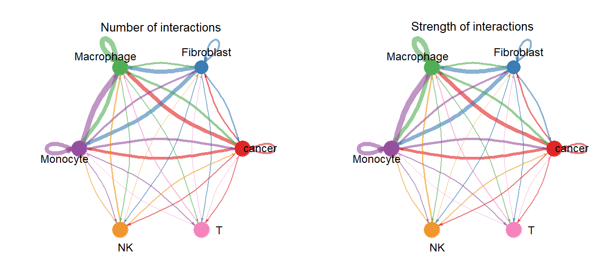   

```{r step2, eval=FALSE}

# Examine the signaling sent from each cell group
mat <- cellchat@net$weight
par(mfrow = c(2,3), xpd=TRUE)
for (i in 1:nrow(mat)) {
  mat2 <- matrix(0, nrow = nrow(mat), ncol = ncol(mat), dimnames = dimnames(mat))
  mat2[i, ] <- mat[i, ]
  netVisual_circle(mat2, vertex.weight = groupSize, weight.scale = T, edge.weight.max = max(mat), title.name = rownames(mat)[i])
}


```
The figure illustrates the cell-cell communication network, highlighting the interaction strengths of signaling sent from each cell group. Each panel represents one cell type acting as the source of signaling, with arrows indicating the direction of signal transmission to other cell types.Cancer cells demonstrate strong outgoing signaling interactions, particularly directed towards macrophages, fibroblasts, and T cells.
 
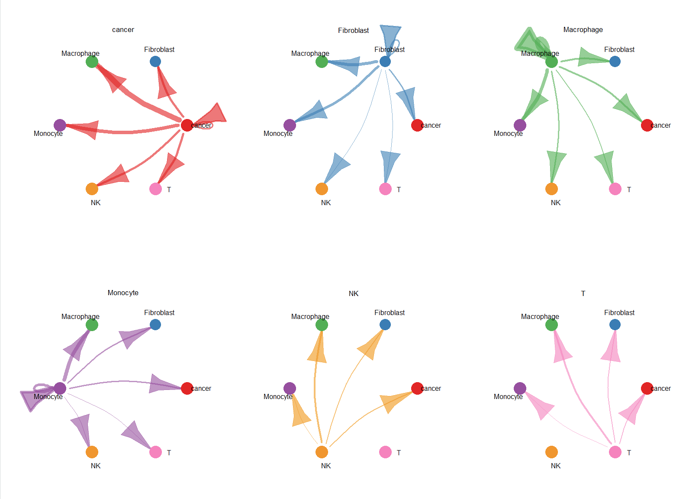   


```{r step3, eval=FALSE}

# Check the significantly enriched pathway
pathway_name = cellchat@netP$pathways 

# Visualize the inferred signaling network of signaling pathways by aggregating all L-R pairs
par(mfrow = c(5,5), xpd=TRUE)
for (i in pathway_name ){
  netVisual_aggregate(cellchat, signaling =i, layout = "circle")
}
# keep the figure manually rather than using pdf() to show two figures in one page
pdf(file = "./results/cellchat_allpathway.pdf", width = 6, height =6)


```

This figure illustrates the significant pathways involved in cell-to-cell communication across various cell types in the tumor microenvironment, with a particular emphasis on their enrichment in cancer cells.athways such as MIF, MK, GDF, UGRP1, EGF, TWEAK, TRAIL, ANNEXIN exhibit strong enrichment in cancer cells. These pathways are likely critical in driving tumor progression, immune evasion, and interactions between cancer cells and the surrounding microenvironment. Pathways like MIF (Macrophage Migration Inhibitory Factor), MK (Midkine), and TWEAK are known to play pivotal roles in cancer metastasis. 

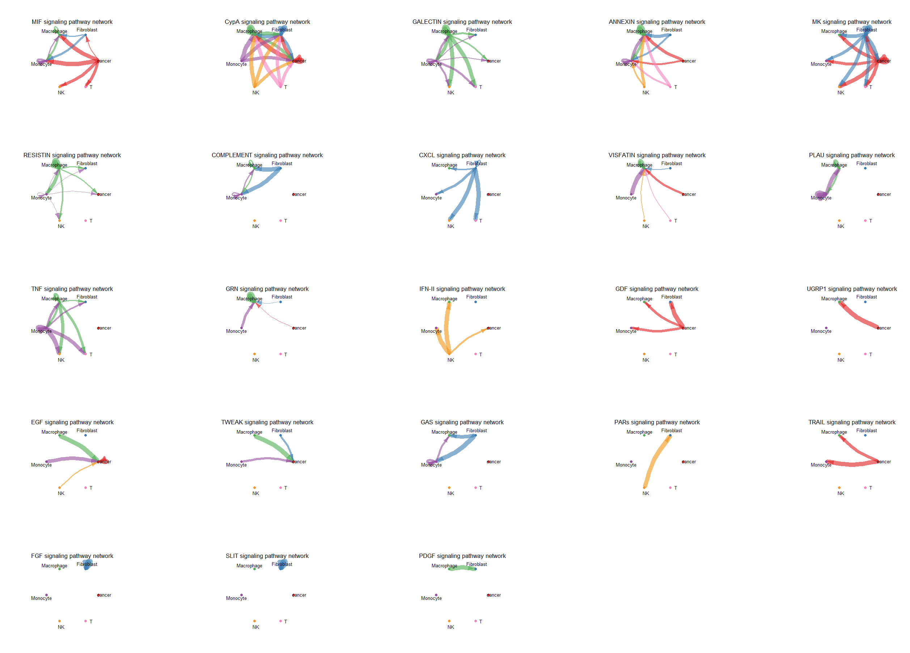  


##### Step 4.2: Visualization and Interpretation of interested pathway
```{r step4, eval=FALSE}

# Here we choose pathway MIF to down stream analysis.
# Assign interested pathway
pathways.show <- "MIF" 

levels(cellchat@idents)            #check cell order
vertex.receiver = c(3,4,5,6)          #assign index of receiver cells

# Visualize each signaling pathway using Hierarchy plot, Circle plot or Chord diagram
pdf(file = "./results/cellchat_MIF_3plot.pdf", width = 15, height =10)
# Hierarchy plot
netVisual_aggregate(cellchat, signaling = 'MIF', vertex.receiver = c(3,4,5,6), layout="hierarchy")

# Circle plot
netVisual_aggregate(cellchat_all, signaling =pathways.show, layout = "circle")

# Chord diagram
netVisual_aggregate(cellchat_all, signaling = pathways.show, layout = "chord")

# Heatmap
netVisual_heatmap(cellchat_all, signaling = pathways.show, color.heatmap = "Reds",
                 title.name = paste(pathways.show, "signaling ",names(cellchat_all)))
dev.off()


```

In the following visualization plots (Hierarchical, Chord diagram and Circle plot), edge weights are proportional to the interaction strength, and circle sizes are proportional to the number of cells in each cell group.

Hierarchical plot: the left portion shows autocrine and paracrine signaling to certain cell groups of interest, and the right portion shows autocrine and paracrine signaling to the remaining cell groups in the dataset. solid and open circles represent source and target, respectively.
Thus, hierarchy plot provides an informative that cancer cells as source cells has communications with Macrophage, Monocyte, NK, and T cells.

  

Chord diagram (left) and Circle plot(right): the inner thinner bar colors represent the targets that receive signal from the corresponding outer bar. The inner bar size is proportional to the signal strength received by the targets.


  

Heatmap: colobar represents the relative signaling strength of a signaling pathway across cell groups (values are row-scaled). X-axis stands for the target (receiver), and y-axis stands for the source (sender). Cancer send strong signal to Monocyte in this result.  
  


Visualization of the contribution of each ligand-receptor pair to the overall signaling pathway
```{r step5, eval=FALSE}

# Calculate the contribution of each ligand-receptor+pair to the signaling pathway
netAnalysis_contribution(cellchat_all, signaling = pathways.show)

# function extractEnrichedLR to extract all the significant interactions (L-R pairs)  and related signaling genes for a given signaling pathway.
pairLR <- extractEnrichedLR(cellchat_all, signaling = pathways.show, geneLR.return = FALSE)

# Extract and display the ligand receptor pairs that contribute the most to this pathway (other ligand receptor pairs can also be selected)
LR.show <- pairLR[1,] 


pdf(file = "./results/cellchat_MIF_LRpair_3plot.pdf", width = 15, height =10)
# Hierarchy plot, circle plot, chord plot
netVisual_individual(cellchat_all, signaling =pathways.show  , pairLR.use = LR.show, 
                     vertex.receiver = vertex.receiver, layout = "hierarchy")
netVisual_individual(cellchat_all, signaling =pathways.show  , pairLR.use = LR.show, layout = "circle")
netVisual_individual(cellchat_all, signaling =pathways.show  , pairLR.use = LR.show, layout = "chord")
dev.off()

```

These two figures visualize the cell-cell communication through the MIF (CD74+CXCR4) signaling pathway, focusing on a single ligand-receptor pair, using a chord diagram (left) and a circular network plot (right).

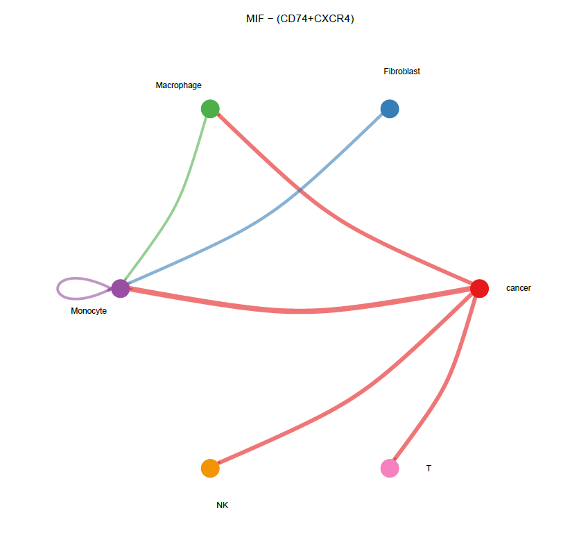
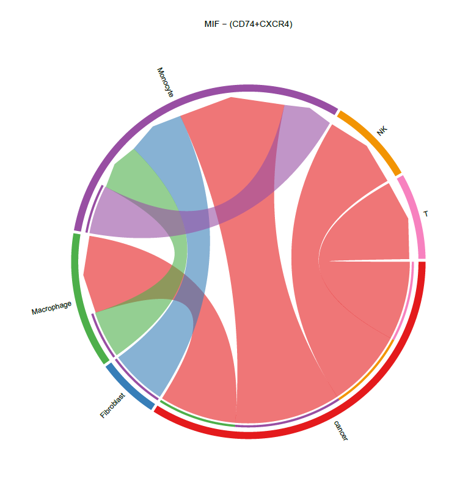


Visualize cell-cell communication mediated by multiple ligand-receptors or signaling pathways 
```{r step6, eval=FALSE}

# Bubble plot 
# show all the significant interactions (L-R pairs) from some cell groups (defined by 'sources.use') to other cell groups 
netVisual_bubble(cellchat_all, sources.use = c(1), targets.use = c(2,3,4,5,6), remove.isolate = FALSE)

# show all the significant interactions (L-R pairs) associated with certain signaling pathways
netVisual_bubble(cellchat_all, sources.use = c(1), targets.use = c(2,3,4,5,6), remove.isolate = FALSE, signaling = c("MIF","MK"))

# show all the significant interactions (L-R pairs) based on user's input (defined by `pairLR.use`)
pairLR  <- extractEnrichedLR(cellchat_all, signaling =c("MK","MIF"), geneLR.return = FALSE)
netVisual_bubble(cellchat_all, sources.use =c(1), targets.use =c(2,3,4,5,6), pairLR.use =pairLR , remove.isolate = FALSE)


# Chord diagram ####             
netVisual_chord_gene(cellchat_all, signaling = c("MK","MIF"),sources.use = c(1), targets.use = c(2,3,4,5,6), lab.cex = 0.5,legend.pos.y = 30)

# Plot the signaling gene expression distribution using violin/dot plot, not that important.
plotGeneExpression(cellchat_all, signaling = "MIF")
# By default, plotGeneExpression only shows the expression of signaling genes related to the inferred significant communications. 
# USERS can show the expression of all signaling genes related to one signaling pathway by "enriched.only = FALSE"

# Dot plot
plotGeneExpression(cellchat_all, signaling = "MIF",type = "dot",color.use = "celltype")


```


This bubble plot illustrates significant ligand-receptor (L-R) interactions and signaling pathways between cancer cells and other cell groups, emphasizing the direction of communication from cancer cells.
X-axis: Represents the target cell groups (e.g., Fibroblast, Macrophage, Monocyte, NK cells, and T cells) receiving signals from cancer cells. Y-axis: Lists the specific L-R pairs or pathways mediating these interactions (e.g., MIF (CD74+CXCR4), MDK-SDC4, ANXA1-FPR1). Bubble size: Indicates the p-value significance of the interaction, where larger bubbles signify more statistically significant interactions. Bubble color: Represents the communication probability, with red indicating higher interaction strength and blue indicating lower interaction strength.
Notable Pathways and L-R Pairs: MIF (CD74+CXCR4): Shows strong interactions between cancer cells and multiple cell types, particularly macrophages and T cells. Cancer cells exhibit diverse interactions with immune cells (e.g., macrophages, T cells) and stromal cells (e.g., fibroblasts). The strongest interactions (in terms of both probability and significance) are observed with macrophages, emphasizing their critical role in the tumor microenvironment.

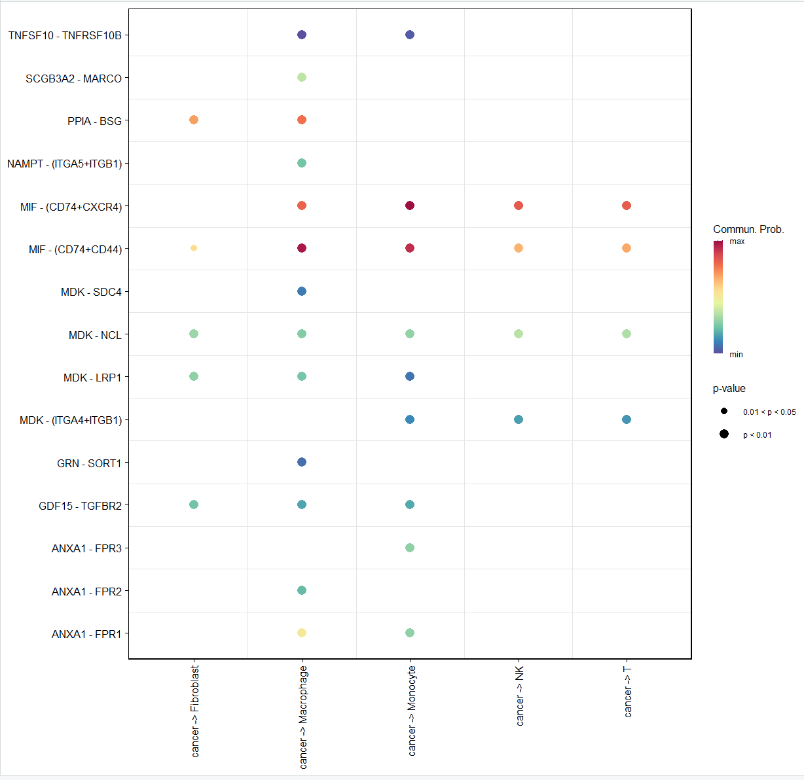


##### Step 5: CellChat Analysis: Systems analysis of cell-cell communication network

Identify signals contributing the most to outgoing or incoming signaling of certain cell groups.  
```{r step8, eval=FALSE}

# Compute the network centrality scores
cellchat_all <- netAnalysis_computeCentrality(cellchat_all, slot.name = "netP")

# Visualize the computed centrality scores using heatmap, allowing ready identification of major signaling roles of cell groups
netAnalysis_signalingRole_network(cellchat_all, signaling = "MIF", width = 8, height = 2.5, font.size = 10)

# Visualize the dominant senders (sources) and receivers (targets) in a 2D space
# Dotplot
# Signaling role analysis on the aggregated cell-cell communication network from all signaling pathways
gg1 <- netAnalysis_signalingRole_scatter(cellchat_all)
# Signaling role analysis on the cell-cell communication networks of interest
gg2 <- netAnalysis_signalingRole_scatter(cellchat_all, 
                                         signaling = c("MK", "CCL"))
gg1 + gg2

# Identify signals contributing most to outgoing or incoming signaling of certain cell groups
ht1 <- netAnalysis_signalingRole_heatmap(cellchat_all, pattern = "outgoing")
ht2 <- netAnalysis_signalingRole_heatmap(cellchat_all, pattern = "incoming")
ht1 + ht2

```


This heatmap provides a comprehensive view of the signaling pathways contributing most to outgoing (left) and incoming (right) signals in six cell groups, with a focus on their relative signaling strengths. The top colored bar plot shows the total signaling strength of a cell group by summarizing all signaling pathways displayed in the heatmap. The right grey bar plot shows the total signaling strength of a signaling pathway by summarizing all cell groups displayed in the heatmap.  
Outgoing Signaling (Left Panel): Cancer cells are the dominant source of outgoing signaling, as shown by the red bar at the top of the left heatmap. MIF (Macrophage Migration Inhibitory Factor) is the most significant outgoing pathway from cancer cells, strongly interacting with multiple cell groups, including fibroblasts, macrophages, and T cells. Other notable outgoing pathways from cancer cells include MK (Midkine) and ANNEXIN, which also target various immune and stromal cells.  
Incoming Signaling (Right Panel): Fibroblasts and macrophages are the top recipients of incoming signals, as indicated by the blue and green bars at the top of the right heatmap. Pathways like MIF, CXCL, and GDF are the strongest contributors to incoming signals for these cell types, suggesting their active roles in receiving and processing tumor microenvironment signals.

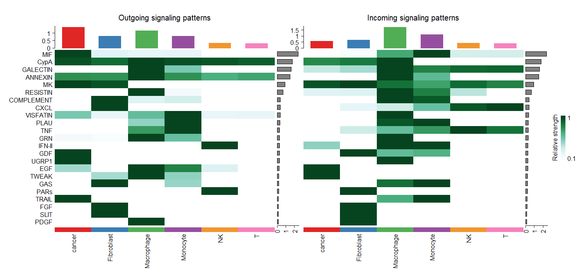  


#### Step 6: CellChat Analysis: Identify global communication patterns to explore how multiple cell types and signaling pathways coordinate together 

CellChat employs a pattern recognition method to identify the global communication patterns, by using NMF package to measure the stability for a particular number of patterns.   
This analysis can be done for outgoing  and incoming signaling patterns. Outgoing patterns reveal how the sender cells (cells as signal source) coordinate with each other as well as how they coordinate with certain signaling pathways to drive communication. Incoming patterns show how the target cells (i.e., cells as signal receivers) coordinate with each other as well as how they coordinate with certain signaling pathways to respond to incoming signals.  

```{r step9, eval=FALSE}

library(NMF)
library(ggalluvial)

# Identify and visualize outgoing/incoming communication pattern of secreting cells

# Choose to infer outgoing or incoming patterns
patten_type =  "outgoing"
# patten_type =  "incoming"


#infer the number of patterns
selectK(cellchat_all, pattern = patten_type)

# Both Cophenetic and Silhouette values begin to drop suddenly when the number of outgoing patterns is 3
nPatterns = 6 # 6 for outgoing and = 4 for incoming 

cellchat_all <- identifyCommunicationPatterns(cellchat_all, pattern = patten_type, k = nPatterns)
# Alluvial  plot
netAnalysis_river(cellchat_all, pattern = patten_type)
# Dot plot
netAnalysis_dot(cellchat_all, pattern = patten_type)


# Save the final CellChat object
save(cellchat_all, file = "./rdata/Cellchat_final.Rdata")
```


Alluvial plot showing the outgoing signaling patterns of target cells, also indicating the correspondence between the inferred latent patterns and cell groups, as well as signaling pathways. The thickness of the flow indicates the contribution of the cell group or signaling pathway to each latent pattern. Cancer cells primarily contribute to Pattern 3, as indicated by the thick blue flow. Pattern 3, dominated by cancer cells, shows strong associations with key pathways such as MIF, MK, TNF, and GDF. These pathways are critical in tumor progression, immune modulation, and interaction with the tumor microenvironment.

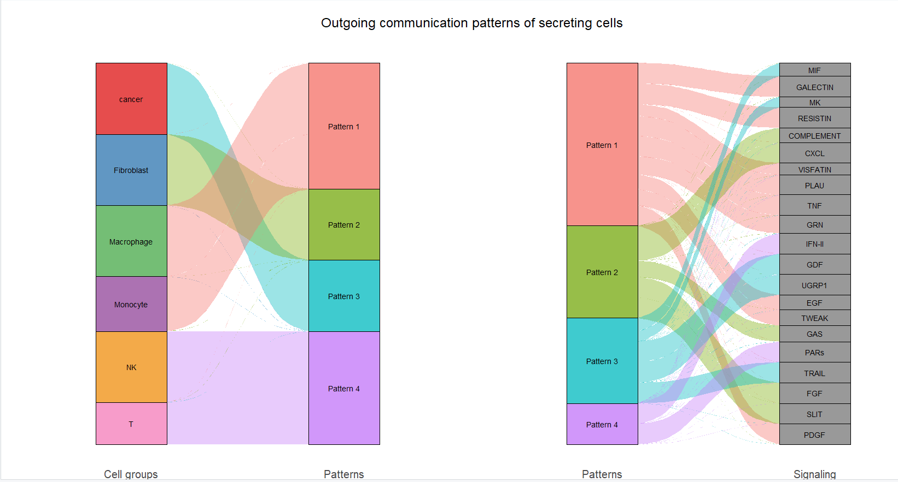  

Dot plot: the dot size is proportion to the contribution score to show association between cell group and their enriched signaling pathways. 

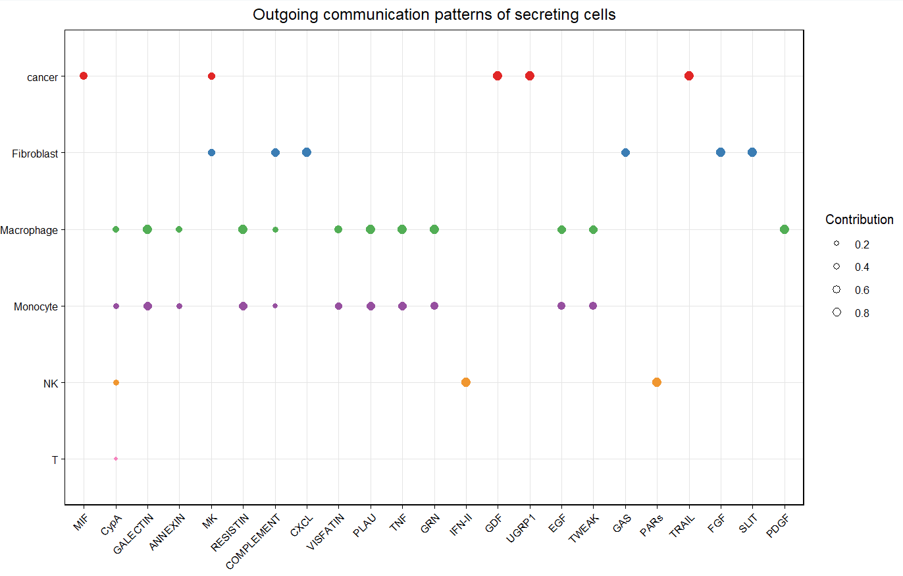


#### Step 7: NicheNet analysis starting from a seurat object 

NicheNet analysis was performed based on ranking potential ligands, infer receptors, and top-predicted target genes of ligands,which can predict: 
1) which ligands from a cell population (“sender/niche”) are most likely to affect target gene expression in an interacting cell population (“receiver/target”) 
2) which specific target genes are affected by which of these predicted ligands.

After using CellChat to infer cell type-specific communication by identifying overexpressed ligands or receptors in cell groups and  identify enhanced ligand‒receptor interactions,
NicheNet is used to investigate the signaling mediators (i.e., gene ) involved in ligand‒receptor pairing among cancer cells signaling with other celltypes. 
During the NicheNet runs, cancer cells were set as ‘receiver’ and other cell types as ‘sender’ populations. 


##### Step 7.1: Prepare NicheNet analysis data 

```{r step10, eval=FALSE}

library(nichenetr)

# Read in NicheNet’s networks: ligand-target prior model, ligand-receptor network, and weighted integrated networks
organism <- "human"

if(organism == "human"){
  lr_network <- readRDS(url("https://zenodo.org/record/7074291/files/lr_network_human_21122021.rds"))
  ligand_target_matrix <- readRDS(url("https://zenodo.org/record/7074291/files/ligand_target_matrix_nsga2r_final.rds"))
  weighted_networks <- readRDS(url("https://zenodo.org/record/7074291/files/weighted_networks_nsga2r_final.rds"))
} else if(organism == "mouse"){
  lr_network <- readRDS(url("https://zenodo.org/record/7074291/files/lr_network_mouse_21122021.rds"))
  ligand_target_matrix <- readRDS(url("https://zenodo.org/record/7074291/files/ligand_target_matrix_nsga2r_final_mouse.rds"))
  weighted_networks <- readRDS(url("https://zenodo.org/record/7074291/files/weighted_networks_nsga2r_final_mouse.rds"))

}

save(lr_network, ligand_target_matrix, weighted_networks, file= "NicheNet_database.Rdata")

#lnames = load("./rdata/NicheNet_database.Rdata")

# Read seurat object
seuratObj <- cg_sce
Idents(seuratObj) <- seuratObj$celltype_new


```

##### Step 7.2: Perform the NicheNet analysis: explain differential expression between two conditions 
```{r step11, eval=FALSE}


# Define condition list, here, we use IAC as the condition
conditions <- c("AIS", "MIA", "IAC")
#Assign condition groups exclude the current group
condition = 'IAC'
reference_conditions <- conditions[conditions != condition]

# The cell type of receiver
receiver_celltypes = c('cancer')
# The cell type of sender
sender_celltypes = c( "T","Monocyte","Macrophage","NK","Fibroblast" )

# The basic analysis of NicheNet can be done in one go by the wrapped nichenet_seuratobj_aggregate() function
# Time consuming: 1 minutes when using 14,000 cells with 23,000 genes  
nichenet_outputs <- nichenet_seuratobj_aggregate(
  
  seurat_obj = seuratObj,  # Seurat object with active.ident as celltype
  expression_pct = 0.10,   # The threshold that defines whether the cell type expresses the ligand/receptor ratio is 0.1 by default
  
  # Group
  condition_colname = "group",
  condition_oi = condition,
  condition_reference = reference_conditions,
  
  # receiver
  receiver = receiver_celltypes, 
  geneset = "DE", # # Method for determining a specific gene set, default uses all differential genes (oi/ref)c("DE","up","down")
  lfc_cutoff = 0.25, # Determine the threshold of differential genes
  # sender
  sender = sender_celltypes, 
  
  top_n_targets = 50, # Each ligand considers a maximum of 200 target genes
  top_n_ligands = 20, # gives the most likely 20 upstream ligands
  cutoff_visualization = 0.33, # Sets the threshold for visualizing ligand-target scores
  
  # refer data
  ligand_target_matrix = ligand_target_matrix, 
  lr_network = lr_network, 
  weighted_networks = weighted_networks, 
)


nichenet_outputs$ligand_activity_target_heatmap
ggsave('nitchnet_compare_all4figure1.pdf',path = "results/", width = 15,height = 7)

nichenet_outputs$ligand_receptor_heatmap
ggsave('nitchnet_compare_ligand_receptor1.pdf',path = "results/", width = 8,height = 6)

```


This comprehensive plot integrates multiple aspects of ligand-receptor interactions, highlighting ligand activities, expression patterns, differential expression, and predicted target genes. Here's the interpretation of the figure:  
Key Sections:  
Ligand Activities (Leftmost Panel): The top 30 ligands are ranked by their activity, with color intensity representing the activity level (AUPR score). ADM and MIF pathways show the highest activity levels, suggesting their significant roles in cellular communication within this context.  
Expression in Sender Cells (Second Panel): Displays the expression levels of the top ligands across different sender cell types, with the bubble size indicating the percentage of cells expressing the ligand. Monocytes, Macrophages, and Fibroblasts are the major contributors to expressing these highly ranked ligands.  
For instance, MIF is highly expressed in monocytes and macrophages, while fibroblasts express ligands like TGF-β.
Differential Expression (Third Panel):Indicates the log fold change (LFC) of ligand expression in different sender cell populations, with blue and red representing downregulated and upregulated ligands, respectively. MIF and TGF-β pathways are upregulated in sender cells, particularly during the IAC lung stage, highlighting their enhanced roles in this pathological state.  
Predicted Target Genes (Rightmost Panel):Shows the predicted target genes for each top-ranked ligand, with color intensity indicating the regulatory potential of the ligand for the gene. Specific pathways, such as TGF-β, primarily regulate genes like ACVRL1, TGFBR1, and TGFBR2. This suggests that TGF-β signaling is predominantly mediated through these target genes, which are essential for tumor progression and immune modulation.  

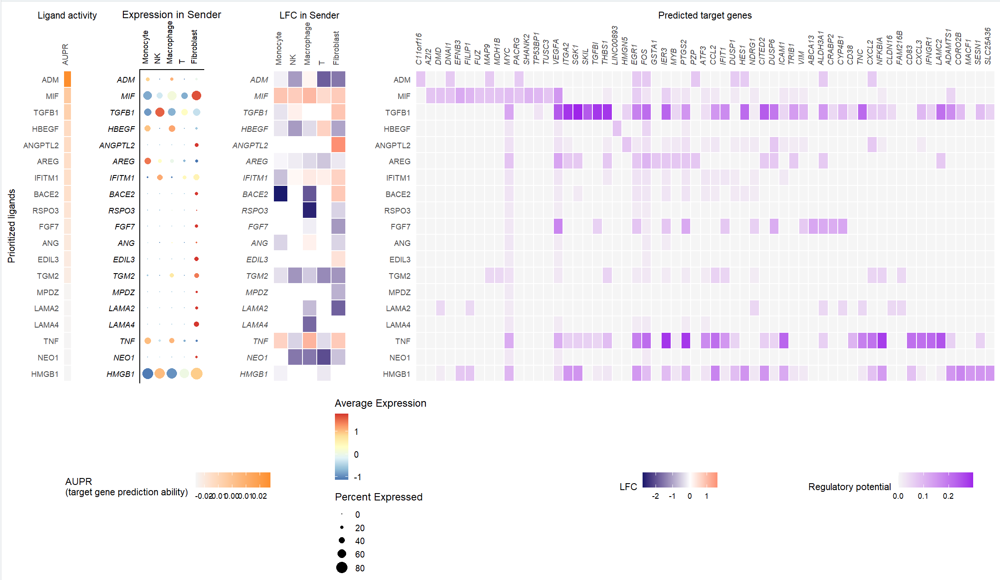 
  
  
This heatmap illustrates the top ligand-receptor interactions predicted by NicheNet in IAC (Invasive Adenocarcinoma) and highlights the expression levels of downstream target genes associated with these interactions. The color gradient reflects the interaction potential and expression levels of downstream genes. Darker shades indicate stronger interactions and higher expression.  
Ligands such as TGFB1 show significant interaction potential with receptors like TGFBR2, ENG, SDC2, and ITGB6. The strong interactions and downstream activation suggest that the TGF-β signaling pathway is highly active in the IAC stage, which is consistent with its known role in promoting tumor invasion, metastasis, and immune modulation. The involvement of additional pathways, such as EGFR and MIF, indicates a complex network of interactions driving IAC progression and the tumor microenvironment's dynamics.
  
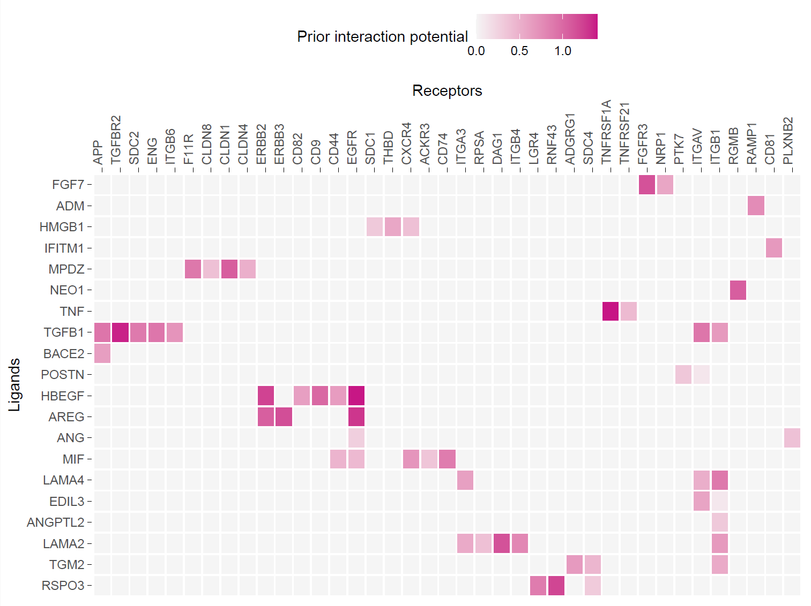 

