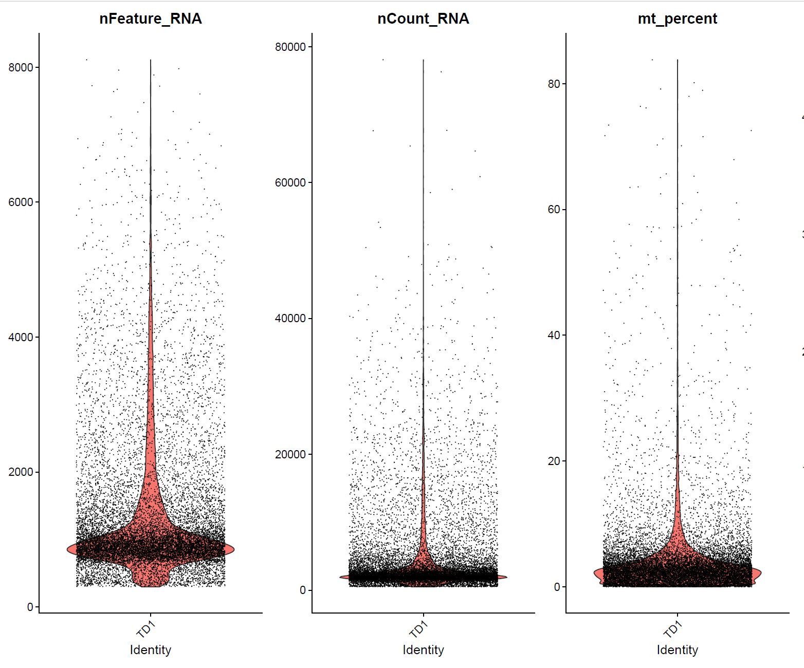
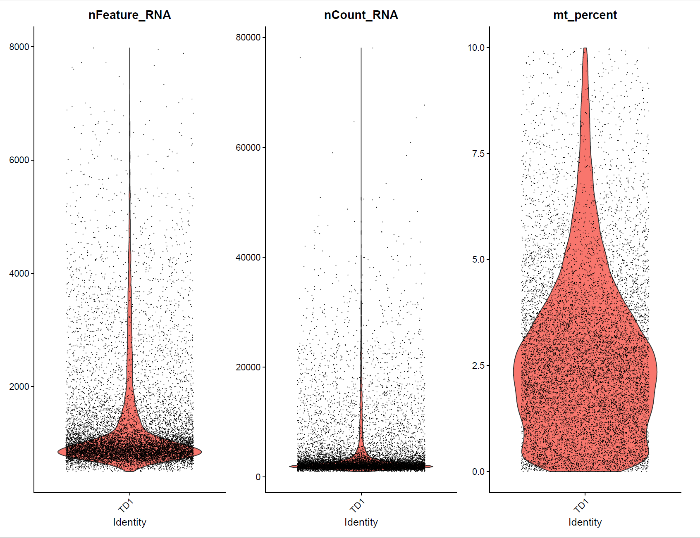
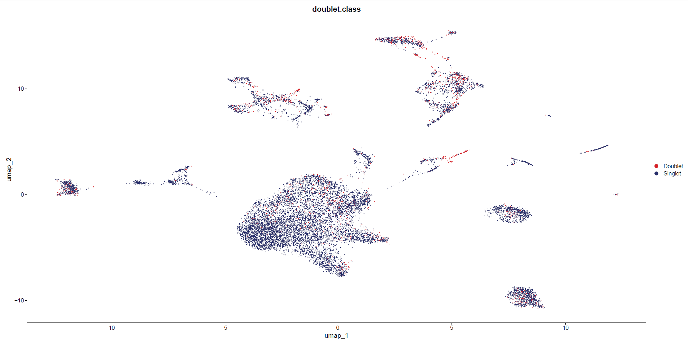
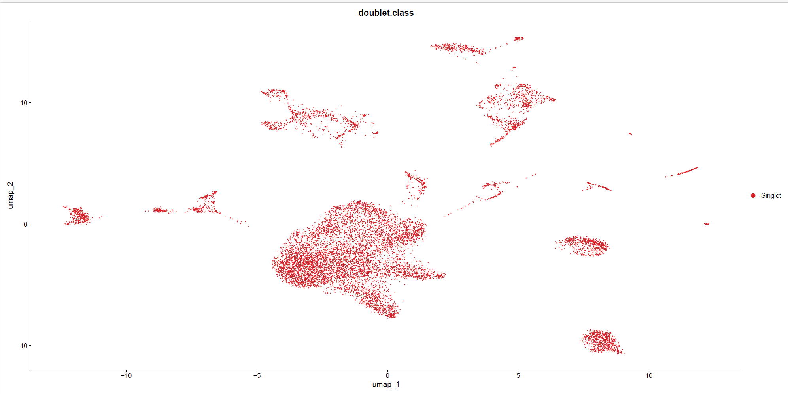
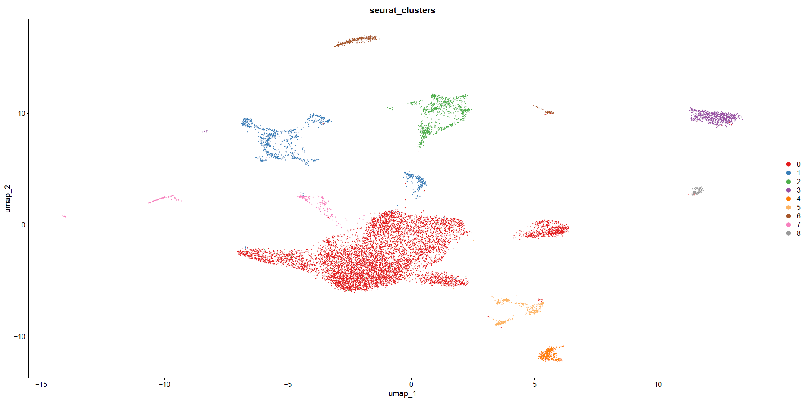
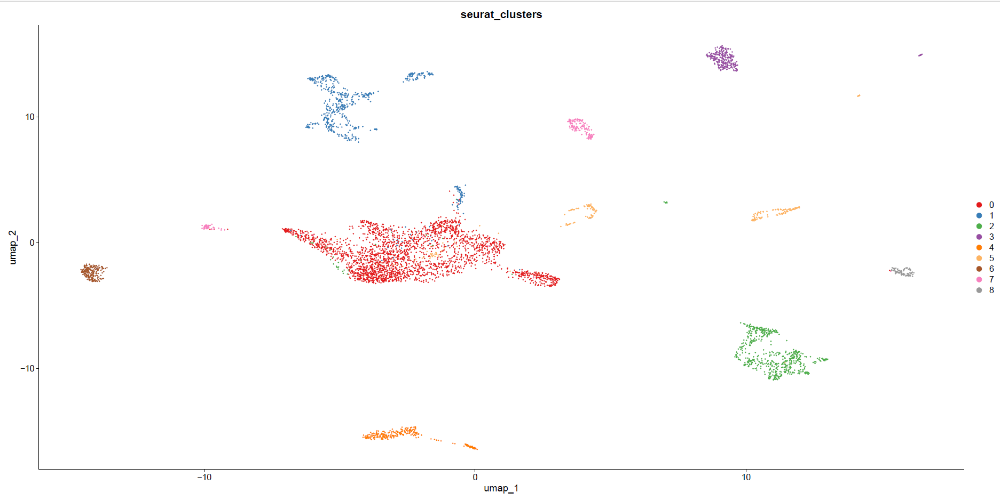

#### Basic Quality Control of Raw scRNA Seq Data
author: "Xiaoqian Jiang"  
date: "Created on December 16, 2024"  
output: html_document  


#### Introduction

This document outlines the steps involved in conducting basic quality control on raw scRNA seq data. The process includes setting up the environment, loading necessary libraries, initializing Seurat objects, and applying quality control functions.

#### Step 1: Set the Clean Environment and Load Required Libraries

First, we set up a clean environment and load the necessary libraries to ensure reproducibility and manage dependencies.

```{r setup-environment, eval=FALSE}
Sys.setenv(LANGUAGE = "en")
options(stringsAsFactors = FALSE)
rm(list=ls())
set.seed(123456)
setwd("C:/Users/xqbus/Desktop/sg_rnaseq/")
getwd()

library(Seurat)
library(ggplot2)
library(dplyr)
library(stringr)
library(DoubletFinder)
```

#### Step 2:Initial Seurat object
The Raw data were downloaded from https://www.ncbi.nlm.nih.gov/geo/query/acc.cgi?acc=GSE189357.

```{r Initial, eval=FALSE}

project_dir = "GSE189357_RAW/"
files=list.files(project_dir,'^GSM')
#files

#Processing data, organizing the original files into barcodes.tsv.gz, features.tsv.gz, and matrix.mtx.gz into their respective folders. 

samples=str_split(files,'_',simplify = T)[,1]
if(T){
  lapply(unique(samples),function(x){
    y=files[grepl(x,files)]
    subfolder=paste0(project_dir, paste(str_split(y[1],'_',simplify = T)[,1:2], collapse = "_"))
    dir.create(subfolder,recursive = T)
    file.rename(paste0(project_dir,y[1]),file.path(subfolder,"barcodes.tsv.gz"))
    file.rename(paste0(project_dir,y[2]),file.path(subfolder,"features.tsv.gz"))
    file.rename(paste0(project_dir,y[3]),file.path(subfolder,"matrix.mtx.gz"))
  })
}

dir_name <- list.files(project_dir)
#dir_name


#Initialize Seurat objects with minimal cells 10 and features 200  with raw counts
# The purpose of this step is only to check the data structure of each sample

scRNAlist <- list()
for(i in 1:length(dir_name)){
  counts <- Read10X(data.dir = 
                      paste(project_dir, dir_name[i], sep = ""))
  
  #Batch rename files to names recognized by the Read10X() function.
  name=str_split(dir_name[i],'_',simplify = T)[,2]
  scRNAlist[[i]] <- CreateSeuratObject(counts, project = name,min.cells = 10, 
                                       min.features = 200)
}

#check the initial sample info
scRNAlist
```
#### Step 3: Quality Control
In this part, I encapsulate a function:  make_seurat_object_and_doublet_removal to reduce redundancy, increase clarity, and improve the maintainability of the code. 


##### Step 3.1: The function: make_seurat_object_and_doublet_removal   
Quality control: function for basic seurat based qc and doubletfinder based doublet removal  
Please notice that 3 functions should added firstly from file "all_functions.R":   
Batch drawing of plots  in the "1." and "2." parts, 3,function: seurat_standard_normalize_and_scale  

```{r make_seurat_object_and_doublet_removal, eval=FALSE}

make_seurat_object_and_doublet_removal <- function(data_directory, project_name, DoubletRate, output_directory ){
  
  # data_directory: the directory stores all the inital samples with 3 10X standard file
  # project_name: the new assigned name of each sample by author
  # DoubletRate: Assuming 5% doublet formation rate - tailor for your dataset, 8% for 20,000 cells in 10X data.
  # output_directory: the output position of QC plot figures
  
  colon.data <- Read10X(data.dir = data_directory)
  currentSample <- CreateSeuratObject(counts = colon.data, project = project_name, min.cells = 5, min.features = 300)
  
  # Calculating mitochondrial ratio
  currentSample[["mt_percent"]] <- PercentageFeatureSet(currentSample, pattern = "^MT-")
  
  # Calculating red blood cell ratio
  currentSample[["HB_percent"]] <- PercentageFeatureSet(currentSample, pattern="^HB[ABDGQEMZ]")  
  
  # Calculate the ribosomal gene ratio
  currentSample[["RP_percent"]] <- PercentageFeatureSet(currentSample, pattern = "^Rp[sl]")  
  
  # qc plot-pre filtering
  violin_name <- paste0(project_name,"_violin_initial.pdf")
  violin_plot(currentSample, output_directory, violin_name, 
              c("nFeature_RNA", "nCount_RNA", "mt_percent","HB_percent", "RP_percent"))
  
  # filter sample to 500 unique genes/cell
  # Batch filter the cell according to the ratio of MT、HB, RP genes
  # the set of nFeature_RNA should be set according to Violin plot
  # The general default is that the mitochondrial content should be less than 10%, 
  # the number of red blood cells should be less than 3%, 
  # and the number of ribosomal should be less than 5%
  currentSample <- subset(currentSample, subset =  nFeature_RNA > 500 & nCount_RNA > 1000 & 
                            mt_percent < 10  &  HB_percent < 3 & RP_percent < 5 )
  
  
  # Normalization, FindVariableFeatures, scale data, FindNeighbors, FindClusters for each sample
  # from a initial seurat list-merge file, i.e., before quality control.
  resolution_list = c(0.01, 0.05, 0.1, 0.2, 0.3, 0.5,1)
  currentSample <- seurat_standard_normalize_and_scale(currentSample, FALSE)
  
  # Run doublet finder:Assuming 8% doublet formation rate - tailor for your dataset
  pc.num <- 1:30
  DoubletRate = DoubletRate 
  
  # Find pK
  sweep.res <- paramSweep(currentSample, PCs = pc.num, sct = F) # we didn't run sctransform 
  sweep.stats <- summarizeSweep(sweep.res, GT = FALSE)
  pk_values <- find.pK(sweep.stats)
  pK_chosen <- pk_values$pK[which.max(pk_values$BCmetric)] %>% as.character() %>% as.numeric()
  #print(paste(pK_chosen, "pK_chosen!!!!!!!!!!!!!!!!!!!!!!!!!!!!!!!!!!", sep=" "))
  
  # Calculate homotypic doublets probability and the expected doublets number
  
  # homotypic.prop <- modelHomotypic(currentSample$seurat_clusters)   
  # nExp_poi <- round(DoubletRate * ncol(currentSample))
  # nExp_poi.adj <- round(nExp_poi * (1 - homotypic.prop))
  nExp_poi.adj <- round(DoubletRate*length(currentSample@meta.data$orig.ident)*length(currentSample@meta.data$orig.ident)/10000)  
  
  seu_colon <- doubletFinder(currentSample, PCs = pc.num, pN = 0.25, pK = pK_chosen, nExp = nExp_poi.adj, reuse.pANN = FALSE, sct = FALSE)
  #print(head(seu_colon@meta.data))
  
  # rename columns
  name = paste0("DF.classifications_0.25_", pK_chosen,"_")
  seu_colon$doublet.class <- seu_colon[[paste0(name,nExp_poi.adj )]]
  seu_colon[[paste0(name,nExp_poi.adj )]] <- NULL
  pann <- grep(pattern="^pANN", x=names(seu_colon@meta.data), value=TRUE)
  seu_colon$pANN <- seu_colon[[pann]]
  seu_colon[[pann]] <- NULL
  print(project_name)
  print(table(seu_colon$doublet.class))

  # plot pre and post doublet finder results
  dim_name <- paste0(project_name,"_dimplot_before_doubleremove.pdf")
  dim_plot(seu_colon, output_directory, dim_name)
  
  seu_colon_single <- subset(seu_colon, subset = doublet.class != "Doublet")
  dim_name <- paste0(project_name,"_dimplot_after_doubleremove.pdf")
  dim_plot(seu_colon_single, output_directory, dim_name)

  # qc plot-after filtering
  violin_name <- paste0(project_name,"_violin_afterqc.pdf")
  violin_plot(seu_colon_single, output_directory, violin_name, 
              c("nFeature_RNA", "nCount_RNA", "mt_percent"))
  
  # Remove extra stuff and return filtered Seurat object
  seu_colon_single <- DietSeurat(seu_colon_single, counts=TRUE, data=TRUE, scale.data=FALSE, assays="RNA")
  return(seu_colon_single)
}

```

##### Step 3.2: Quality Control using 3.1 functions  
```{r Quality_Control, eval=FALSE}
project_dir = "GSE189357_RAW/"
name= list.files(project_dir)
data_directory =paste0(getwd(),"/",project_dir,name, sep="")
project_name = str_split(name,'_',simplify = T)[,2]

# DoubletRate: Assuming 8% doublet formation rate for 20,000 cells in 10X data.
# With 20,000 cells in one sample, the memory need is about 5Gb, so careful about the global memory setting. 
# Each sample need about 10 minutes to complete the total quality control

DoubletRate = 0.08
output_directory <- paste0(getwd(),"/","results/", sep="")
sample1 <- make_seurat_object_and_doublet_removal(data_directory[1], project_name[1], DoubletRate, output_directory)
getwd()

scRNAlist2 <- list()
for(i in length(project_name)){

  scRNAlist2[[i]] <- make_seurat_object_and_doublet_removal(data_directory[i], project_name[i], DoubletRate, output_directory)
}


#Merge multiple samples, the total process need 9*10= 90 minutes
seu_list <- list()
seu_list <- sample1
for (i in 2:length(project_name)){
  sc.i = make_seurat_object_and_doublet_removal(data_directory[i], project_name[i], DoubletRate, output)
  seu_list=merge(seu_list,sc.i)
}

table(seu_list$orig.ident)
save(seu_list,file = "./rdata/seu_list.Rdata")
```

##### Step 3.3: Sketch A Subset of Cells   
Due to individual computational limitations, I select a subset (‘sketch’) of 5,000 cells of each sample for downstream analysis.  
```{r Sketch, eval=FALSE}
#adding class information to each sample according to the supplemental table 1 in the paper
sample_to_group <- c(
  TD1 = "IAC", TD2 = "IAC", TD9 = "IAC",
  TD3 = "MIA", TD4 = "MIA", TD6 = "MIA",
  TD5 = "AIS", TD7 = "AIS", TD8 = "AIS"
)

sketchlist <- list()
for (i in 1:length(seu_list)) {
  obj <- scRNAlist[[i]]
  obj <- NormalizeData(obj)
  obj <- FindVariableFeatures(obj)
  obj <- SketchData(
    object = obj,
    ncells = 5000,
    method = "LeverageScore",
    sketched.assay = "sketch"
  )

  count <- LayerData(obj, assay = "sketch", layer = "count")
  name = paste0('TD',i)
  
  # create new seurat object for each sample with sketch data
  seurat_obj <- CreateSeuratObject(count, project = name)
  
  # add group information
  group <- sample_to_group[[name]]
  seurat_obj <- AddMetaData(seurat_obj, metadata = list(group = group))
  
  # save object
  sketchlist[[i]] <- seurat_obj
  
}

# Save the file
save(sketchlist,file = "./rdata/sketchlist.Rdata")
```

Below is quality control visualization of the sample: TD1  

Left: violin plot with raw data. Right: violin plot after quality control

 

Left: dim plot with raw data. Right: dim plot after remove double cells and quality control

 

Check the data after sketch using sample TD1
```{r check_sketch, eval=FALSE}

sketch_1 <- seurat_standard_normalize_and_scale (sketchlist[[1]], T, cluster_resolution=0.05)
scrnalist_1 <- seurat_standard_normalize_and_scale (scRNAlist2[[1]], T, cluster_resolution=0.05)

dim_plot(scrnalist_1, output_directory, name = "TD1_all.pdf",group_by="seurat_clusters",color = 'F')
dim_plot(sample1, output_directory, name = "TD1_sketch.pdf",group_by="seurat_clusters",color = 'F')

```
Left: dim plot with original all data. Right: dim plot using sketch data

 